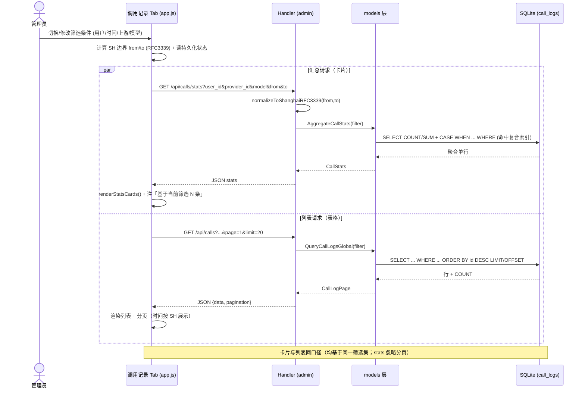

# 增量设计文档：调用记录汇总面板（call_stats_panel）

> 架构师：高见远（Bob，Architect）　|　基于：`docs/prd-call-stats.md`（定稿 v1.0）　|　日期：2026-07-14
> 形态：增量开发，增强 Admin 后台，走标准 SOP　|　落盘：`docs/design-call-stats.md`

---

## 1. 实现方案与框架选型

### 1.1 技术栈与框架

**完全沿用现有栈，不引入任何新框架 / 路由库 / 前端依赖。**

- 后端：Go 1.22 标准库 `net/http`（`http.ServeMux` 的 `GET /api/...` 模式匹配），SQLite（`modernc.org/sqlite`，driver `"sqlite"`，零 CGO）。
- 前端：原生 HTML/CSS/JS，经 `//go:embed` 嵌入二进制（`web/admin` → `embed.go`）。改前端必须重新 `go build`。
- 新增两个（建议三个）只读查询接口 + 一个顶层 Tab，全部基于既有 `models` 层参数化查询模式，无 SQL 拼接。

### 1.2 技术难点与对策

| 难点 | 对策 |
|---|---|
| 全局筛选（用户/时间/上游/模型组合）需命中索引 | 新增 2 个复合索引 `(user_id, created_at)`、`(provider_id, created_at)`，保留单列 `created_at`；WHERE 用参数化动态拼接，列名写死、值用 `?` 绑定 |
| 时区语义一致（PRD D5/P1-1，AGENTS §6 时区锁定） | 筛选边界在 **Go 端** 用 `timeutil.ShanghaiTZ` 计算并格式化为 RFC3339（与 `created_at` 同格式），做字符串比较；禁止裸 `time.Now()` 做窗口比较 |
| 聚合性能（目标 <500ms / 100 万行） | `stats` 走单条 `COUNT/SUM + CASE WHEN` 聚合 SQL，复用同一 WHERE 与索引 |
| 防注入（PRD D8 模型手输） | 所有过滤值用参数化 `?` 绑定；列名（`user_id`/`provider_id`/`model`/`created_at`）为代码字面量，绝不拼接用户输入 |
| 嵌入重编译 | 前端改动后必须 `make build-linux` 重新嵌入；部署走既有 systemd + nginx 流程 |

### 1.3 AGENTS.md 第 5–7 节禁区合规检查（结论：不触碰）

| AGENTS 条款 | 是否触碰 | 说明 |
|---|---|---|
| 第 5 节 密钥铁律 | **否** | 不新增/读取任何明文 Key；上游下拉复用既有 `ProviderStore.BuildMaskedProviders()`（已脱敏，`masked_key`） |
| 第 6 节 隐蔽路径 | **否** | 新路由注册在 `adminMux`（`/api/calls*`），外部经 nginx `/m-7xa2/` → `/admin/` 反代，绝不暴露真实 `/admin/` |
| 第 6 节 时区锁定 | **遵守（正向使用）** | 边界统一 `timeutil.ShanghaiTZ`；禁止裸 `time.Now()` 做窗口比较 |
| 第 6 节 配额计量口径 | **否** | 仅只读聚合（`SUM(effective_calls)` 等），不改配额/倍率/路由逻辑 |
| 第 7 节 各项禁区 | **否** | 不回退路由、不改 `/v1/models`、不移除 1MB 限制、不改子 Key 哈希等 |

> ✅ 本功能属纯只读分析增强，**不触碰任何禁区**；仅需遵守「时区锁定」与「嵌入重编译」两条既有约定。

---

## 2. 文件列表（区分新增 / 修改）

| 文件 | 动作 | 说明 |
|---|---|---|
| `internal/db/migrations.go` | **修改** | 迁移切片内新增 2 条 `CREATE INDEX IF NOT EXISTS`（幂等）；不改既有表结构 |
| `internal/models/call_log.go` | **修改** | `CallLogFilter` 增加 `ProviderID`/`Model` 字段；`QueryCallLogs` 复用共享 WHERE 构造器（行为不变） |
| `internal/models/call_stats.go` | **新增** | 新增类型 `CallStats`/`TokenBreakdown`/`SuccessStats`；函数 `QueryCallLogsGlobal`/`AggregateCallStats`/`DistinctModels`；辅助 `buildCallLogWhere` |
| `internal/admin/handler.go` | **修改** | `RegisterRoutes` 的 `adminMux` 内注册 2~3 条路由 |
| `internal/admin/calls_stats.go` | **新增** | handler：`ListCalls` / `CallsStats` / `ListCallModels` |
| `web/admin/index.html` | **修改** | 新增导航项 + `tab-callstats` 区块（筛选条 + 4 汇总卡片 + 全局列表 + 分页） |
| `web/admin/app.js` | **修改** | 新增/改造函数（见 §3.2）；Tab 路由注册、时区、持久化 |

> `internal/admin/calls.go` 当前仅为注释占位（`GetUserCalls` 实际在 `users.go`），故新 handler 放新文件 `calls_stats.go`，与既有风格一致。

---

## 3. 数据结构和接口

### 3.1 类图（Mermaid）

```mermaid
classDiagram
    class CallLog {
        +int64 ID
        +int64 UserID
        +string Model
        +string ProviderID
        +int PromptTokens
        +int CompletionTokens
        +int TotalTokens
        +int EffectiveCalls
        +float64 MultiplierUsed
        +int StatusCode
        +int LatencyMs
        +string ErrorMsg
        +string CreatedAt
    }
    class CallLogFilter {
        +int64 UserID
        +string ProviderID
        +string Model
        +string From
        +string To
        +int Page
        +int Limit
    }
    class CallLogPage {
        +CallLog[] Data
        +Pagination Pagination
    }
    class Pagination {
        +int Page
        +int Limit
        +int Total
    }
    class CallStats {
        +int TotalCalls
        +TokenBreakdown Tokens
        +int EffectiveCalls
        +SuccessStats Success
    }
    class TokenBreakdown {
        +int Prompt
        +int Completion
        +int Total
    }
    class SuccessStats {
        +int SuccessCount
        +int ErrorCount
        +float64 SuccessRate
    }
    class Handler {
        +ListCalls(w, r)
        +CallsStats(w, r)
        +ListCallModels(w, r)
    }
    CallLogPage "1" *-- "0..*" CallLog : data
    CallLogPage "1" *-- "1" Pagination : pagination
    CallStats "1" *-- "1" TokenBreakdown : tokens
    CallStats "1" *-- "1" SuccessStats : success
    Handler ..> CallLogPage : QueryCallLogsGlobal()
    Handler ..> CallStats : AggregateCallStats()
    Handler ..> "[]string" : DistinctModels()
```

### 3.2 接口契约与函数签名（骨架）

#### 3.2.1 `GET /admin/api/calls`（外部 `/m-7xa2/api/calls`）— 全局列表

查询参数（均与 PRD §六一致；`user_id=0` 或空 = 全部）：

| 参数 | 类型 | 默认 | 说明 |
|---|---|---|---|
| `user_id` | int | 0 | 0 = 全部用户 |
| `provider_id` | string | "" | 上游 slug（真实值，见 D7）；空 = 全部 |
| `model` | string | "" | 真实模型名；空 = 全部 |
| `from` | RFC3339 | "" | `created_at >= from`（SH 边界，由 Go 归一化） |
| `to` | RFC3339 | "" | `created_at <= to` |
| `page` | int | 1 | 页码 |
| `limit` | int | 20 | 每页条数 |

响应（复用既有 `CallLogPage` 形状）：
```json
{ "data": [ {CallLog...} ], "pagination": { "page":1, "limit":20, "total":1234 } }
```

Handler 骨架：
```go
// internal/admin/calls_stats.go
func (h *Handler) ListCalls(w http.ResponseWriter, r *http.Request) {
    q := r.URL.Query()
    userID, _ := strconv.ParseInt(q.Get("user_id"), 10, 64) // 0 = all
    providerID := q.Get("provider_id")
    model := q.Get("model")
    from := normalizeToShanghaiRFC3339(q.Get("from"))
    to := normalizeToShanghaiRFC3339(q.Get("to"))
    page, _ := strconv.Atoi(q.Get("page"))
    limit, _ := strconv.Atoi(q.Get("limit"))

    filter := models.CallLogFilter{
        UserID: userID, ProviderID: providerID, Model: model,
        From: from, To: to, Page: page, Limit: limit,
    }
    page_, err := models.QueryCallLogsGlobal(h.DB, filter)
    if err != nil {
        log.Printf("ERROR: query global calls: %v", err)
        writeJSON(w, http.StatusInternalServerError, map[string]string{"error": "Failed to query calls"})
        return
    }
    writeJSON(w, http.StatusOK, page_)
}
```

models 骨架：
```go
// internal/models/call_stats.go
func QueryCallLogsGlobal(db *sql.DB, f CallLogFilter) (*CallLogPage, error) {
    if f.Limit <= 0 { f.Limit = 20 }
    if f.Page <= 0 { f.Page = 1 }
    offset := (f.Page - 1) * f.Limit

    where, args := buildCallLogWhere(f) // user_id 可选（0=不过滤）

    var total int
    db.QueryRow(`SELECT COUNT(*) FROM call_logs WHERE `+where, args...).Scan(&total)

    rows, err := db.Query(
        `SELECT id, user_id, model, provider_id, prompt_tokens, completion_tokens, total_tokens,
                effective_calls, multiplier_used, status_code, latency_ms, COALESCE(error_msg,''), created_at
         FROM call_logs WHERE `+where+` ORDER BY id DESC LIMIT ? OFFSET ?`,
        append(args, f.Limit, offset)...,
    )
    // scan → []CallLog ...
}
```

#### 3.2.2 `GET /admin/api/calls/stats`（外部 `/m-7xa2/api/calls/stats`）— 聚合

**相同筛选参数**（忽略 `page`/`limit`；基于全量筛选结果，见 D3/P2-3）。

响应（PRD §六）：
```json
{
  "total_calls": 1234,
  "tokens": { "prompt": 100000, "completion": 200000, "total": 300000 },
  "effective_calls": 1500,
  "success": { "success_count": 1200, "error_count": 34, "success_rate": 97.2 }
}
```

Handler 骨架：
```go
func (h *Handler) CallsStats(w http.ResponseWriter, r *http.Request) {
    q := r.URL.Query()
    filter := models.CallLogFilter{
        UserID:     parseInt64(q.Get("user_id")),
        ProviderID: q.Get("provider_id"),
        Model:      q.Get("model"),
        From:       normalizeToShanghaiRFC3339(q.Get("from")),
        To:         normalizeToShanghaiRFC3339(q.Get("to")),
    }
    stats, err := models.AggregateCallStats(h.DB, filter)
    if err != nil { /* 500 */ return }
    writeJSON(w, http.StatusOK, stats)
}
```

models 骨架（聚合 SQL 草稿）：
```go
type CallStats struct {
    TotalCalls     int            `json:"total_calls"`
    Tokens         TokenBreakdown `json:"tokens"`
    EffectiveCalls int            `json:"effective_calls"`
    Success        SuccessStats   `json:"success"`
}
type TokenBreakdown struct {
    Prompt     int `json:"prompt"`
    Completion int `json:"completion"`
    Total      int `json:"total"`
}
type SuccessStats struct {
    SuccessCount int     `json:"success_count"`
    ErrorCount   int     `json:"error_count"`
    SuccessRate  float64 `json:"success_rate"`
}

func AggregateCallStats(db *sql.DB, f CallLogFilter) (*CallStats, error) {
    where, args := buildCallLogWhere(f)
    const q = `SELECT
        COUNT(*),
        COALESCE(SUM(prompt_tokens),0),
        COALESCE(SUM(completion_tokens),0),
        COALESCE(SUM(total_tokens),0),
        COALESCE(SUM(effective_calls),0),
        SUM(CASE WHEN status_code >= 200 AND status_code < 300 THEN 1 ELSE 0 END),
        SUM(CASE WHEN status_code >= 400 THEN 1 ELSE 0 END)
    FROM call_logs WHERE ` + where

    var s CallStats
    var total, okSuccess, errCount int64
    err := db.QueryRow(q, args...).Scan(
        &total, &s.Tokens.Prompt, &s.Tokens.Completion, &s.Tokens.Total,
        &s.EffectiveCalls, &okSuccess, &errCount,
    )
    if err != nil { return nil, err }
    s.TotalCalls = int(total)
    s.Success.SuccessCount = int(okSuccess)
    s.Success.ErrorCount = int(errCount)
    if total > 0 {
        s.Success.SuccessRate = float64(okSuccess) / float64(total) * 100.0
    }
    return &s, nil
}
```

#### 3.2.3 （建议）`GET /admin/api/calls/models`（外部 `/m-7xa2/api/calls/models`）— 模型下拉源

为满足 PRD D8「真实模型名下拉 + 手输」，提供轻量去重端点（**超出 PRD 原 2 端点规划，需主理人确认，见 §8**）：

```go
// models
func DistinctModels(db *sql.DB) ([]string, error) {
    rows, err := db.Query(`SELECT DISTINCT model FROM call_logs ORDER BY model`)
    // scan → []string
}
// handler
func (h *Handler) ListCallModels(w http.ResponseWriter, r *http.Request) {
    models, err := models.DistinctModels(h.DB)
    if err != nil { /* 500 */ return }
    writeJSON(w, http.StatusOK, map[string]any{"data": models})
}
```

#### 3.2.4 共享 WHERE 构造器（防注入核心）

```go
// buildCallLogWhere：列名写死，值全用 ? 绑定；零值跳过 → 支持「全部」
func buildCallLogWhere(f CallLogFilter) (string, []any) {
    conds := []string{}
    args := []any{}
    if f.UserID != 0     { conds = append(conds, "user_id = ?");     args = append(args, f.UserID) }
    if f.ProviderID != "" { conds = append(conds, "provider_id = ?"); args = append(args, f.ProviderID) }
    if f.Model != ""     { conds = append(conds, "model = ?");       args = append(args, f.Model) }
    if f.From != ""      { conds = append(conds, "created_at >= ?"); args = append(args, f.From) }
    if f.To != ""        { conds = append(conds, "created_at <= ?"); args = append(args, f.To) }
    if len(conds) == 0 { return "1=1", args }
    return strings.Join(conds, " AND "), args
}
```

#### 3.2.5 Go 端时区归一化（关键）

```go
// normalizeToShanghaiRFC3339：把任意 RFC3339/日期 归一化为 SH(+08:00) RFC3339，
// 保证与 stored created_at（同格式）做字符串比较时语义一致；解析失败则忽略该边界。
func normalizeToShanghaiRFC3339(s string) string {
    if s == "" { return "" }
    t, err := time.Parse(time.RFC3339, s)
    if err != nil {
        if d, e2 := time.Parse("2006-01-02", s); e2 == nil { t = d } else { return "" }
    }
    return t.In(timeutil.ShanghaiTZ).Format(time.RFC3339)
}
```

#### 3.2.6 路由注册（handler.go）

```go
// 在 adminMux 内、其他 GET /api 路由附近追加：
adminMux.HandleFunc("GET /api/calls", h.ListCalls)
adminMux.HandleFunc("GET /api/calls/stats", h.CallsStats)
// adminMux.HandleFunc("GET /api/calls/models", h.ListCallModels) // 若主理人批准 §8-3
```

> Go 1.22 `ServeMux`：`GET /api/calls` 与 `GET /api/calls/stats` 为互异精确模式，无冲突；均自动走 `AdminSessionAuthAPI`（路径以 `/api/` 开头）。

---

## 4. 程序调用流程（时序图，Mermaid）



---

## 5. 任务列表（有序、含依赖、按实现顺序）

> 实现任务 T1–T5（≤5，符合分解纪律），T6 为发布前验证/重编译门禁（AGENTS §4/§10）。整体近似线性链，但 T4/T5 在「本设计文档契约已定稿」后即可与 T3 并行启动。

| Task | 名称 | 源文件（新增/修改） | 依赖 | 优先级 |
|---|---|---|---|---|
| **T1** | 迁移：新增 2 复合索引（幂等） | `internal/db/migrations.go`（改） | 无 | P0 |
| **T2** | models：全局查询 + 聚合 + 模型去重 | `internal/models/call_log.go`（改，`CallLogFilter` 扩展）、`internal/models/call_stats.go`（新） | T1 | P0 |
| **T3** | handler：ListCalls + CallsStats（+ ListCallModels）+ 路由注册 | `internal/admin/calls_stats.go`（新）、`internal/admin/handler.go`（改） | T2 | P0 |
| **T4** | 前端 index.html：Tab + 筛选条 + 4 卡片 + 列表 DOM | `web/admin/index.html`（改） | T3（接口契约） | P0 |
| **T5** | 前端 app.js：fetch/渲染/联动/时区/持久化 | `web/admin/app.js`（改） | T4 | P0 |
| **T6** | 编译验证（embed 重编译）+ 本地 test + 部署验证 | 全量；`make build-linux` + `make test` | T5 | P0 |

**依赖说明**
- T1 → 无：索引为性能项，不改语义；先于 T2 落地以便联调时即命中索引。
- T2 → T1：聚合/查询在带索引的库上开发与压测。
- T3 → T2：handler 直接调用 T2 的函数。
- T4 → T3：DOM 结构需对齐 T3 的接口字段（已在本文档锁定）。
- T5 → T4：JS 事件绑定依赖 T4 的 DOM id。
- T6 → T5：全链路就绪后做 `make build-linux` 重嵌 + `make test` + 服务器 `curl` 验证。

---

## 6. 依赖包列表

**无新增依赖。** 仅用既有标准库与项目内包：

```
- database/sql            # 标准库，参数化查询
- net/http                # 标准库 ServeMux 路由
- strconv                 # 标准库，参数解析
- time                    # 标准库，RFC3339 解析
- llm_api_gateway/internal/timeutil   # 复用 ShanghaiTZ（时区锁定，禁止裸 time.Now()）
- llm_api_gateway/internal/models      # 复用 CallLog/CallLogPage/Pagination
- llm_api_gateway/internal/provider    # 复用 BuildMaskedProviders（脱敏上游列表）
```

> ⚠️ 时区处理复用 `timeutil.ShanghaiTZ`，**禁止裸 `time.Now()` 做窗口比较**（AGENTS §6、PRD P1-1）。

---

## 7. 共享知识（跨文件约定）

1. **时区（最重要）**：所有筛选边界（`今天`/`近7天`/`近30天`/`自定义`）在 **Go 端** 用 `timeutil.ShanghaiTZ` 计算起止，经 `normalizeToShanghaiRFC3339` 格式化为 RFC3339（与 `created_at` 同格式）后做字符串比较。前端展示 `created_at` 统一 SH（`toLocaleString('zh-CN', {timeZone:'Asia/Shanghai'})`），仅本页（调用记录）使用 SH，不动其他页（PRD D6）。
2. **索引命中**：WHERE 顺序天然为 `(user_id|provider_id) + created_at`；复合索引把 `created_at` 置于右列以支撑范围扫描。仅按时间/上游筛选时走 `idx_call_logs_created_at`。`model` 过滤为残差过滤（无索引，PRD P2-4 预留 `(model, created_at)`）。
3. **汇总与分页无关**：`/calls/stats` **忽略** `page`/`limit`，基于全量筛选结果聚合；卡片注明「基于当前筛选 N 条」（D3/P2-3）。
4. **嵌入重编译**：任何 `web/admin/*` 改动必须 `make build-linux` 重新嵌入（`//go:embed`），再走 systemd 重启；nginx 配置不变则无需 reload（AGENTS §4）。
5. **防注入**：所有过滤值参数化 `?` 绑定；列名写死（`buildCallLogWhere`）。模型手输也走 `model = ?`，绝不字符串拼接（PRD D8）。
6. **默认筛选**：首次进入 Tab 建议默认 `近7天`（避免无时间条件导致全表扫描，支撑 <500ms 目标）；筛选状态用 `sessionStorage` 持久化（PRD P1-4）。
7. **响应形状复用**：列表复用既有 `CallLogPage`（`{data, pagination}`），与 per-user `GetUserCalls` 完全一致，前端渲染可复用既有列逻辑（仅新增「上游」列）。

---

## 8. 待明确事项（需主理人/工程师拍板）

| # | 事项 | 现状 / 建议 |
|---|---|---|
| 1 | **provider_id 传 slug 还是 id** | 结论：传 **slug**（PRD D4/D7；DB 列 `provider_id` 为 TEXT，存真实 slug 如 `zhipu`）。前端下拉 `value=slug`、显示 `name`，数据源 `GET /api/providers`（已确认返回 `slug`/`name`/`masked_key` 等）。✅ 已定 |
| 2 | **模型手输防注入** | 结论：参数化 `model = ?`，零拼接。✅ 已定；`DistinctModels` 无入参，天然安全 |
| 3 | **是否新增第 3 个端点 `GET /api/calls/models`** | PRD D8 要求「真实模型名下拉」；但原规划仅 2 端点。建议**新增**该轻量端点（仅 `SELECT DISTINCT model`）。若主理人不接受，则退化为前端 `datalist` 初始空 + 纯手输（牺牲下拉便利性）。**需主理人确认** |
| 4 | **服务器运行时时区（关键前置）** | `created_at` 由 `time.Now().Format(RFC3339)` 写入（服务器本地时区）。本功能要求边界与 `created_at` 同为 SH(+08:00) 方能字符串比较正确 + 命中索引。**请主理人确认部署服务器 `115.190.223.216` 运行时时区；强烈建议在 systemd unit 加 `Environment=TZ=Asia/Shanghai` 锁定**。否则 SH 边界与 stored 值偏移不一致，比较语义错位 |
| 5 | **「今天/近7天/近30天」上界语义** | 建议：`to` = `now.SH`（滚动，含当天进行中数据）；`from` = 起始日 `00:00:00 SH`。自定义区间：结束日 < 今天 → `23:59:59.999 SH`；结束日 = 今天 → `now.SH`。**需确认** |
| 6 | **空 user_id / 空 provider_id 语义** | `user_id=0` 或空 = 全部；`provider_id=""` = 全部；`model=""` = 全部。`buildCallLogWhere` 零值跳过。✅ 已定 |
| 7 | **索引冗余** | 新增 `idx_call_logs_user_created` 在 `(user_id, created_at)` 上覆盖了单列 `idx_call_logs_user_id` 的能力。PRD §7 要求保留 `idx_call_logs_created_at`；单列 `idx_call_logs_user_id` 建议**保留不动**（无害、最小改动），后续清理可作为独立任务 |
| 8 | **前端 Tab 命名** | 新增顶层 Tab 标签建议「📈 调用记录」（`data-tab="callstats"`），与 per-user 子区块「调用记录 — 用户名」区分，避免混淆 |

---

## 附：Mermaid 图文件

- 时序图：`docs/call-stats-sequence.mermaid`
- 类图：`docs/call-stats-class.mermaid`

> 本设计为「设计 + 任务分解 + 关键 SQL/签名骨架」，**不含完整实现代码**；工程师按 T1–T6 与 §3 骨架落地即可。
