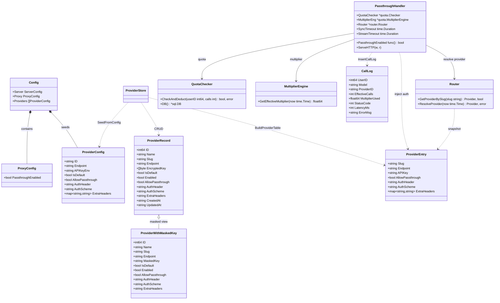
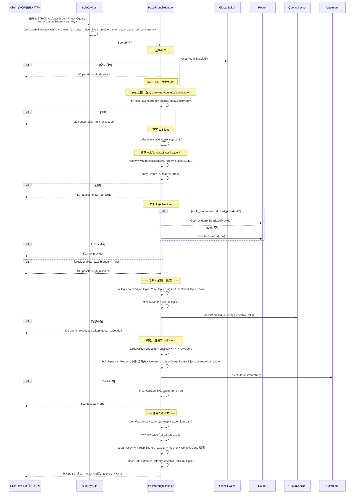
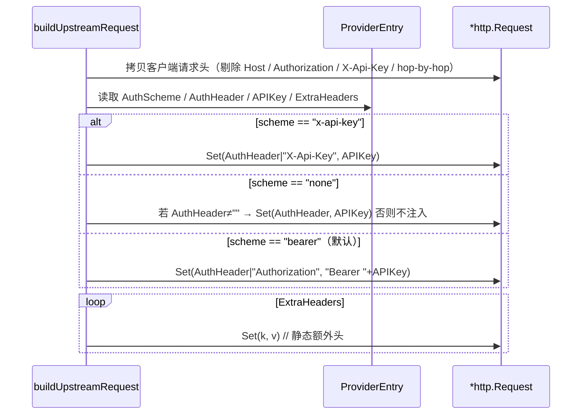
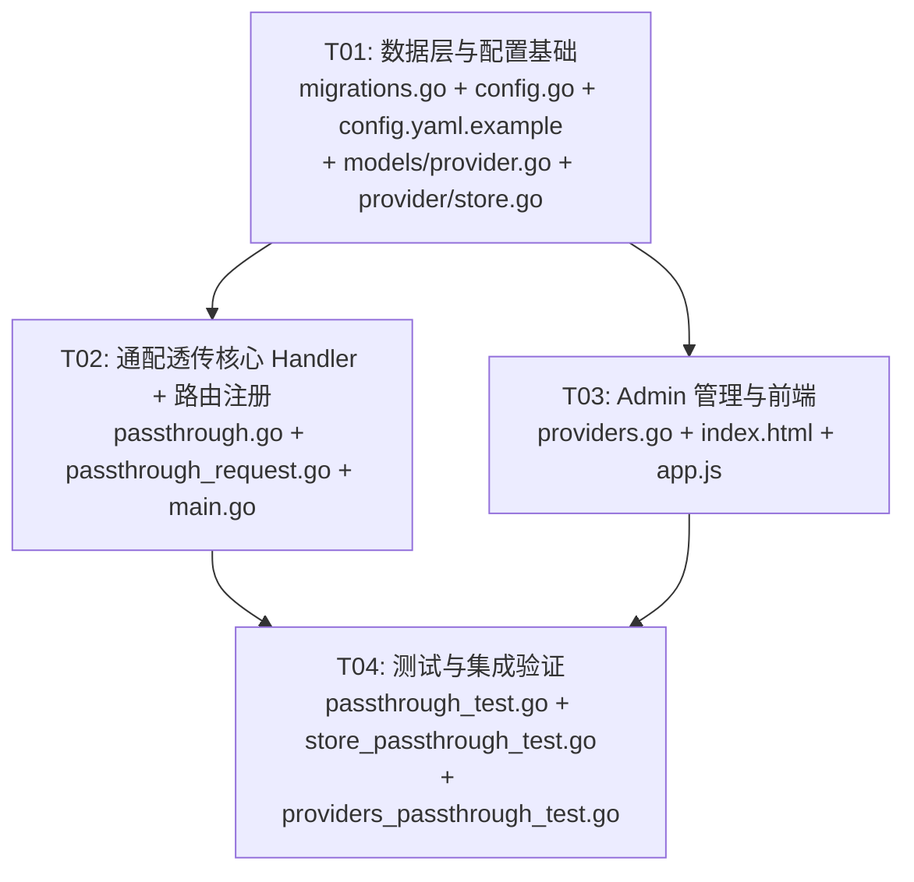

# 系统设计：统一中转任意上游 MCP / 任意路径（含鉴权、配额、藏 Key）

| 项 | 内容 |
|---|---|
| 架构师 | Bob（software-architect） |
| 日期 | 2026-07-18 |
| 基于 | PRD: `docs/prd-mcp-passthrough.md`（Alice, Draft） |
| 关联项目 | LLM API Gateway（Go 1.22 / SQLite / nginx 前置） |

> 本文件为**增量设计**，仅描述本次变更（`/v1/passthrough/` 通配透传端点）。
> 既有 `/v1/chat/completions` 路径行为完全不变（独立 Handler）。
> 所有复用点均指向现有包级函数，避免重复造轮子。

---

## Part A: 系统设计

### 1. 实现方案

#### 1.1 核心技术挑战

| 挑战 | 分析 | 决策 |
|------|------|------|
| **通配 + 原样转发** | 需保留任意 method / 子路径 / query / 请求头 / 请求体，不能像 chat handler 那样改路径、改 model、归一化 JSON | 新增 `PassthroughHandler`，独立构造上游 URL（endpoint + 子路径 + query），原样拷贝过滤后的请求头 |
| **藏 Key（安全最高优先级）** | 客户端持子 Key，绝不能把子 Key 透传到上游；上游真实 Key 由网关注入；真实 Key 绝不出现在日志/错误体 | 转发前 `Del("Authorization")` / `Del("X-Api-Key")`；按 provider 认证方案注入真实 Key；日志中 Key 字段一律不落 |
| **SSRF / 开放代理面** | 通配转发 = 潜在开放代理 | 双开关默认关：`config.Proxy.PassthroughEnabled`（全局）+ `provider.allow_passthrough`（每 Provider）；二者皆真才放行，否则 403 `passthrough_disabled` |
| **复用现有治理（鉴权/并发/配额）** | 一套治理面，行为一致 | 复用 `authMW.SubKeyAuth`、`proxy.tryAcquireConcurrency/releaseConcurrency`、`quota.Checker.CheckAndDeduct`、`router.Router.GetProviderBySlug/ResolveProvider`、`models.InsertCallLog` |
| **通用流式转发（支持 MCP SSE）** | 响应可能是 SSE / chunked / 普通 JSON；需边读边 flush | 用 `io.Copy` + `http.Flusher`；检测 `r.Context().Done()` 中止；流式时设 `X-Accel-Buffering: no` 并移除 `Content-Length` 转 chunked |
| **上游端点形态歧义** | chat 路由的 `provider.endpoint` 是 **base URL**（不含 `/chat/completions`，该后缀由 `BuildUpstreamRequest` 在运行时追加）。passthrough 是**直接拼接** `endpoint + subPath`，若复用 chat provider 会把 `/chat/completions` 也拼进子路径导致 404/错误 | 见 §5「待明确事项」Q1 + ⚠️ 实现者注意：passthrough / MCP 用途的 provider **必须独立于 chat provider 新建**（endpoint 填你想命中的 base URL，如 `https://api.anthropic.com`），绝不可复用 chat provider 的 endpoint |

#### 1.2 技术栈与架构

- **后端**：Go 1.22，零 CGO，SQLite（`modernc.org/sqlite`），标准库 `net/http`（Go 1.22 路由）。**不新增任何第三方依赖**。
- **路由注册**：`mux.Handle("/v1/passthrough/", authMW.SubKeyAuth(passthroughHandler))` —— 注册带尾斜杠的子树模式，匹配该前缀下**任意 method 与任意子路径**（Go 1.22 ServeMux 语义）。
- **包归属**：新文件 `internal/proxy/passthrough.go` 与 `internal/proxy/passthrough_request.go` 同属 `package proxy`，可直接调用已有的包级函数 `tryAcquireConcurrency` / `releaseConcurrency` / `writeProxyError` / `models.MaxBodySizeCeiling`。
- **认证方案（P1，与 P0 同版上线）**：Provider 新增 `auth_header` / `auth_scheme` / `extra_headers` 三列，支持 `bearer`（默认）/ `x-api-key` / `none`，以及静态额外头（如 `anthropic-version`），满足 MCP/Anthropic 共存。
- **配额口径**：沿用全局不变量「按调用次数计量」。`effective_calls = ceil(1 × multiplier)`（P0 每 HTTP 请求算 1 次基准，倍率仍为全局/固定倍率）。Token 字段留 0（P2 best-effort）。
- **⚠️ 实现者注意（Provider 隔离）**：chat 路由的 `providers.endpoint` 是 **base URL**，`/chat/completions` 由 `BuildUpstreamRequest` 在运行时追加；而 passthrough 是**直接 `endpoint + subPath` 拼接**。因此 **passthrough / MCP 用途的 provider 必须独立于 chat provider 新建**，其 `endpoint` 填你想命中的真实 base URL（例如 `https://api.anthropic.com`），切勿复用 chat provider 实例——否则子路径会被错误拼接。运维约定见 §5 Q1 与 §8。

#### 1.3 模块改动清单

```
internal/db/migrations.go        → +4 条 idempotent ALTER providers（allow_passthrough / auth_header / auth_scheme / extra_headers）
internal/config/config.go        → Config 增加 Proxy ProxyConfig{PassthroughEnabled bool}
config.yaml.example              → 增加 proxy.passthrough_enabled 注释
internal/models/provider.go      → ProviderRecord + 4 字段；ProviderWithMaskedKey + 透传字段
internal/provider/store.go       → ProviderEntry + 4 字段；BuildProviderTable/ListProviders/GetProvider/CreateProvider/UpdateProvider/SeedFromConfig/BuildMaskedProviders 同步
internal/proxy/passthrough.go    → 新增 PassthroughHandler（ServeHTTP 派发 + 开关/并发/路由/配额/转发编排）
internal/proxy/passthrough_request.go → 新增 buildPassthroughTarget / buildUpstreamRequest / injectUpstreamAuth / copyResponseHeaders / streamCopy
main.go                          → 构造 PassthroughHandler 并注册 /v1/passthrough/ 路由
internal/admin/providers.go      → create/update 请求结构体 + handler 读写新字段（CreateProvider 签名已扩展）
web/admin/index.html             → Provider 创建/编辑弹窗增加字段 + 列表「透传」列
web/admin/app.js                 → 创建/编辑/列表支持新字段
```

---

### 2. 文件列表

```
internal/db/migrations.go            # 修改：+4 ALTER providers（idempotent）
internal/config/config.go            # 修改：+ProxyConfig / Config.Proxy
config.yaml.example                  # 修改：+proxy.passthrough_enabled
internal/models/provider.go          # 修改：ProviderRecord / ProviderWithMaskedKey +字段
internal/provider/store.go           # 修改：ProviderEntry +字段；BuildProviderTable/ListProviders/GetProvider/CreateProvider/UpdateProvider/SeedFromConfig/BuildMaskedProviders
internal/proxy/passthrough.go        # 新增：PassthroughHandler.ServeHTTP 编排
internal/proxy/passthrough_request.go# 新增：请求构造 / 藏 Key / 响应转发 helper
main.go                              # 修改：构造 + 注册 /v1/passthrough/ 路由
internal/admin/providers.go          # 修改：create/update 请求 + handler 传新字段
web/admin/index.html                 # 修改：Provider 表单 + 列表列
web/admin/app.js                     # 修改：create/edit/list 支持新字段
```

---

### 3. 数据结构与接口



**关键 API 契约（新增 / 修改）**

`ProviderEntry`（内存快照，新增 4 字段，由 `BuildProviderTable` 填充）：
```go
type ProviderEntry struct {
    Slug            string
    Endpoint        string
    APIKey          string // 解密明文，仅内存
    AllowPassthrough bool
    AuthHeader       string // 默认 "Authorization"
    AuthScheme       string // "bearer" | "x-api-key" | "none"，默认 "bearer"
    ExtraHeaders     map[string]string // 静态额外头，如 anthropic-version
}
```

`PassthroughHandler`（新增）：
```go
type PassthroughHandler struct {
    QuotaChecker       *quota.Checker
    MultiplierEng      *quota.MultiplierEngine
    Router             *router.Router
    PassthroughEnabled func() bool        // 全局开关 getter（闭包读 cfg.Proxy.PassthroughEnabled）
    SyncTimeout        time.Duration      // 默认 300s
    StreamTimeout      time.Duration      // 默认 10min
}
func (h *PassthroughHandler) ServeHTTP(w http.ResponseWriter, r *http.Request)
```

`CreateProvider` 签名扩展（`internal/provider/store.go`）：
```go
func (s *ProviderStore) CreateProvider(name, slug, endpoint, apiKey string,
    isDefault, allowPassthrough bool, authHeader, authScheme string,
    extraHeaders map[string]string) (*models.ProviderRecord, error)
```

`UpdateProvider` 的 `updates` map 增加 key：`allow_passthrough`(bool)、`auth_header`(string)、`auth_scheme`(string)、`extra_headers`(map→JSON 字符串)。

---

### 4. 程序调用流

#### 4.1 通配透传主流程（P0）



#### 4.2 藏 Key 注入逻辑（injectUpstreamAuth）



---

### 5. 待明确事项（假设与拍板点）

| Q | 现状 / 决策 | 实现方式 |
|---|------------|---------|
| **Q1 上游端点形态** | chat 路由的 `provider.endpoint` 是 **base URL**（不含 `/chat/completions`，该后缀由 `BuildUpstreamRequest` 运行时追加）；passthrough 是**直接拼接** `endpoint + subPath`。P0 约定：**passthrough 以 `provider.endpoint` 为 base 直接拼接子路径**（`trimSuffix("/", endpoint) + subPath`）。**运维约定：passthrough / MCP 用途的 provider 必须独立于 chat provider 新建**，其 `endpoint` 填你想命中的真实 base URL（如 `https://api.anthropic.com`），避免与 chat 路由的 endpoint 形态冲突、也避免子路径被错误拼接。**不新增 `passthrough_base_url` 字段**（保持最小集）。 | `buildPassthroughTarget(endpoint, subPath, rawQuery)` 做拼接；admin 文案 + 设计文档 §1.2「实现者注意」双重提示 |
| **Q2 认证方案模型** | 按 P1-13 落实 `auth_header`/`auth_scheme`/`extra_headers` 三列（P0 默认 bearer，P1 同版上线以满足 MCP/Anthropic 共存） | 见 §3 数据结构 |
| **Q3 配额计量** | P0「每 HTTP 请求扣 1 次基准 × 倍率」。P2-17 再做 JSON-RPC method 计数 | `effectiveCalls = ceil(multiplier)` |
| **Q4 用户维度开关** | P0 不加「每用户 passthrough 能力位」，依赖子 Key 鉴权 + 全局/Provider 双开关兜底 | 不改 user 表 |
| **Q5 允许方法范围** | P0 放开 GET/POST/PUT/PATCH/DELETE（任意 method 均命中子树路由）；P2-19 可配方法白名单 | 中间件不过滤 method |
| **Q6 上游超时** | 复用：流式 10min / 同步 300s。**但 MCP `GET /sse` 长连接可能超过 10min** —— P0 先用 `StreamTimeout=10min` 兜底，P2 改为可配置（或按 Content-Type 放宽） | `PassthroughHandler.StreamTimeout` 字段，默认 10min |
| **Q7 Host 头处理** | 转发时**不拷贝客户端 Host 头**，交由 Go `http.Client` 按上游 targetURL 自动重写，避免上游 400 | buildUpstreamRequest 显式 `req.Host = ""` 且不拷贝 Host |
| **Q8 响应头过滤边界** | 流式时删除 `Content-Length` 转 chunked；删除 `Transfer-Encoding`（Go 托管）；始终剔除 hop-by-hop（Connection/Keep-Alive/Proxy-*/Te/Trailers/Upgrade） | `copyResponseHeaders` |
| **call_logs 维度** | P0 无 method/path 列，将 `Model` 字段存为 `"<METHOD> <subPath>"`（如 `POST /mcp`）以便观测；P2-18 增加 method/path 专用列 | 共享约定见 §8 |

---

## Part B: 任务分解

### 6. 所需依赖包

无新增第三方依赖。全部使用 Go 标准库（`net/http`、`io`、`encoding/json`、`strings`、`math`、`time`）+ 项目现有包。

```
# 无新增 go.mod 依赖
```

### 7. 任务列表（有序，按依赖）

| Task ID | 任务名称 | 源文件 | 依赖 | 优先级 |
|---------|---------|--------|------|--------|
| **T01** | 数据层与配置基础（迁移 + Provider 模型 + 配置） | `internal/db/migrations.go`, `internal/config/config.go`, `config.yaml.example`, `internal/models/provider.go`, `internal/provider/store.go` | 无 | P0 |
| **T02** | 通配透传核心 Handler 与路由注册 | `internal/proxy/passthrough.go`, `internal/proxy/passthrough_request.go`, `main.go` | T01 | P0 |
| **T03** | Admin 管理与前端（认证方案 + 透传开关） | `internal/admin/providers.go`, `web/admin/index.html`, `web/admin/app.js` | T01 | P0 |
| **T04** | 测试与集成验证 | `internal/proxy/passthrough_test.go`, `internal/provider/store_passthrough_test.go`, `internal/admin/providers_passthrough_test.go` | T02, T03 | P0 |

#### T01 详情：数据层与配置基础

**范围**：

- **`migrations.go`**：在 `RunMigrations` 末尾追加 4 条幂等迁移：
  ```go
  if !columnExists(conn, "providers", "allow_passthrough") {
      conn.Conn.Exec(`ALTER TABLE providers ADD COLUMN allow_passthrough INTEGER NOT NULL DEFAULT 0`)
  }
  if !columnExists(conn, "providers", "auth_header") {
      conn.Conn.Exec(`ALTER TABLE providers ADD COLUMN auth_header TEXT NOT NULL DEFAULT 'Authorization'`)
  }
  if !columnExists(conn, "providers", "auth_scheme") {
      conn.Conn.Exec(`ALTER TABLE providers ADD COLUMN auth_scheme TEXT NOT NULL DEFAULT 'bearer'`)
  }
  if !columnExists(conn, "providers", "extra_headers") {
      conn.Conn.Exec(`ALTER TABLE providers ADD COLUMN extra_headers TEXT NOT NULL DEFAULT '{}'`)
  }
  ```

- **`config.go`**：
  ```go
  type ProxyConfig struct {
      PassthroughEnabled bool `yaml:"passthrough_enabled"`
  }
  // Config 内新增：
  Proxy ProxyConfig `yaml:"proxy"`
  // ProviderConfig 内新增：
  AllowPassthrough bool              `yaml:"allow_passthrough"`
  AuthHeader       string            `yaml:"auth_header"`
  AuthScheme       string            `yaml:"auth_scheme"`
  ExtraHeaders     map[string]string `yaml:"extra_headers"`
  ```

- **`config.yaml.example`**：新增
  ```yaml
  proxy:
    passthrough_enabled: false   # 通配透传总开关（默认关）；需同时为 provider 开启 allow_passthrough 才生效
  ```

- **`models/provider.go`**：
  - `ProviderRecord` 增加 `AllowPassthrough bool`, `AuthHeader string`, `AuthScheme string`, `ExtraHeaders string`(JSON) 及 json tag。
  - `ProviderWithMaskedKey` 增加 `AllowPassthrough bool`, `AuthHeader string`, `AuthScheme string`, `ExtraHeaders string`。

- **`provider/store.go`**：
  - `ProviderEntry` 增加 `AllowPassthrough bool`, `AuthHeader string`, `AuthScheme string`, `ExtraHeaders map[string]string`。
  - `BuildProviderTable`：`SELECT` 增加 4 列，`Scan` 增加对应字段，`extra_headers` JSON 解析为 map（解析失败回落空 map）。
  - `ListProviders` / `GetProvider`：`SELECT`/`Scan` 同步 4 列（ExtraHeaders 序列化为 JSON 字符串存入 `ProviderRecord.ExtraHeaders`）。
  - `CreateProvider` 签名扩展（见 §3），`INSERT` 包含 4 列（ExtraHeaders map→JSON）。
  - `UpdateProvider`：`updates` map 支持 `allow_passthrough`(bool)、`auth_header`(string)、`auth_scheme`(string)、`extra_headers`(map→JSON 字符串)。
  - `SeedFromConfig`：读取 `ProviderConfig` 新字段传给 `CreateProvider`。
  - `BuildMaskedProviders`：填充 `ProviderWithMaskedKey` 新字段。

**产出物**：迁移幂等；`make test` 通过（既有 provider 测试需适配 `CreateProvider` 新签名——见 T03 同步）。

#### T02 详情：通配透传核心 Handler 与路由注册

**范围**：

- **`internal/proxy/passthrough.go`**（新增 `package proxy`）：
  - `PassthroughHandler` struct（见 §3）。
  - `ServeHTTP` 编排：全局开关 → 并发获取 → 请求体上限(ReadAll) → 解析 Provider → `allow_passthrough` 检查 → 倍率+配额 → `buildUpstreamRequest` → `client.Do` → `streamCopy` 转发 → `InsertCallLog` → `defer releaseConcurrency`。
  - 复用：`auth.GetUserID/GetMaxConcurrency/GetMaxBodySize/GetRouteMode/GetFixedProvider`、`proxy.tryAcquireConcurrency/releaseConcurrency/writeProxyError`、`models.MaxBodySizeCeiling/DefaultMaxBodySize`、`models.GetFixedMultiplier`、`quota.Checker.CheckAndDeduct`、`router.Router.GetProviderBySlug/ResolveProvider`、`models.InsertCallLog`。
  - 错误码对齐既有：`401 not_authenticated`(由 middleware)、`403 passthrough_disabled`、`429 concurrency_limit_exceeded`/`quota_exceeded`/`token_quota_exceeded`、`502 upstream_error`、`503 no_provider`、`413 request_entity_too_large`。
  - 倍率解析复用 chat handler 逻辑：`fixedMult, _ := models.GetFixedMultiplier(h.QuotaChecker.DB(), userID); if valid → ceil(fixedMult) else ceil(MultiplierEng.GetEffectiveMultiplier(now))`。

- **`internal/proxy/passthrough_request.go`**（新增 `package proxy`）：
  - `buildPassthroughTarget(endpoint, subPath, rawQuery string) string`：`strings.TrimSuffix(endpoint, "/") + subPath + ("?"+rawQuery)`（subPath 已含前导 `/`）。
  - `buildUpstreamRequest(r *http.Request, targetURL string, bodyBytes []byte, prov provider.ProviderEntry) (*http.Request, error)`：用 `http.NewRequestWithContext(r.Context(), r.Method, targetURL, bodyReader)`（GET/HEAD/DELETE 等无体方法 body 传 `nil`/`http.NoBody`）；拷贝客户端请求头**剔除** `Host`/`Authorization`/`X-Api-Key`/`Proxy-Authorization` 与 hop-by-hop；调用 `injectUpstreamAuth`。
  - `injectUpstreamAuth(req *http.Request, prov provider.ProviderEntry)`：按 §4.2 逻辑注入。
  - `copyResponseHeaders(dst, src http.Header, isStream bool)`：剔除 hop-by-hop 与 `Transfer-Encoding`；`isStream` 时剔除 `Content-Length` 并设 `X-Accel-Buffering: no`。
  - `streamCopy(w http.ResponseWriter, r *http.Request, body io.ReadCloser) error`：用 `http.Flusher`（不支持则降级为 `io.Copy`）；循环读块 `w.Write` 后 `Flush`；每次写前 `select { case <-r.Context().Done(): return }`；返回时关闭 body。

- **`main.go`**：
  - 构造：
    ```go
    passthroughHandler := &proxy.PassthroughHandler{
        QuotaChecker:       quotaChecker,
        MultiplierEng:      multiplierEng,
        Router:             routerInst,
        PassthroughEnabled: func() bool { return cfg.Proxy.PassthroughEnabled },
        SyncTimeout:        300 * time.Second,
        StreamTimeout:      10 * time.Minute,
    }
    ```
  - 注册（在 `POST /v1/chat/completions` 附近）：`mux.Handle("/v1/passthrough/", authMW.SubKeyAuth(passthroughHandler))`。

**产出物**：`make vet` 通过；端点默认关闭时不改变 chat 行为。

#### T03 详情：Admin 管理与前端

**范围**：

- **`internal/admin/providers.go`**：
  - `createProviderRequest` 增加 `AllowPassthrough bool`, `AuthHeader string`, `AuthScheme string`, `ExtraHeaders map[string]string`；`HandleCreateProvider` 传给扩展后的 `CreateProvider`。
  - `updateProviderRequest` 增加 `*bool`/`*string`/`*map[string]string` 指针字段；`HandleUpdateProvider` 将非空字段加入 `updates` map。
  - `UpdateProvider` 已写审计（`provider.update`），透传/认证方案变更自动入 `audit_logs`（满足 P2-20）。

- **`web/admin/index.html`**：
  - 创建/编辑 Provider 弹窗增加：「允许通配透传」checkbox（默认关）、「认证头字段」`auth_header`（默认 `Authorization`）、「认证方案」`auth_scheme` 下拉（bearer/x-api-key/none）、「额外静态请求头」`extra_headers`（key-value 列表，如 `anthropic-version: 2023-06-01`）。
  - Provider 列表增加「透传」列（✓/✗），编辑时回填新字段。

- **`web/admin/app.js`**：
  - `createProvider`/`editProvider`/`updateProvider` 读写新字段；`loadProviders` 列表展示「透传」列；extra_headers 的 key-value 列表增删交互。

**产出物**：Admin 可配置每 Provider 透传开关与认证方案；前端改动需重新编译（embed）。

#### T04 详情：测试与集成验证

**范围**：

- **`internal/proxy/passthrough_test.go`**（新增）：用 `httptest.NewServer` 作上游桩，断言：
  1. 通配路径原样转发（subPath + query 正确拼接）；
  2. 藏 Key（上游收到 `Authorization: Bearer <realKey>`，**未**收到客户端子 Key；日志无 Key）；
  3. 流式 SSE 透传正确性（上游 SSE → 客户端逐块收到，`X-Accel-Buffering: no`）；
  4. 配额不足 → 429（沿用 `quota_exceeded`）；
  5. 并发超限 → 429（不写 call_logs）；
  6. 全局开关关 → 403 `passthrough_disabled`；Provider `allow_passthrough=false` → 403；
  7. 上游 4xx/5xx 原样转发（状态码 + body 不包装）；上游不可达 → 502 `upstream_error`；
  8. 认证方案 `x-api-key` 注入 `X-Api-Key`；`extra_headers` 注入。
- **`internal/provider/store_passthrough_test.go`**（新增）：`SeedFromConfig` 注入含新字段的 provider；`BuildProviderTable` 快照含 `AllowPassthrough`/`AuthScheme`/`ExtraHeaders`。
- **`internal/admin/providers_passthrough_test.go`**（新增）：create/update provider 经 API 往返新字段正确落库与返回。
- 运行 `make ci`（fmt + vet + test + build-linux）确保无回归；手动验证：开关默认关 → chat 不受影响；开全局+Provider → MCP 客户端经 `/v1/passthrough/` 调通并隐藏真实 Key。

**产出物**：`make ci` 通过；手动验证清单完成。

---

### 8. 共享约定

```
- 端点前缀：/v1/passthrough/（尾斜杠子树，匹配任意 method + 子路径）
- 双开关：config.Proxy.PassthroughEnabled（全局，默认 false）AND provider.allow_passthrough（默认 false）；任一 false → 403 passthrough_disabled
- 藏 Key：转发前 Del("Authorization") / Del("X-Api-Key") / Del("Proxy-Authorization")；绝不记录真实 Key
- 认证方案：
    bearer（默认）→ Header=auth_header(默认"Authorization")，Value="Bearer "+key
    x-api-key      → Header=auth_header(默认"X-Api-Key")，Value=key
    none           → 仅当 auth_header 非空时 Set(auth_header, key)，否则不注入
  extra_headers：静态 map，原样注入
- 请求头转发：剔除 Host / 客户端认证头 / hop-by-hop；其余原样
- 响应头转发：剔除 hop-by-hop 与 Transfer-Encoding；流式时剔除 Content-Length 并设 X-Accel-Buffering: no
- 请求体：MaxBytesReader 上限 = clamp(auth.GetMaxBodySize, [1, MaxBodySizeCeiling=32MB])；超限 413；不做 compaction / 不做 JSON 归一化
- 配额：effectiveCalls = ceil(multiplier)；multiplier = 固定倍率 ?: MultiplierEng.GetEffectiveMultiplier(now)
- call_logs：P0 将 Model 字段存为 "<METHOD> <subPath>"（如 "POST /mcp"）以便观测；Token 字段留 0；P2 增加 method/path 专用列
- 上游超时：SyncTimeout=300s（同步/短响应），StreamTimeout=10min（SSE/长连接）；P2 可配置
- 客户端断开：streamCopy 检测 r.Context().Done() 立即中止并释放并发
- 错误码对齐既有：passthrough_disabled / concurrency_limit_exceeded / quota_exceeded / token_quota_exceeded / upstream_error / no_provider / request_entity_too_large
- Provider 端点形态（Q1）：passthrough 以 provider.endpoint 为 base 直接拼接子路径。**⚠️ passthrough / MCP 用途的 provider 必须独立于 chat provider 新建**（chat 的 endpoint 是 base URL，`/chat/completions` 由 BuildUpstreamRequest 运行时追加；passthrough 直接拼接 endpoint+subPath，复用 chat provider 会导致子路径错误拼接）。MCP 用途 provider 的 endpoint 填真实 base URL（如 `https://api.anthropic.com`）
- 密钥铁律：真实 Key 仅在内存（解密快照）+ 环境变量注入，绝不落盘/日志（沿用 AGENTS.md §5 / ADR-0002 / ADR-0007）
- 时区：倍率窗口统一 time.Now().In(timeutil.ShanghaiTZ)
```

---

### 9. 任务依赖图


