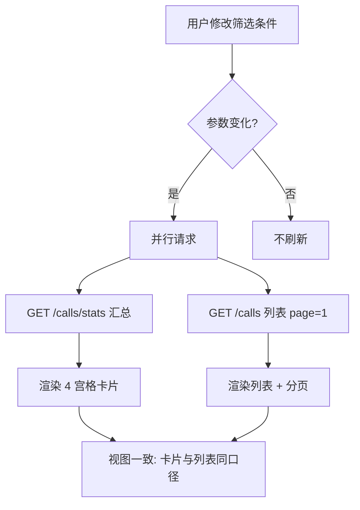

# 增量 PRD：调用记录汇总面板（call_stats_panel）

> 版本：定稿 v1.0（2026-07-14）
> 项目：shimiaocheng-llm（LLM API 网关）
> 形态：增量开发，增强 Admin 后台，走标准 SOP
> 落盘路径：`docs/prd-call-stats.md`

---

## 〇、决策记录（主理人拍板，用户可推翻）

| # | 议题 | 决议 | 依据 |
|---|------|------|------|
| D1 | 入口形态 | **新增顶层「调用记录」Tab** | 代码现状无独立 Tab（记录在用户管理内 per-user 子区块），"全部用户 + 全局汇总"只能此方式落地 |
| D2 | 折合费用口径 | **折合调用次数 = `SUM(effective_calls)`，不做货币化** | 库内无单价，货币化需额外数据源；折合次数口径清晰、可复现，后续可扩展 |
| D3 | 汇总范围 | 始终基于"全量筛选结果"（忽略分页），卡片注明"基于当前筛选 N 条" | 见第四节 P2-3 |
| D4 | 字段名 | 以代码为准：`provider_id` / `status_code`（整型） | 任务书误写为 `provider` / `status` |
| D5 | 存储时区 | `created_at` 由 `time.Now().Format(RFC3339)` 写入（服务器本地时区）；查询与展示统一按 **Asia/Shanghai** 处理 | 见第六节 / 第九节 |
| D6 | 展示时区 | 仅本页（调用记录）统一 Asia/Shanghai，不动全站其他页面 | 最小影响面 |
| D7 | 上游下拉来源 | 取自 `GET /api/providers`（真实 slug），不写死 | 见第四节 P0-3 |
| D8 | 模型过滤形式 | 下拉（`SELECT DISTINCT model FROM call_logs`）+ 允许手输 | 见第四节 P0-3 |

---

## 一、项目信息

| 项 | 内容 |
|---|---|
| Language | 中文 |
| 技术栈 | **Go 1.22（后端）+ 原生 HTML/CSS/JS（Admin 后台，无框架，嵌入二进制）** |
| 原始需求 | 在 Admin 支持按 用户 / 时间 / 上游 组合筛选调用记录，筛选后展示 4 项汇总卡片（调用次数、Token 用量、折合费用、成功率）；第一期纯数字卡片，不做图表 / CSV 导出 |
| 本次范围 | 增量增强：新增全局调用记录列表 + 聚合接口 + 筛选条 + 汇总卡片（含新顶层 Tab） |

## 二、现状描述（已读代码）

**数据结构（`internal/models/call_log.go` + `internal/db/migrations.go`）**
- `call_logs` 已落库字段：`id, user_id, model`(真实模型名), `provider_id`, `prompt_tokens, completion_tokens, total_tokens, effective_calls, multiplier_used, status_code`(整型), `latency_ms, error_msg, created_at`(TEXT/RFC3339)。
- admin 看真实模型名（如 astron-code-latest）。
- 现有索引仅 2 个单列：`idx_call_logs_user_id`、`idx_call_logs_created_at`。**无复合索引**。

**后端（`internal/admin/calls.go` + `internal/admin/handler.go`）**
- 现有调用记录接口仅 **`GET /admin/api/users/{id}/calls`**（外部 `/m-7xa2/api/users/{id}/calls`），由 `GetUserCalls` 处理。
- 该接口仅支持 `from / to / page / limit`；底层 `models.QueryCallLogs` 只按 `user_id + 时间 + 分页` 查询，**不支持 provider/model 过滤、不支持聚合**。
- **不存在全局调用记录列表接口，也不存在任何 stats 聚合接口**。唯一聚合是 `GetDashboardOverview`（仅 total/today，无筛选）。

**前端（`web/admin/index.html` + `web/admin/app.js`）**
- 调用记录是「用户管理」Tab 内 per-user 子区块（`#calls-section`，由 `viewCalls()` / `loadCalls()` 渲染），必须点开某用户才看得到。
- 列表列：ID / 模型 / Token / 消耗次数 / 倍率 / 状态码 / 延迟 / 时间；分页 limit=20。
- `formatDate()` 用浏览器本地时区；`created_at` 写入用 `time.Now().Format(time.RFC3339)`（服务器本地时区）。

## 三、产品目标
> 让管理员在**单一视图**内按 用户 / 时间 / 上游 组合筛选调用记录，并即时看到稳定的聚合汇总，替代"逐用户点开 + 人工心算"。

价值：① 运营/财务快速评估用户用量、成本与上游健康度；② 汇总基于已落库聚合字段，零回溯历史倍率规则，口径可复现；③ 为后续图表/导出预留结构化聚合接口。

## 四、用户故事
1. **运营管理员**：按「用户 + 近 7 天 + 指定上游」筛选，快速评估某用户在某上游的用量与成功率。
2. **财务/决策者**：看全量折合调用次数与 Token 总消耗，评估成本与资源占用。
3. **运维**：按时间区间查看成功率与 4xx/5xx 次数，定位异常时段。
4. **管理员**：切换任一筛选条件后汇总卡片与列表联动刷新，始终看到与当前筛选一致的口径。
5. **未来分析者**：聚合接口返回结构化指标，后续接图表/导出时无需改动后端聚合逻辑。

## 五、需求池

### P0（必须）
- **P0-1 全局列表接口**：新增 `GET /admin/api/calls`（外部 `/m-7xa2/api/calls`），参数 `user_id`(可选,0/空=全部)、`provider_id`(可选)、`model`(可选)、`from`、`to`(RFC3339)、`page`、`limit`；返回 `{ data: [CallLog], pagination }`，复用现有 `CallLog` 结构。
- **P0-2 聚合接口**：新增 `GET /admin/api/calls/stats`，**相同筛选参数**，返回 4 项汇总（口径见第六节）；汇总基于**全量筛选结果**（忽略 page/limit）。
- **P0-3 筛选条（前端，新顶层 Tab 内）**：
  - 用户：下拉（全部用户 + `GET /api/users` 列表）
  - 时间区间：今天 / 近 7 天 / 近 30 天 / 自定义起止（时区 Asia/Shanghai）
  - 上游：`provider_id` 下拉（取自 `GET /api/providers` 真实 slug）
  - 模型：真实模型名下拉（`SELECT DISTINCT model FROM call_logs`）+ 允许手输
- **P0-4 汇总卡片（4 宫格）**：① 调用次数 ② Token 用量（输入/输出/总）③ 折合调用次数 ④ 成功率（2xx 占比 + 4xx/5xx 次数）。
- **P0-5 联动刷新**：切换任一筛选条件 → 并行请求 `stats` + `calls`，卡片与列表同步刷新；列表沿用分页（limit 默认 20）。
- **P0-6 空数据态**：无结果时 4 卡片显示 `0` / `-`，列表显示"暂无调用记录"。
- **P0-7 新增顶层 Tab**：在 Admin 导航新增「调用记录」Tab（与 Dashboard/用户管理/上游/映射/路由/倍率/审计并列），点击进入即展示筛选条 + 汇总卡片 + 全局列表。

### P1（应该）
- **P1-1 时区正确的筛选边界**：时间边界以 Asia/Shanghai 语义计算，查询前转换为与 `created_at` 一致的存储时区做字符串比较；禁止沿用 overview 的 `time.Now().Format("2006-01-02")` 本地日期匹配。
- **P1-2 时区统一展示**：前端 `created_at` 统一按 Asia/Shanghai 渲染（现状为浏览器本地），本页内保证与筛选语义一致。
- **P1-3 自定义区间边界**：起 = 选定开始日 `00:00:00` SH，止 = 结束日 `23:59:59.999` SH（或 now）；提供日期（含可选时间）选择器。
- **P1-4 筛选持久化**：切换 Tab / 刷新后保留当前筛选（参考 dashboard 的 `location.hash`，可用 hash 或 sessionStorage）。
- **P1-5 性能**：`stats` 走聚合 SQL（`COUNT/SUM`）；筛选/聚合必须命中索引（见第七节）。

### P2（可选，预留）
- **P2-1 图表预留**：`stats` 接口可扩展返回按天分桶时间序列，便于未来绘图。
- **P2-2 导出预留**：`calls` 接口支持 `export=1`（返回全量不限页）或独立 `/calls/export`，为未来 CSV 铺路。
- **P2-3 一致性标注**：卡片注明"基于当前筛选 N 条"，明确汇总与分页无关。
- **P2-4 模型索引**：若 `model` 过滤频繁，补充 `(model, created_at)` 索引。

## 六、聚合口径与数据定义（明确、可测试）

| 指标 | 计算口径（作用于筛选后的全量集） |
|---|---|
| 调用次数 | `COUNT(*)` |
| Token 用量 | `SUM(prompt_tokens)` 输入、`SUM(completion_tokens)` 输出、`SUM(total_tokens)` 总 |
| 折合调用次数 | `SUM(effective_calls)`（落库值，无需回溯倍率） |
| 成功率 | 成功 = `status_code >= 200 AND status_code < 300`；`success_rate = 成功数 / COUNT(*) * 100%`；错误次数 = `COUNT(status_code >= 400)` |

`stats` 响应结构：
```json
{
  "total_calls": 1234,
  "tokens": { "prompt": 100000, "completion": 200000, "total": 300000 },
  "effective_calls": 1500,
  "success": { "success_count": 1200, "error_count": 34, "success_rate": 97.2 }
}
```

## 七、非功能需求（索引 / 性能）
- 新增复合索引（迁移幂等，参考现有 `PRAGMA table_info` 检测模式）：
  - `idx_call_logs_user_created ON call_logs(user_id, created_at)`
  - `idx_call_logs_provider_created ON call_logs(provider_id, created_at)`
- 保留现有 `idx_call_logs_created_at`（支撑仅按时间/上游的全量筛选）。
- `stats` 必须走聚合 SQL；目标：100 万行内单查询 < 500ms。

## 八、UI 设计稿

### ASCII 布局（新增「调用记录」顶层 Tab）
```
┌─ 导航 ─────────────────────────────────────────────────────────────┐
│ Dashboard │ 用户管理 │ 上游 │ 映射 │ 路由 │ 倍率 │ 审计 │ 【调用记录】★ │
└────────────────────────────────────────────────────────────────────┘

┌─ 筛选条 ───────────────────────────────────────────────────────────┐
│ 用户:[全部用户▾]  时间:[今天▾|近7天|近30天|自定义 起__ 止__]          │
│ 上游:[zhipu▾]  模型:[astron-code-latest▾]   [查询][重置]              │
└────────────────────────────────────────────────────────────────────┘

┌─ 汇总卡片（4 宫格）────────────────────────────────────────────────┐
│ ┌─调用次数────┐ ┌─Token 用量─────────┐ ┌─折合调用次数─┐ ┌─成功率──────┐ │
│ │ 1,234      │ │ 输入 100K          │ │ 1,500 次    │ │ 97.2%       │ │
│ │            │ │ 输出 200K          │ │             │ │ 成功1200    │ │
│ │            │ │ 总计 300K          │ │             │ │ 错误 34     │ │
│ └────────────┘ └───────────────────┘ └─────────────┘ └────────────┘ │
│ (基于当前筛选 1,234 条)                                              │
└────────────────────────────────────────────────────────────────────┘

┌─ 调用记录列表 ─────────────────────────────────────────────────────┐
│ ID | 模型 | Token | 消耗次数 | 倍率 | 状态码 | 延迟 | 时间(SH) | 上游 │
│ ...（沿用现有列 + 上游列，时间按 Asia/Shanghai 展示）                 │
│ [上一页] 第 1 / 62 页（共 1,234 条）[下一页]                         │
└────────────────────────────────────────────────────────────────────┘
```

### Mermaid 交互流（筛选 → 联动刷新）


## 九、待确认问题（已闭环，列此备查）
1. **入口形态** → 决议 D1：新增顶层「调用记录」Tab。
2. **折合费用口径** → 决议 D2：`SUM(effective_calls)` 折合调用次数，货币化预留。
3. **汇总范围** → 决议 D3：全量筛选结果，卡片注明条数。
4. **字段名** → 决议 D4：以代码为准（provider_id / status_code 整型）。
5. **存储时区** → 决议 D5/D6：统一 Asia/Shanghai；实现时工程师需确认服务器运行时时区并正确换算 SH 边界（参考 `internal/timeutil.ShanghaiTZ`）。
6. **展示时区** → 决议 D6：仅本页 SH。
7. **上游下拉来源** → 决议 D7：取自 `GET /api/providers`。
8. **模型过滤形式** → 决议 D8：下拉 + 手输。

---

> 本 PRD 已对齐 `/Users/changjiedu/Desktop/home/projects/魔力转` 现有代码；若架构/实现阶段发现新差异，由架构师在增量设计中标注并回主理人。
