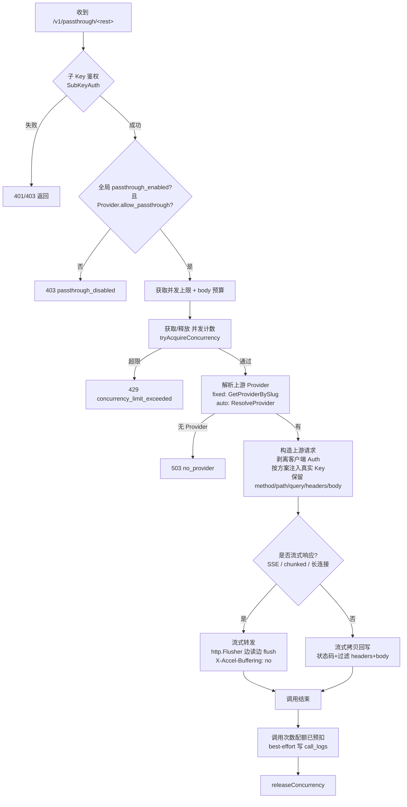

# 增量 PRD：统一中转任意上游 MCP / 任意路径（含鉴权、配额、藏 Key）

| 项 | 内容 |
|---|---|
| 关联项目 | LLM API Gateway（Go 1.22 / SQLite / nginx 前置） |
| 文档类型 | 增量 PRD（仅描述本次变更，非完整产品文档） |
| 作者 | Alice（Product Manager） |
| 状态 | Draft（§7 八项决策已由架构师拍板，可进工程） |
| 关联文件 | `internal/proxy/handler.go`、`internal/proxy/upstream.go`、`internal/proxy/stream.go`、`internal/auth/middleware.go`、`internal/router/*`、`internal/provider/store.go`、`internal/models/provider.go`、`main.go`、`web/admin/*`、`config.yaml.example` |
| 关联设计 | `docs/design-mcp-passthrough.md`（架构师增量设计，与本文档 §7 决策一一对应） |

---

## 1. 产品目标（一句话）

在现有「仅代理 `/v1/chat/completions` 固定路径、强制改写上游路径、强制解析 chat JSON」的能力之外，新增一个**统一通配透传端点**，将任意 HTTP 方法 / 任意子路径**原样中转**到已解析的上游 Provider（含 MCP Streamable HTTP / SSE），并复用现有**子 Key 鉴权、并发上限、调用次数配额**，同时**隐藏上游真实 Key**（藏 Key）。

---

## 2. 变更点概述（对比现有能力）

| 维度 | 现有能力（`proxy.Handler`） | 本次变更（`passthrough` 端点） |
|---|---|---|
| 代理路径 | 仅 `POST /v1/chat/completions`，且强制改写上游为 `…/chat/completions` | 新增通配前缀（默认 `/v1/passthrough/`），**原样保留**上游子路径与 query，`GET/POST/PUT/PATCH/DELETE` 均可 |
| 请求体处理 | 强制 `json.Unmarshal` 为 `ChatCompletionRequest`、归一化 content、按 body budget 压缩 | **不解析、不改写**：仅按 body 上限做滥用防护（MaxBytesReader），原样流式转发 |
| 上游路径/模型改写 | `rewriteBodyModel` 强制改写 `model` 字段 | **无**字段改写，原样透传 |
| 鉴权 | `authMW.SubKeyAuth`（子 Key → userID/routeMode/fixedProvider） | 复用同一中间件，子 Key 不落上游 |
| 藏 Key | `BuildUpstreamRequest` 硬编码 `Authorization: Bearer <realKey>` | 剥离客户端 `Authorization`/`X-Api-Key`，按 Provider 认证方案注入真实 Key（默认 Bearer，支持 x-api-key 等，**P0 同版提供**，见 §5-P0/P1-13） |
| 配额 | 调用次数原子预扣 + 并发上限（内存计数器） + Token 记账 | 复用调用次数预扣 + 并发上限；**每 HTTP 请求扣 1 次**（P0），Token 记账 best-effort（P2） |
| 响应 | sync 全读后回写 / stream 按 SSE 逐行改写 model | **通用流式转发**：无论是否 SSE，均边读边 flush 回客户端（支持 MCP SSE） |
| MCP 支持 | 无 | 通配 + 流式转发天然支持 MCP（JSON-RPC over HTTP/SSE） |

---

## 3. 透传判定 / 转发流程

**关键约束**
- 上游 Key 只在构造上游请求时注入，**绝不**出现在日志或错误体。
- 客户端断开（`r.Context().Done()`）立即中止上游读取，释放并发计数。
- 上游不可达 → 502 `upstream_error`；上游返回 4xx/5xx → **原样转发**状态码与 body（不包装）。
- 请求体超过 body 上限（默认 32MB 天花板）→ 413（沿用现有文案）。

---

## 4. 用户故事

**US-1 终端用户用 MCP 客户端经网关调用上游 MCP 服务**
> As a user with a sub-key, I want to point my MCP client (e.g. Cursor / Claude Desktop / MCP Inspector) at `https://gw/v1/passthrough/` with my sub-key so that the gateway forwards MCP traffic verbatim to the configured upstream MCP server, with streaming (SSE) support, so I never touch the upstream's real credential.

**US-2 管理员开启通配透传并隐藏上游 Key**
> As an admin, I want to enable passthrough per-provider (and globally), configure the provider's auth scheme, so that end-users only ever hold sub-keys while the gateway injects the real upstream key for every forwarded request.

**US-3 用户配额与并发被统一管控**
> As a user, my passthrough calls consume the same call-count quota and concurrency cap as chat calls, so there is one unified governance surface and I get the same 429 behaviour when exhausted.

**US-4 任意路径 / 任意方法的内部工具转发**
> As a developer, I want to forward arbitrary non-MCP HTTP paths (e.g. `/v1/embeddings`, `/v1/audio/*`, custom endpoints) through the same authenticated, key-hiding gateway without per-endpoint code changes.

---

## 5. 需求池

### P0（Must）
| # | 需求 | 说明 |
|---|---|---|
| 1 | 新增通配端点 | `main.go` 注册 `mux.Handle("/v1/passthrough/", authMW.SubKeyAuth(passthroughHandler))`；handler 按 `r.Method` 派发，子路径 = `strings.TrimPrefix(r.URL.Path, "/v1/passthrough")` |
| 2 | 原样路径/方法/query 转发 | 上游 URL = `trimSuffix(provider.Endpoint, "/") + subPath + "?" + r.URL.RawQuery`；`subPath` 为去掉 `/v1/passthrough` 前缀后的剩余路径（含前导 `/`）。**运维约定**：passthrough 以 `provider.endpoint` 作为 base 直接拼接，**不新增 `passthrough_base_url` 字段**；因 chat 路由的 endpoint 形态为「不含 `/chat/completions` 的基址（运行时由 `BuildUpstreamRequest` 追加）」，为避免冲突，**用于 passthrough / MCP 的 provider 应独立新建**，其 `endpoint` 直接填上游 base URL（如 `https://api.anthropic.com`），保留 `GET/POST/PUT/PATCH/DELETE` 等原方法 |
| 3 | 复用子 Key 鉴权 | 复用 `authMW.SubKeyAuth`，从 context 取 userID / routeMode / fixedProvider / maxBodySize / maxConcurrency |
| 4 | 并发上限复用 | 复用 `tryAcquireConcurrency` / `releaseConcurrency`（defer 释放），超限返回 429（沿用 `concurrency_limit_exceeded`） |
| 5 | body 上限防护 | 用 `http.MaxBytesReader` 限制请求体（沿用 `models.MaxBodySizeCeiling` 32MB 天花板），超限 413；**不做** compaction / 不做 JSON 归一化 |
| 6 | Provider 解析复用 | 复用 `Router`：`fixed` 模式 `GetProviderBySlug(fixedProvider)`；`auto` 模式 `ResolveProvider(now)`；无 Provider → 503 `no_provider` |
| 7 | 藏 Key（默认方案） | 剥离客户端 `Authorization` 与 `X-Api-Key`；注入 `Authorization: Bearer <prov.APIKey>`（默认）；绝不记录 Key |
| 8 | 通用流式转发 | 构造上游请求后用 `io.Copy` + `http.Flusher` 边读边 flush 回客户端；对 `text/event-stream` / chunked 设置 `X-Accel-Buffering: no`；检测 `r.Context().Done()` 中止；上游超时复用（流式 10min / 同步 300s） |
| 9 | 调用次数配额 | `CheckAndDeduct(userID, effectiveCalls)`，P0 每 HTTP 请求计 1 次基准，`effectiveCalls = ceil(multiplier)`（倍率向上取整，与 chat 一致）；超限返回 429（沿用 `quota_exceeded` / `token_quota_exceeded` 文案） |
| 10 | 响应透传 | 回写上游状态码、过滤 hop-by-hop 头（`Connection`/`Keep-Alive`/`Proxy-*`/`Te`/`Trailers`/`Upgrade`/`Transfer-Encoding`）后转发 body；上游 4xx/5xx 原样转发 |
| 11 | 安全开关 | 全局 `config.yaml` `proxy.passthrough_enabled`（默认 false）+ 每 Provider `allow_passthrough`（默认 false）二者皆真才放行，否则 403 `passthrough_disabled` |
| 12 | 调用日志 | 复用 `models.InsertCallLog`：因 P0 的 `call_logs` 暂无 method/path 专用列，临时将 `Model` 字段存为 `"<METHOD> <subPath>"`（如 `POST /mcp`）以便观测，后续 P2-18 再加专用列；其余记录 providerID、status、latency、effectiveCalls、multiplier；Token 字段留 0（best-effort 见 P2） |

### P1（Should）
| # | 需求 | 说明 |
|---|---|---|
| 13 | 每 Provider 认证方案（**P0 同版上线**） | Provider 新增 `auth_header`（默认 `Authorization`）、`auth_scheme`（默认 `bearer`）、`extra_headers`（JSON map，如 Anthropic 的 `anthropic-version`）字段；注入时按方案构造（如 `x-api-key: <key>`）。**决策**：为满足 MCP/Anthropic 共存，认证方案与 P0 首发**同版交付**（不推迟到后续迭代） |
| 14 | Admin 管理 UI | Provider 编辑表单新增「允许通配透传」开关 + 认证方案字段；列表展示 `allow_passthrough` |
| 15 | 全局开关 UI / 配置 | `config.yaml.example` 标注 `proxy.passthrough_enabled`；Admin 设置面板（可选）提供开关 |
| 16 | 请求头白名单策略 | 明确「除 hop-by-hop 与客户端认证头外，其余请求头原样转发」；对 `Host` 头按上游重写（避免上游 400） |

### P2（Nice to have）
| # | 需求 | 说明 |
|---|---|---|
| 17 | MCP 用量可观测 | 解析 JSON-RPC 响应，best-effort 抽取 token 用量写入 `call_logs` / 计入 Token 配额；或按 JSON-RPC batch 内 method 数扣减调用次数（替代 P0 的「每请求 1 次」） |
| 18 | 用户自助面板 | `/v1/calls` 增加 method/path 维度展示；面板区分 passthrough 调用 |
| 19 | 细粒度方法限制 | 可配置仅允许 `GET` / `POST`（默认放开常用方法），降低误用风险 |
| 20 | 审计日志 | Provider `allow_passthrough` / 认证方案变更写入 `audit_logs`（与现有 route/multiplier 审计一致） |

---

## 6. UI 变更点

### 6.1 Admin 后台（`web/admin/`）
- **Provider 编辑弹窗**：新增
  - 「允许通配透传」开关（checkbox，默认关）；
  - 「认证头字段」`auth_header`（默认 `Authorization`）；
  - 「认证方案」`auth_scheme`（下拉：`bearer` / `x-api-key` / `none`）；
  - 「额外静态请求头」`extra_headers`（key-value 列表，如 `anthropic-version: 2023-06-01`）。
  - 提交 body 增加上述字段。
- **Provider 列表**：新增「透传」列（✓/✗）。
- **校验**：`allow_passthrough` 开启时，若上游端点非 MCP/透传用途，给出提示但不强阻。

### 6.2 User 自助面板（`web/user/`）
- P2：在「调用记录」中增加 method / path 维度，区分 passthrough 调用（复用 `/v1/calls`）。

---

## 7. 决策记录（原 §7 待确认问题，已由架构师拍板）

> 以下 8 项已由架构师 Bob 在增量设计阶段（docs/design-mcp-passthrough.md）默认拍板，PRD 据此可直接进工程，无需再回抛用户。

1. **Q1 上游端点形态（拍板）**：P0 以 `provider.endpoint` 作为 base 直接拼接子路径（`trimSuffix(endpoint, "/") + subPath`），**不新增 `passthrough_base_url` 字段**（最小集）。**运维约定**：用于 passthrough / MCP 的 provider 应**独立新建**（endpoint 填 base URL，如 `https://api.anthropic.com`），避免与 chat 路由 endpoint 形态（不含 `/chat/completions`、运行时由 `BuildUpstreamRequest` 追加）冲突。→ 已回填 §2、§5-P0-2。
2. **Q2 认证方案（拍板）**：按 P1-13 落实 `auth_header`/`auth_scheme`/`extra_headers` 三列，且 **P1 与 P0 同版上线**（满足 MCP/Anthropic 共存）。→ 已回填 §2、§5-P1-13。
3. **Q3 配额计量（拍板）**：P0「每 HTTP 请求扣 1 次基准 × 倍率」，`effectiveCalls = ceil(multiplier)`。→ 已回填 §5-P0-9。
4. **Q4 用户维度开关（拍板）**：P0 不加，依赖子 Key 鉴权 + 全局/Provider 双开关。
5. **Q5 方法范围（拍板）**：P0 放开 `GET/POST/PUT/PATCH/DELETE`（子树路由天然匹配任意 method）。
6. **Q6 超时（拍板）**：复用同步 300s / 流式 10min；MCP `GET /sse` 长连接可能超限，P2 改为可配置。
7. **Q7 Host 头（拍板）**：转发时**不拷贝**客户端 Host，交由 Go `http.Client` 按上游 URL 自动重写。
8. **Q8 响应头（拍板）**：流式时删 `Content-Length` 转 chunked、删 `Transfer-Encoding`，剔除 hop-by-hop 头。
- **附加约定（call_logs 观测）**：P0 的 `call_logs` 暂无 method/path 列，临时将 `Model` 字段存为 `"<METHOD> <subPath>"`（如 `POST /mcp`）以便观测，P2-18 再加专用列。→ 已回填 §5-P0-12。

---

## 8. 影响面 / 回归提示（给架构师）

- **新增文件**
  - `internal/proxy/passthrough.go`：通配透传 Handler（含 `ServeHTTP` 派发、`buildPassthroughRequest`、`streamCopy` 流式转发）。
  - 可复用 `internal/proxy/upstream.go` 中 `BuildUpstreamRequest` 思路，但需**新写**支持任意 method/path/auth 方案的构造器（不要复用「强制追加 /chat/completions + 硬编码 Bearer」的逻辑）。
- **修改文件**
  - `main.go`：注册 `mux.Handle("/v1/passthrough/", authMW.SubKeyAuth(passthroughHandler))`；构造 `passthroughHandler` 并注入 `QuotaChecker` / `MultiplierEng` / `Router`（与现有 `proxyHandler` 共用实例或新建）。
  - `internal/models/provider.go`：`ProviderRecord` 增加 `AllowPassthrough bool`、`AuthHeader string`、`AuthScheme string`、`ExtraHeaders string`（JSON）；`ProviderWithMaskedKey` 同步。
  - `internal/db/migrations.go`：ALTER providers 表加上述列 + 默认值。
  - `internal/provider/store.go`：SeedFromConfig / 读写新列（config.yaml 增加对应用例）。
  - `internal/config/config.go` + `config.yaml.example`：增加 `Proxy.PassthroughEnabled`。
  - `internal/admin/providers.go`：编辑表单读取/写入新字段 + 校验。
  - `web/admin/*`：Provider 编辑 UI 新增字段（见 §6.1）。
- **复用点（务必复用，勿重复造轮子）**
  - 鉴权：`authMW.SubKeyAuth`、`auth.GetUserID/GetRouteMode/GetFixedProvider/GetMaxBodySize/GetMaxConcurrency`。
  - 并发：`proxy.tryAcquireConcurrency` / `proxy.releaseConcurrency`（包级函数/变量）。
  - 配额：`quota.Checker.CheckAndDeduct`、`quota.MultiplierEngine.GetEffectiveMultiplier` / `GetFixedMultiplier`。
  - 路由：`router.Router.GetProviderBySlug` / `ResolveProvider`。
  - 日志：`models.InsertCallLog`。
  - 流式 flush 模式参考 `internal/proxy/stream.go` 的 `http.Flusher` 用法（但**不要**做 SSE 行解析 / model 改写）。
- **回归风险**
  - 现有 `/v1/chat/completions` 行为**完全不变**（独立 Handler）。
  - 新增端点默认关闭（`passthrough_enabled=false` 且 `allow_passthrough=false`），不影响存量部署。
- **安全要点（最高优先级）**
  - 通配透传 = 潜在 SSRF / 开放代理面，必须：`passthrough_enabled` + `allow_passthrough` 双开关默认关；剥离客户端认证头；**绝不**回显上游 Key；body/并发上限沿用现有防护；建议 P2 增加方法白名单。
- **性能**
  - 流式转发用 `io.Copy` + Flusher，避免全量读内存；长连接占用 worker 由上游超时与并发上限兜底。
- **测试建议**
  - 参考 `internal/proxy/handler_route_test.go` / `handler_test.go` 风格，新增：① 通配路径原样转发；② 藏 Key（断言上游收到 Bearer 真实 Key、未收到子 Key）；③ 流式 SSE 透传正确性；④ 配额/并发拦截；⑤ 开关关闭返回 403；⑥ 上游 4xx/5xx 原样转发。
