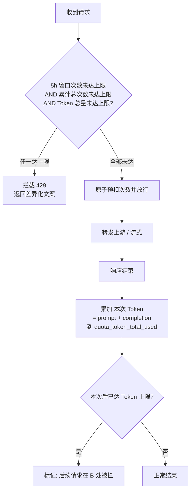

# 增量 PRD：用户 Token 总量上限

| 项 | 内容 |
|---|---|
| 关联项目 | LLM API Gateway（Go 1.22 / SQLite / nginx 前置） |
| 文档类型 | 增量 PRD（仅描述本次变更，非完整产品文档） |
| 作者 | 许清楚（Product Manager） |
| 状态 | Draft，待架构师评审 |
| 关联文件 | `internal/models/quota.go`、`internal/db/migrations.go`、`internal/proxy/handler.go`、`internal/proxy/stream.go`、`internal/admin/users.go`、`internal/handler/quota.go`、`web/admin/*`、`web/user/*` |

---

## 1. 产品目标（一句话）

在现有「调用次数配额」之上，新增**用户级「累计 Token 总量上限」**作为第三个独立限额维度，与次数限额呈 **OR 关系**——任一到达即拦截后续请求（上限可设为 0 表示不限制），以支撑按量成本管控。

---

## 2. 变更点概述（对比现有能力）

| 维度 | 现有能力 | 本次变更 |
|---|---|---|
| 限额维度 | 5h 窗口次数（AND）+ 累计总次数 | 新增「累计 Token 总量上限」（第 3 维度，与次数维度 OR） |
| 作用对象 | 用户（子 Key 归属用户） | 不变，仍以 user 为单位 |
| 记账时机 | 次数：请求前原子预扣 | Token：请求后累加（sync + 流式均覆盖） |
| 计量参与 | Token 仅统计不参与限额 | Token 计数参与限额判定 |
| 拦截触发 | 次数达上限 → 拦 | 次数达上限 **或** Token 达上限 → 拦 |
| 0 值语义 | 无 | token 上限 = 0 → 不限制（存量兼容） |
| 超限误差 | 无（预扣精确） | 单条超大请求可能少量超出，之后必拦（已与用户确认接受） |

---

## 3. 拦截判定逻辑

**判定要点**
- 三个维度在**请求前**统一判定：`5h`、`total`、`token` 任一达上限即拦；其中 `5h` 与 `total` 仍保持原有 AND（嵌入原子 `UPDATE` 的 `WHERE`）。
- `token` 为**请求后累加**，下一次请求前的判定读取该计数，因此「达上限」在下一请求生效，符合用户确认的 OR + 后记账模型。

---

## 4. 用户故事

**US-1 管理员配置 Token 上限**
> As an admin, I want to set each user's `token_total_limit` (0 = unlimited) when creating or editing a user, so that I can cap their cumulative token consumption.

**US-2 普通用户被 Token 上限拦截**
> As a user, when my cumulative tokens reach the cap, I want a clear 429 with a token-specific message and to see my token usage/limit in the self-service panel, so I understand why calls stop.

**US-3 存量用户向后兼容**
> As an admin, existing users should default to `token_total_limit = 0` (unlimited) with historical token usage backfilled, so the change does not disrupt active users.

**US-4 子 Key 透明计入**
> As a user with a sub-key, my sub-key's token usage accrues to the same user-level token cap, so there is one unified limit.

---

## 5. 需求池（仅变更相关）

### P0（Must）
| # | 需求 | 说明 |
|---|---|---|
| 1 | 数据层新增字段 | `quotas` 表加 `quota_token_total_limit`（默认 0 = 不限制）、`quota_token_total_used`（默认 0）；存量行回填 `used = SUM(prompt_tokens + completion_tokens)`（来自 `call_logs`） |
| 2 | 请求后记账 | sync（`handleSync` 结尾）与 stream（`handleStream` 结尾）响应结束后，将本次 `prompt_tokens + completion_tokens` 累加到 `quota_token_total_used`（用户级，含子 Key 归属） |
| 3 | 请求前拦截 | 扩展现有原子预扣的 `WHERE`，加入 Token 维度：`token_total_limit = 0 OR token_total_used < token_total_limit`；任一次数/Token 维度达上限即返回 429 |
| 4 | 0 = 不限制 | `token_total_limit = 0` 时跳过该维度判定，行为完全等同于现状 |
| 5 | Admin API | 创建/编辑用户支持 `quota_token_total_limit`；列表与详情返回 token 上限与用量 |
| 6 | /v1/quota 接口 | 返回 `quota_token_total_limit` 与 `quota_token_total_used` |

### P1（Should）
| # | 需求 | 说明 |
|---|---|---|
| 7 | 拦截差异文案 | 区分「次数超限」与「Token 超限」的 429 `type`（如 `token_quota_exceeded`），便于面板/客户端提示 |
| 8 | Admin 列表列 | 新增/调整「Token 用量 / 上限」列（上限 0 显示「无限」），可带进度色 |
| 9 | User 自助面板 | 新增「Token 总量」进度条（used / limit；limit = 0 显示「无限」并隐藏进度条） |

### P2（Nice to have）
| # | 需求 | 说明 |
|---|---|---|
| 10 | 全局默认 token 上限 | 后台配置项，作为新建用户默认值（当前默认 0） |
| 11 | 审计日志 | token 上限变更写入 `audit_logs`（与现有 route/multiplier 审计一致） |

---

## 6. UI 变更点

### 6.1 Admin 后台（`web/admin/`）
- **用户列表**：在现有「累计 Token」列（现展示 `call_logs` 求和）改为展示 `token_total_used / token_total_limit`；上限为 0 时显示「无限」。
- **新建用户弹窗**：新增字段「Token 总量上限」（number，默认 0，占位提示「0 = 不限制」）；提交 body 增加 `quota_token_total_limit`。
- **编辑用户弹窗**：新增同名字段并回填当前值；提交时纳入 `quota_token_total_limit`（保留现有「仅传非空即更新」语义）。
- **校验**：仅允许非负整数；0 合法（表示不限制）。

### 6.2 User 自助面板（`web/user/`）
- **配额概览**：在「总配额」进度条下方新增「Token 总量」行 + 进度条，展示 `token_total_used / token_total_limit`；上限 0 时显示「无限」并隐藏进度条。
- 复用 `/v1/quota` 新增字段，无需新增接口。

---

## 7. 待确认问题（需用户 / 架构师拍板）

1. **子 Key 是否独立限 Token？** 本次按「仅用户级」实现（子 Key 计入所属用户）。是否需下放到子 Key 独立限额？（建议：否，与次数限额一致）
2. **拦截 HTTP 状态码与文案？** 建议沿用 **429**；`type` 是否区分 `quota_exceeded`（次数）vs `token_quota_exceeded`（Token）？文案建议「Token 额度已用尽」。
3. **存量数据回填口径？** 回填 `quota_token_total_used` 用 `SUM(prompt_tokens + completion_tokens)`（与本次口径一致）还是 `SUM(total_tokens)`（上游返回，可能含额外计费项）？（建议前者）
4. **Token 上限低于当前已用量时？** 管理员把上限设得低于已用量 → 下次请求立即被拦（自洽，视为收紧）。是否允许此操作？（建议允许）
5. **计数口径统一？** 请求后累加采用 `prompt + completion`（来自 `call_logs` 已存字段）；与 `/v1/quota` 现 `total_tokens`（call_logs 求和）可能不完全相等，是否以 `quotas.token_total_used` 作为唯一口径？（建议是）
6. **是否需要全局默认 token 上限配置项？**（对应 P2-10）

---

## 8. 影响面 / 回归提示（给架构师）

- **涉及文件**
  - `internal/models/quota.go`：`Quota` / `QuotaStatus` struct、SQL（GetQuota、AtomicDeductQuota、UpdateQuotaLimits、CreateUser 默认值）
  - `internal/db/migrations.go`：ALTER 加两列 + 存量回填
  - `internal/quota/checker.go`：`CheckAvailability` 同步返回 token 剩余（如被前端/预检使用）
  - `internal/proxy/handler.go`：`handleSync` 结尾记账 + 拦截分支文案
  - `internal/proxy/stream.go`：`handleStream` 结尾记账（或复用 `Manager.ConfirmStream` 预留空钩子）
  - `internal/admin/users.go`：`createUserRequest` / `updateUserRequest` / 响应体 / `ListUsers`
  - `internal/models/user.go`：`CreateUser`、`ListUsers`
  - `internal/handler/quota.go`：`QuotaStatus` 组装
  - `web/admin/app.js` + `index.html`、`web/user/index.html`
- **回归风险**：现有次数限额行为完全不变；仅新增第三维度且默认 0 不触发，影响面可控。
- **性能**：扩展 `AtomicDeductQuota` 的 `WHERE` 需命中 `user_id` 唯一索引，避免全表扫描；token 累加为轻量 `UPDATE ... SET used = used + ?`（`user_id` 主键命中）。
- **注意**：`Manager.ConfirmStream(userID, totalTokens)` 当前为 no-op 且签名已含 token，可作为流式记账的统一挂点，建议与 `handleStream` 直接记账二选一，避免重复累加。
