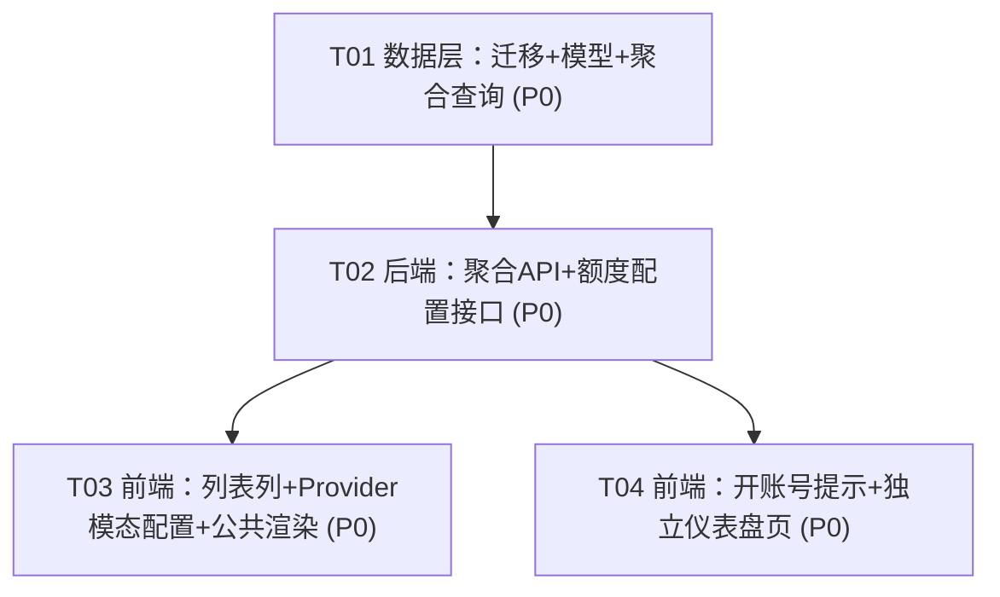

# 系统架构设计 + 任务分解：上游 Provider 月度额度可见性

> 作者：高见远（software-architect）
> 基于：产品经理许清楚输出的已确认 PRD（4 项用户决策 + P0/P1 功能池）
> 代码事实：已阅读 `internal/models/provider.go`、`internal/db/migrations.go`、`internal/models/call_log.go`、`internal/models/user.go`、`internal/provider/store.go`、`internal/admin/handler.go`、`internal/admin/providers.go`、`main.go`、`web/admin/{index.html,app.js,style.css}`

---

## Part A：系统设计

### 1. 实现方案 + 框架选型

**结论：不引入任何新框架。纯 Go（标准库 `net/http` + `database/sql`）+ 嵌入式静态前端（原生 HTML/JS/CSS，零前端框架），与现有代码风格 100% 一致。**

**技术难点与选型理由**

| 难点 | 方案 | 理由 |
|------|------|------|
| 滚动 30 天聚合 | 实时 SQL `SUM` 聚合 + 复合索引 `(provider_id, created_at)`（已存在 `idx_call_logs_provider_created`） | 现有 `call_logs` 已建该索引；PRD 默认假设"不预聚合/不缓存"，实时聚合响应达标；零新增依赖 |
| 窗口口径（now-30d，非自然月） | `windowStart = now-30*24h` 在 `Asia/Shanghai` 计算为 RFC3339，`created_at >= ?` 文本比较 | `created_at` 全库统一存为 SH RFC3339（见 `call_log.go` D10 注释），同格式文本比较=时间序，与现有 `QueryCallLogs` 一致 |
| 双口径（token 总量 + 调用次数） | 同一聚合语句 `SUM(prompt_tokens+completion_tokens)` 与 `SUM(effective_calls)` | 一次 `GROUP BY provider_id` 同时算出两口径，单查询 |
| 三处展示 | 单批量端点 `GET /api/provider-usage` 复用于列表与仪表盘；单 provider 端点 `GET /api/providers/{slug}/usage` 用于开账号表单 | 后端即单一真相源，前端只渲染 |
| 低余额仅提醒不拦截 | 后端算 `token_low`/`call_low` 布尔，前端仅标红 CSS class | 单一判定逻辑，三处统一；不触碰写操作 |

**架构模式**：沿用现有分层 —— `models`（数据+查询）/ `provider.ProviderStore`（加密 CRUD）/ `admin.Handler`（HTTP 路由与聚合端点）/ 嵌入式 `web/admin`（前端渲染）。新增聚合逻辑放 `models` 查询层，HTTP 端点放 `admin` 包，遵循现有 `call_log.go` 聚合风格。

---

### 2. 文件列表（新增 / 修改）

**新增文件**
- `internal/models/provider_usage.go` — 聚合查询函数、用量视图结构、低余额判定、窗口起点计算
- `internal/admin/provider_usage.go` — 两个 admin API 端点 + 仪表盘页 serving 方法

**修改文件**
- `internal/db/migrations.go` — `providers` 表幂等新增 `monthly_token_limit` / `monthly_call_limit` 两列
- `internal/models/provider.go` — `ProviderRecord` 与 `ProviderWithMaskedKey` 增加两字段
- `internal/provider/store.go` — `ListProviders`/`GetProvider`/`CreateProvider`/`UpdateProvider`/`BuildMaskedProviders`/`SeedFromConfig` 读写新字段
- `internal/admin/handler.go` — 注册 3 条新路由（2 个 API + 1 个页面）
- `internal/admin/providers.go` — `createProviderRequest`/`updateProviderRequest` 增加额度字段；`HandleCreateProvider`/`HandleUpdateProvider` 透传
- `web/admin/index.html` — 上游列表加 2 列；上游模态加 2 个额度输入；用户模态加"上游剩余额度"提示块；侧栏加"上游额度"导航；新增仪表盘 tab section
- `web/admin/app.js` — `loadProviders` 合并用量渲染 2 列；provider 模态收发额度；`fetchProviderUsage`；`loadProviderUsage`；`formatToken`；fixed_provider 实时提示
- `web/admin/style.css` — 低余额标红 class、用量卡片/进度条样式

（另输出 `docs/class-diagram.mermaid`、`docs/sequence-diagram.mermaid` 供 Engineer 直接引用。）

---

### 3. 数据结构与接口

#### 3.1 DB Schema（增量迁移，幂等）

`providers` 表新增两列（在 `RunMigrations` 末尾、`Passthrough` 段落之后追加）：

```sql
-- 0 = 不限制 / 无限
ALTER TABLE providers ADD COLUMN monthly_token_limit INTEGER NOT NULL DEFAULT 0;
ALTER TABLE providers ADD COLUMN monthly_call_limit  INTEGER NOT NULL DEFAULT 0;
```

守卫方式：复用现有 `columnExists(conn, "providers", "monthly_token_limit")` 判断，缺失才 ALTER。两列均为 `INTEGER`（token 可能上亿，SQLite INTEGER 为 64 位，足够；Go 侧用 `int64`）。

#### 3.2 Go 模型（`internal/models/provider.go` 增量）

```go
// ProviderRecord 增加：
MonthlyTokenLimit int64 `json:"monthly_token_limit"` // 0 = 无限
MonthlyCallLimit  int64 `json:"monthly_call_limit"`  // 0 = 无限

// ProviderWithMaskedKey 同步增加同样两字段（列表 API 返回用）
```

#### 3.3 聚合查询与视图（`internal/models/provider_usage.go` 新增）

```go
package models

import (
    "database/sql"
    "time"
    "llm_api_gateway/internal/timeutil"
)

// LowBalanceRatio 默认低余额阈值：剩余 < 10% 即标红（全局统一，token/次数共用）。
const LowBalanceRatio = 0.9

// RollingWindowStart 返回滚动窗口起点：now-30*24h，按 Asia/Shanghai 渲染为 RFC3339。
// 与 call_logs.created_at 同格式，可直接文本比较。
func RollingWindowStart() string {
    return time.Now().Add(-30 * 24 * time.Hour).In(timeutil.ShanghaiTZ).Format(time.RFC3339)
}

// ProviderMonthlyUsage 单 provider 滚动窗口内的原始聚合（已用）。
type ProviderMonthlyUsage struct {
    Slug      string `json:"slug"`
    TokenUsed int64  `json:"token_used"`
    CallUsed  int64  `json:"call_used"`
}

// AggregateProviderUsage 一次性 GROUP BY 聚合所有 provider 的窗口内用量。
// 返回 map[slug]*ProviderMonthlyUsage；窗口内无调用的 provider 不在 map 中（前端按 0 处理）。
func AggregateProviderUsage(db *sql.DB, windowStart string) (map[string]*ProviderMonthlyUsage, error)

// GetProviderUsage 单 provider 窗口内用量（开账号表单实时提示用）。
func GetProviderUsage(db *sql.DB, slug, windowStart string) (*ProviderMonthlyUsage, error)

// ProviderUsageView 面向前端的完整视图（已算好剩余/无限/低余额）。
type ProviderUsageView struct {
    Slug              string `json:"slug"`
    Name              string `json:"name"`
    MonthlyTokenLimit int64  `json:"monthly_token_limit"` // 0 = 无限
    MonthlyCallLimit  int64  `json:"monthly_call_limit"`  // 0 = 无限
    TokenUsed         int64  `json:"token_used"`
    TokenRemaining    int64  `json:"token_remaining"`   // 无限时为 -1；超限时可能为负
    TokenUnlimited    bool   `json:"token_unlimited"`
    CallUsed          int64  `json:"call_used"`
    CallRemaining     int64  `json:"call_remaining"`
    CallUnlimited     bool   `json:"call_unlimited"`
    WindowStart       string `json:"window_start"` // SH RFC3339
    TokenLow          bool   `json:"token_low"`    // 剩余 < 10% 标红
    CallLow           bool   `json:"call_low"`
}

// IsLowBalance 低余额判定（单一真相源）：无限(limit==0)永不标红；否则 used/limit >= LowBalanceRatio。
func IsLowBalance(used, limit int64) bool {
    if limit <= 0 { return false }
    return float64(used)/float64(limit) >= LowBalanceRatio
}

// BuildProviderUsageView 由 provider 记录 + 原始用量 + 窗口起点合成视图。
// 空 provider：used=0，remaining=limit（无限时 -1）。
func BuildProviderUsageView(p ProviderRecord, used *ProviderMonthlyUsage, windowStart string) ProviderUsageView
```

**聚合 SQL（批量）**
```sql
SELECT provider_id,
       COALESCE(SUM(prompt_tokens + completion_tokens), 0) AS token_used,
       COALESCE(SUM(effective_calls), 0)                    AS call_used
FROM call_logs
WHERE created_at >= ?
GROUP BY provider_id;
```
**聚合 SQL（单 provider）**
```sql
SELECT COALESCE(SUM(prompt_tokens + completion_tokens), 0),
       COALESCE(SUM(effective_calls), 0)
FROM call_logs
WHERE provider_id = ? AND created_at >= ?;
```

#### 3.4 Admin API（`internal/admin/provider_usage.go` 新增）

```go
// GET /admin/api/provider-usage
// 返回 { "data": [ ProviderUsageView, ... ] }，覆盖全部 provider（含无限/空用量）。
func (h *Handler) HandleListProviderUsage(w http.ResponseWriter, r *http.Request)

// GET /admin/api/providers/{slug}/usage
// 返回 { "data": ProviderUsageView }；provider 不存在返回 404 { "error": "..." }。
func (h *Handler) HandleGetProviderUsage(w http.ResponseWriter, r *http.Request)

// GET /admin/provider-usage
// 复用 index.html（SPA），注入 window.__INIT_TAB__='provider-usage' 后返回，作为可直链的独立仪表盘页。
func (h *Handler) ServeProviderUsagePage(w http.ResponseWriter, r *http.Request)
```

#### 3.5 Provider 额度配置接口（修改 `internal/admin/providers.go`）

```go
type createProviderRequest struct {
    // ... 现有字段 ...
    MonthlyTokenLimit int64 `json:"monthly_token_limit"` // 0 = 无限，默认 0
    MonthlyCallLimit  int64 `json:"monthly_call_limit"`  // 0 = 无限，默认 0
}
type updateProviderRequest struct {
    // ... 现有字段 ...
    MonthlyTokenLimit *int64 `json:"monthly_token_limit"`
    MonthlyCallLimit  *int64 `json:"monthly_call_limit"`
}
```
`HandleCreateProvider` 透传两字段（0 合法）；`HandleUpdateProvider` 仅在非 nil 时写入 `updates` map。

#### 3.6 前端数据结构（JS，约定字段名与后端 JSON 一致）

- `ProviderUsageView`（同后端字段）：开账号表单实时提示块与仪表盘卡片直接消费。
- 上游列表行：`providerMap[slug]` + 并行拉取的 usage map 按 slug 合并。

---

### 4. 程序调用流程（Mermaid 时序图）

见 `docs/sequence-diagram.mermaid`（完整源码），三个核心流程：列表加载、开账号切换 provider、仪表盘加载。

---

### 5. 待明确事项（PRD 待确认 + 我的默认假设）

**需用户拍板（P2 范围外但建议尽早定）**
1. 阈值是否要可配置（全局 / per-provider / token 与次数分别）？—— 本次默认 **全局统一 10%**，token 与次数共用，per-provider 阈值留 P2。
2. 双口径是否允许"只配其一"？—— PRD 决策 1 已确认"可只配其一，未配=无限"，按此实现（另一条维度 `limit=0` ⇒ 无限）。
3. 超限（已用 > 上限）时是否展示负数剩余？—— 本次**展示真实负值并标红**（仅可见性，不拦截），不做归零。

**我的默认假设（已在设计中落实，如不符请指出）**
- 低余额阈值 = 剩余 < 10%（`LowBalanceRatio = 0.9`），全局共用。
- 独立仪表盘路由 = `/m-7xa2/provider-usage`（内部 `/admin/provider-usage`）。
- 窗口 = 严格 `now - 30*24h` 滑动；实时 SQL 聚合，无预聚合/无缓存。
- 提醒形式 = 仅界面标红，不含通知/邮件。
- 单位：token 用 `K/M/亿` 缩写（<1e3 原值；<1e6 → K；<1e8 → M；≥1e8 → 亿）；次数千分位（`toLocaleString`）。
- 粒度：仅 provider 级，不做 model 细分。
- Provider 额度可在"新增/编辑上游"模态配置（满足 P0-1 "后台可配置"）。

---

## Part B：任务分解

### 6. 依赖包列表

**无新增第三方依赖。** 沿用现有 `modernc.org/sqlite`、`golang.org/x/crypto`；聚合与路由均用标准库 + 现有包。`go.mod` 不变。

---

### 7. 任务列表（按实现顺序，依赖链 ≤ 2 层）

> 规则适配说明：本任务为**存量 Go 项目**（非新建 React 应用），无新建配置文件/入口/依赖可放"T01 基础设施"。故"基础设施"任务适配为**数据层与迁移**——它是后续所有任务的根依赖，等价于模板中的 T01。

#### T01 ｜ 数据层：DB 迁移 + Provider 模型字段 + 聚合查询 【P0】
- **源文件**：`internal/db/migrations.go`、`internal/models/provider.go`、`internal/models/provider_usage.go`（新）、`internal/provider/store.go`
- **依赖**：无
- **要点**：
  - 迁移：`providers` 表幂等新增 `monthly_token_limit`/`monthly_call_limit`（`columnExists` 守卫，DEFAULT 0）。
  - 模型：`ProviderRecord` + `ProviderWithMaskedKey` 增加两 `int64` 字段（json 含 `monthly_*_limit`）。
  - 新增 `provider_usage.go`：`RollingWindowStart`、`AggregateProviderUsage`、`GetProviderUsage`、`IsLowBalance`、`BuildProviderUsageView`、`ProviderUsageView`。
  - `store.go`：`ListProviders`/`GetProvider` SELECT+Scan 加两列；`CreateProvider` 签名加两参数并写入；`UpdateProvider` 支持 `monthly_token_limit`/`monthly_call_limit` 动态更新；`BuildMaskedProviders` 透传；`SeedFromConfig` 写 0。
  - 同步修改 `CreateProvider` 的全部调用方（`providers.go`、`store.go` 内部）及 `internal/provider/*_test.go` 中相关用例，保证 `go build ./...` 与 `go test` 通过。

#### T02 ｜ 后端：聚合 API + Provider 额度配置接口 【P0】
- **源文件**：`internal/admin/provider_usage.go`（新）、`internal/admin/handler.go`、`internal/admin/providers.go`
- **依赖**：T01
- **要点**：
  - 新增 `HandleListProviderUsage`（批量 `GROUP BY` 聚合 + 合并 provider 列表 → `[]ProviderUsageView`）、`HandleGetProviderUsage`（单 slug → `ProviderUsageView`）、`ServeProviderUsagePage`（注入 `window.__INIT_TAB__='provider-usage'` 后返回 `index.html`）。
  - `handler.go` 注册：`GET /api/provider-usage`、`GET /api/providers/{slug}/usage`、`/provider-usage`（页面，置于 `adminMux` 鉴权分支）。
  - `providers.go`：`createProviderRequest`/`updateProviderRequest` 增加额度字段；`HandleCreateProvider`/`HandleUpdateProvider` 透传（0 合法；update 仅非 nil 写入）。
  - 返回统一沿用现有信封 `{ "data": ... }`（**不**用 `{code,data,message}`）。

#### T03 ｜ 前端：上游列表列 + Provider 模态额度配置 + 公共渲染 【P0】
- **源文件**：`web/admin/index.html`、`web/admin/app.js`、`web/admin/style.css`
- **依赖**：T01、T02
- **要点**：
  - `index.html`：上游列表 `<thead>` 加「本月用量(Token)」「本月用量(次数)」两列；Provider 模态加 `monthly_token_limit`/`monthly_call_limit` 两个 `number` 输入（placeholder "0 = 不限制"）。
  - `app.js`：
    - `loadProviders` 内并行 `GET /api/provider-usage`，按 `slug` 合并渲染两列（已用/剩余 + 进度条 + 百分比；无限显示"不限制"；低余额加 `bad`/`low` class）。
    - `saveProvider` 发送两额度字段；`editProvider` 回填；`openProviderModal` 重置为 0。
    - 新增 `formatToken(n)`（K/M/亿 缩写）、`renderUsageCell(used, limit, low)`（进度条+百分比+标红复用 helper）。
  - `style.css`：低余额 `.usage-low`（红色文字）、用量进度条 `.usage-progress`（复用现有 `.token-progress` good/warn/bad 语义）。

#### T04 ｜ 前端：开账号表单实时提示 + 独立额度仪表盘页 【P0】
- **源文件**：`web/admin/index.html`、`web/admin/app.js`、`web/admin/style.css`
- **依赖**：T01、T02
- **要点**：
  - `index.html`：创建/编辑用户模态的 `fixed_provider` 选择框下方加「上游剩余额度」提示块（`<div id="new-provider-usage">` / `<div id="update-provider-usage">`）；侧栏加「上游额度」导航（`data-tab="provider-usage"`）；新增仪表盘 `<section id="tab-provider-usage">`（标题 + 窗口说明 div + `#provider-usage-grid` 卡片容器）。
  - `app.js`：
    - 新增 `fetchProviderUsage(slug)` → `GET /api/providers/{slug}/usage`；创建/编辑模态 `fixed_provider` 的 `change` 事件触发并渲染提示块（未指定显示"未指定/不限制"；低余额标红；**不拦截提交**）。
    - 新增 `loadProviderUsage()`：拉 `GET /api/provider-usage`，渲染每 provider 卡片（token/call 已用/剩余/进度条/百分比/低余额标红 + 窗口起点 + 更新时间）；空 provider 已用=0。
    - `switchTab('provider-usage')`、`VALID_TABS` 增加 `provider-usage`；`DOMContentLoaded` 尊重 `window.__INIT_TAB__`。
  - `style.css`：`.usage-card` 卡片样式。

---

### 8. 共享知识（跨文件约定，供 Engineer 实现时统一）

1. **响应信封**：admin API 沿用现有 `{ "data": ... }`（`writeJSON(w, status, map[string]any{"data": x})`）。列表类包数组、单对象类包对象。**不要**引入 `{code,data,message}`。
2. **低余额判定单一真相源**：`models.IsLowBalance(used, limit)`（无限 limit==0 ⇒ false；`used/limit >= 0.9` ⇒ true）。前端**只读**后端返回的 `token_low`/`call_low` 布尔来标红，不自算阈值。
3. **无限语义**：`limit == 0` ⇒ 无限；视图 `TokenUnlimited/CallUnlimited = true`，`TokenRemaining/CallRemaining = -1`；前端显示"不限制/无限"。
4. **窗口起点**：一律用 `models.RollingWindowStart()`（SH RFC3339），前端不得自行计算窗口；`created_at >= windowStart` 文本比较即可（同格式）。
5. **数字格式化 helper（前端）**：`formatToken(n)`：`<1e3` 原值；`<1e6` → `X.XK`；`<1e8` → `X.XXM`；`≥1e8` → `X.XX亿`（保留至多 2 位小数，去尾零）。次数一律 `.toLocaleString()` 千分位。
6. **进度条 + 标红 CSS 约定**：百分比 `pct = min(100, round(used/limit*100))`；class 取 `pct>80?'bad':pct>50?'warn':'good'`，低余额额外加 `usage-low`（红字）。无限时不渲染进度条，显示"不限制"。
7. **前端调 admin API 取额度**：
   - 列表/仪表盘：`GET api/provider-usage`（相对路径，同 `apiFetch` 现有用法）。
   - 开账号提示：`GET api/providers/<slug>/usage`。
   - 这两个端点均受 `AdminSessionAuthAPI` 保护（`/api/` 前缀自动鉴权），与现有列表 API 一致。
8. **不拦截原则**：开账号表单的额度提示只读展示，任何异常（如请求失败）都**不**阻止表单提交；失败时在提示块显示"获取失败"，不抛错阻断。

---

### 9. 任务依赖图（Mermaid）

见 `docs/sequence-diagram.mermaid` 同目录；依赖关系：T01 → {T02} → {T03, T04}，T03 与 T04 相互独立。


