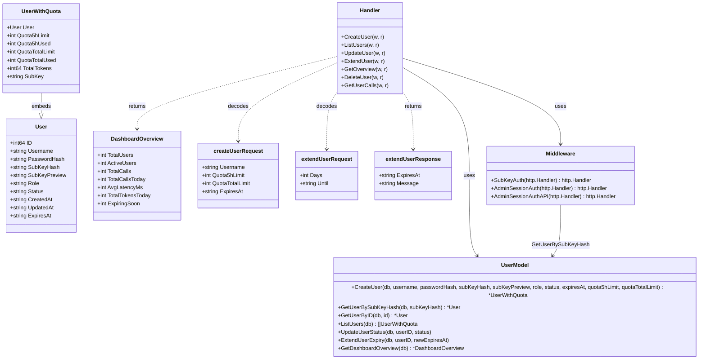
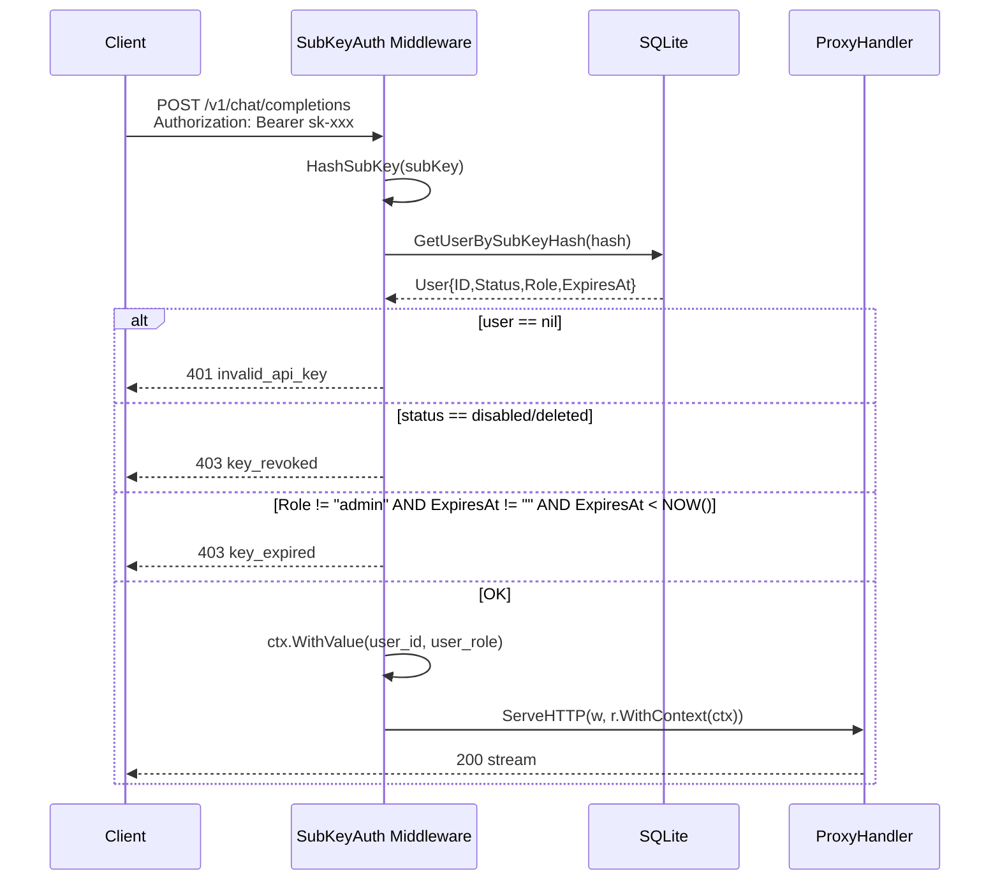
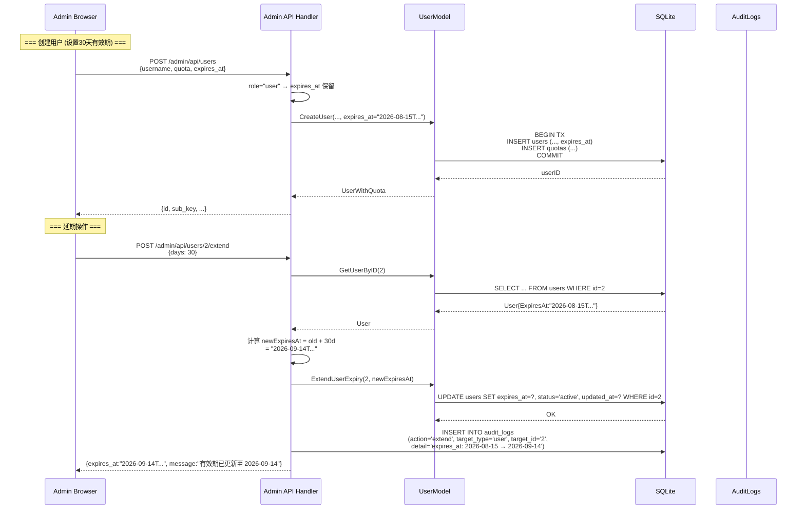
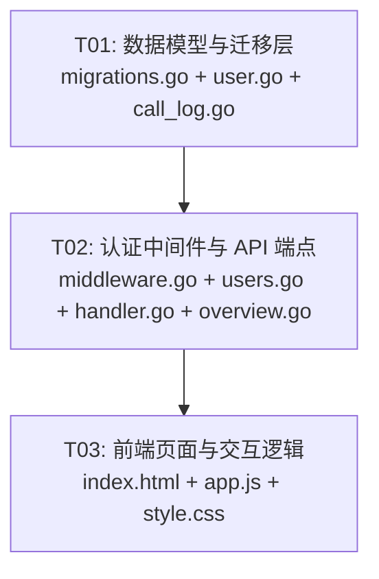

# 系统设计：用户账号有效期管理

| 字段 | 内容 |
|------|------|
| 架构师 | Bob（高见远） |
| 日期 | 2025-07-16 |
| 基于 PRD | `docs/prd-user-expiry.md` |

---

## Part A: 系统设计

### 1. 实现方案

#### 1.1 核心技术挑战

| 挑战 | 分析 |
|------|------|
| **幂等迁移** | SQLite 不支持 `ALTER TABLE ... IF NOT EXISTS`，但已有 `columnExists()` 辅助函数，复用即可 |
| **时区一致性** | 已有 `timeutil.ShanghaiTZ` 作为全局时区入口，时间比较必须走 Go `time.Now().In(timeutil.ShanghaiTZ)`，与现有 quota/multiplier 窗口逻辑一致 |
| **Admin 保护** | 两处拦截：(a) 写入时 `role=admin` 强写 NULL；(b) 认证时 `role=admin` 跳过到期检查 |
| **延期即启用** | Q1 决策：延期 API 同时将 status 设为 `active`，覆盖手动停用状态 |
| **前端颜色逻辑** | 纯 Vanilla JS，在 `loadUsers()` 中按 `expires_at` 计算行颜色：过期=红行、7天内=橙字 |

#### 1.2 技术栈与架构

- **后端**：Go 1.22, 零 CGO, SQLite (`modernc.org/sqlite`), 标准库 `net/http` (Go 1.22 路由)
- **前端**：Vanilla HTML/CSS/JS，Go embed 内嵌
- **时间格式**：RFC3339 (`2006-01-02T15:04:05+08:00`)，与现有 `models/user.go` 中 `time.Now().Format(time.RFC3339)` 一致
- **审计日志**：复用已有 `audit_logs` 表，`action="extend"`, `target_type="user"`, `target_id=<userID>`

#### 1.3 模块改动清单

```
internal/db/migrations.go     → +1 ALTER TABLE (idempotent)
internal/models/user.go       → +ExpiresAt 字段，所有 query/scan 更新，+ExtendUserExpiry()
internal/models/call_log.go   → DashboardOverview +ExpiringSoon
internal/auth/middleware.go   → SubKeyAuth +expiry check
internal/admin/users.go       → CreateUser +expires_at，+ExtendUser handler
internal/admin/handler.go     → +route POST /api/users/{id}/extend
internal/admin/overview.go    → +expiring_soon_count (P1)
web/admin/index.html          → 创建弹窗 +有效期选择，延期弹窗，表头 +有效期列
web/admin/app.js              → createUser/loadUsers/extendUser 更新
web/admin/style.css           → +过期行红色、即将到期橙色样式 (P1)
```

---

### 2. 文件列表

```
internal/db/migrations.go          # 修改：ALTER TABLE users ADD COLUMN expires_at TEXT
internal/models/user.go            # 修改：User.ExpiresAt, 全部查询, ExtendUserExpiry()
internal/models/call_log.go        # 修改：DashboardOverview +ExpiringSoon, GetDashboardOverview()
internal/auth/middleware.go        # 修改：SubKeyAuth() 插入 expires_at 检查
internal/admin/users.go            # 修改：CreateUser(), +ExtendUser()
internal/admin/handler.go          # 修改：RegisterRoutes() +extend 路由
internal/admin/overview.go         # 修改：GetOverview() +expiring_soon_count (P1)
web/admin/index.html               # 修改：创建弹窗 +有效期UI，延期弹窗，表头
web/admin/app.js                   # 修改：createUser(), loadUsers(), +extendUser(), loadOverview()
web/admin/style.css                # 修改：+过期/即将到期行样式 (P1)
```

---

### 3. 数据结构与接口



#### 3.1 API 契约

**POST /admin/api/users** (修改)
```
Request:  {"username":"alice","quota_5h_limit":100,"quota_total_limit":10000,"expires_at":"2026-01-15T00:00:00+08:00"}
Response: {"id":1,"username":"alice","sub_key":"sk-...","sub_key_preview":"sk-a1...","quota_5h_limit":100,...}
```
- `expires_at`：可选，RFC3339 格式；不传/空串 → NULL（永久）
- 若 `role=admin` → 忽略 expires_at，强制 NULL

**POST /admin/api/users/{id}/extend** (新增)
```
Request:  {"days": 30}           ← 在当前到期时间上 +N 天
Request:  {"until": "2026-02-15T00:00:00+08:00"}  ← 直接设置
Response: {"expires_at":"2026-02-14T17:30:00+08:00","message":"有效期已更新至 2026-02-14"}
```
- `days` 和 `until` 互斥；如当前为永久 → `days` 基于 `NOW()` 计算
- 自动将 status 设为 `active`（Q1：延期即启用）
- 写入 audit_logs：`action=extend, target_type=user, target_id=<id>, detail="expires_at: ... → ..."`
- 若 `role=admin` → 拒绝（admin 永不过期，无需延期）

**GET /admin/api/users** (修改)
```
Response: {"data":[{"id":1,"username":"alice",...,"expires_at":"2026-01-15T00:00:00+08:00"},...]}
```
- 返回每个用户的 `expires_at` 字段（NULL 时 JSON 为 `null`）

**403 错误响应格式**（auth 中间件 — 新增 code）
```json
{"error":{"message":"API key has expired","type":"key_expired","code":"key_expired"}}
```

---

### 4. 程序调用流

#### 4.1 API 请求过期拦截



#### 4.2 管理员创建用户（含有效期）+ 延期



---

### 5. 待明确事项

无。所有 6 项决策已锁定：

| Q | 决策 | 实现方式 |
|---|------|---------|
| Q1 | 手动启用覆盖到期 | `ExtendUserExpiry()` 同时 `SET status='active'` |
| Q2 | 无需二次确认 | 前端弹窗内一次确认，无额外 confirm() |
| Q3 | 过期 quota 保留 | 无需任何操作 — 当前架构无过期清理逻辑 |
| Q4 | /user/ 自助面板 | P1 范围，本期不涉及 |
| Q5 | 服务器时间 `time.Now().In(timeutil.ShanghaiTZ)` | 与 `timeutil` 包一致 |
| Q6 | 子 Key 不清理 | 无需任何操作 — 过期仅 auth 拦截 |

---

## Part B: 任务分解

### 6. 所需依赖包

无新增第三方依赖。所有功能基于现有标准库 + `modernc.org/sqlite`。

---

### 7. 任务列表

| Task ID | 任务名称 | 源文件 | 依赖 | 优先级 |
|---------|---------|--------|------|--------|
| **T01** | 数据模型与迁移层 | `internal/db/migrations.go`, `internal/models/user.go`, `internal/models/call_log.go` | 无 | P0 |
| **T02** | 认证中间件与 API 端点 | `internal/auth/middleware.go`, `internal/admin/users.go`, `internal/admin/handler.go`, `internal/admin/overview.go` | T01 | P0 |
| **T03** | 前端页面与交互逻辑 | `web/admin/index.html`, `web/admin/app.js`, `web/admin/style.css` | T02 | P0 |

#### T01 详情：数据模型与迁移层

**范围**：
- `migrations.go`：在 `RunMigrations()` 末尾添加 `ALTER TABLE users ADD COLUMN expires_at TEXT`（通过 `columnExists` 保证幂等）
- `user.go`：
  - `User` struct 新增 `ExpiresAt string \`json:"expires_at"\``
  - `GetUserBySubKeyHash()` — SQL 增加 `u.expires_at`，Scan 增加 `&u.ExpiresAt`
  - `GetUserByID()` — 同上
  - `GetUserByUsername()` — 同上
  - `ListUsers()` — SQL 增加 `u.expires_at`，Scan 增加 `&uwq.ExpiresAt`（注意 `UserWithQuota` 的 ExpiresAt 从嵌入 User 继承）
  - `CreateUser()` — 签名增加 `expiresAt string`，INSERT 增加 `expires_at` 列；若 `role="admin"` 强写空串→NULL
  - 新增 `ExtendUserExpiry(db *sql.DB, userID int64, newExpiresAt string) error` — `UPDATE users SET expires_at=?, status='active', updated_at=? WHERE id=?`
- `call_log.go`：
  - `DashboardOverview` struct 新增 `ExpiringSoon int \`json:"expiring_soon"\``
  - `GetDashboardOverview()` 增加查询：`SELECT COUNT(*) FROM users WHERE expires_at IS NOT NULL AND expires_at >= ? AND expires_at < ?`（now ~ now+7d），使用 `time.Now().In(timeutil.ShanghaiTZ)` 计算边界

**产出物**：编译通过且现有测试不回归。

#### T02 详情：认证中间件与 API 端点

**范围**：
- `middleware.go`：在 `SubKeyAuth()` 第 72 行之后、context 注入之前插入过期检查：
  ```go
  if user.Role != "admin" && user.ExpiresAt != "" {
      expiresAt, err := time.Parse(time.RFC3339, user.ExpiresAt)
      if err == nil && time.Now().In(timeutil.ShanghaiTZ).After(expiresAt) {
          writeAuthError(w, http.StatusForbidden, "API key has expired", "key_expired")
          return
      }
  }
  ```
  需增加 `"time"` 和 `"llm_api_gateway/internal/timeutil"` 导入
- `users.go`：
  - `createUserRequest` 新增 `ExpiresAt string \`json:"expires_at"\``
  - `CreateUser()` — 传入 `req.ExpiresAt` 给 `models.CreateUser()`
  - 新增 `extendUserRequest` struct：`Days int \`json:"days"\`` + `Until string \`json:"until"\``
  - 新增 `ExtendUser()` handler — 完整实现延期逻辑：
    1. 解析 `{id}` → int64
    2. `models.GetUserByID(h.DB, userID)` → 校验存在
    3. 若 `user.Role == "admin"` → 400 `"Admin users do not expire"`
    4. 解析 body → `extendUserRequest`
    5. 计算 `newExpiresAt`：
       - `until` 非空 → 直接使用
       - `days > 0` → 基于当前 `expires_at`（若为空则用 `NOW()`）+ days
       - 均无效 → 400
    6. `models.ExtendUserExpiry(h.DB, userID, newExpiresAt)`
    7. 写入 `audit_logs`（直接 `h.DB.Exec` SQL，action=extend, target_type=user, target_id=userID, detail=描述）
    8. 返回 `{"expires_at": newExpiresAt, "message": "..."}`
- `handler.go`：`RegisterRoutes()` 中注册 `adminMux.HandleFunc("POST /api/users/{id}/extend", h.ExtendUser)`
- `overview.go`：`GetOverview()` 中 response 的 `expiring_soon` 字段已由 T01 的 `GetDashboardOverview()` 自动填充，前端在 T03 展示

**产出物**：API 端点可用，`make ci` 通过。

#### T03 详情：前端页面与交互逻辑

**范围**：
- `index.html`：
  - **创建用户弹窗**（`#create-user-modal`）：在配额输入之后、提交按钮之前，增加"有效期"下拉 + 日期选择器：
    ```html
    <div class="form-group">
      <label for="new-expiry-type">有效期</label>
      <select id="new-expiry-type">
        <option value="permanent">永久</option>
        <option value="7">7天</option>
        <option value="30">30天</option>
        <option value="custom">自定义日期</option>
      </select>
    </div>
    <div class="form-group" id="new-expiry-date-group" style="display:none">
      <label for="new-expiry-date">到期日期</label>
      <input type="date" id="new-expiry-date">
    </div>
    ```
  - **延期弹窗**（新增 `#extend-user-modal`）：参考 PRD 4.3 设计，含当前到期显示、延期方式 radio（+7天/+30天/自定义日期）、日期选择器、预览行、确认/取消按钮
  - **用户表格**：表头 `<th>有效期</th>` 插入在"Token"之后、"状态"之前（即原第7列位置），colspan 从 9 改为 10
- `app.js`：
  - `createUser()`：读取 `#new-expiry-type` → 计算 `expires_at`（7天/30天→`new Date(Date.now()+N*864e7).toISOString()`；自定义→`#new-expiry-date` 值；永久→不传），加入 request body
  - `loadUsers()`：渲染 `expires_at` 列（格式 `yyyy-MM-dd` 或"永久"）；按 `expires_at < now` → 整行 `class="row-expired"`；`expires_at` 在 7 天内 → 有效期文字 `class="text-warning"`（橙色）
  - 新增 `extendUser(id, username, currentExpiry)` → 打开延期弹窗，填充当前到期信息
  - 新增 `submitExtend()` → 调 `POST /admin/api/users/{id}/extend` → 成功后刷新列表 + toast
  - `loadOverview()`：展示 `data.expiring_soon` 统计卡片
  - 新增 `#new-expiry-type` 的 change 事件 → 选"自定义"时展示日期选择器
  - 延期弹窗 radio change 事件 → 实时更新预览日期
- `style.css`：新增样式：
  ```css
  .row-expired td { color: #dc2626; }
  .text-warning { color: #ea580c; font-weight: 500; }
  ```

**产出物**：前端交互完整，创建/延期/列表过期标记均可用。

---

### 8. 共享约定

```
- 时间格式：统一使用 RFC3339 (time.RFC3339)，即 "2006-01-02T15:04:05+08:00"
- 时区：所有服务器时间比较使用 time.Now().In(timeutil.ShanghaiTZ)
- NULL 语义：expires_at = "" (Go) / NULL (SQLite) = 永久有效
- 403 code：key_expired（与现有 key_revoked 平级，均在 error.code 和 error.type 中返回）
- Admin 保护：两处 — 写入时 role=admin 强写 NULL；认证时 role=admin 跳过检查
- 延期即启用：ExtendUserExpiry 同时 SET status='active'（Q1 决策）
- 审计日志格式：action="extend", target_type="user", target_id=<userID>, detail="expires_at: <old> → <new>"
- 前端日期计算：使用客户端 Date 对象（用户本地时间），传给后端的是 ISO 8601/RFC3339 字符串
- 现有测试：T01/T02 完成后必须 make ci 通过，不引入回归
```

---

### 9. 任务依赖图


