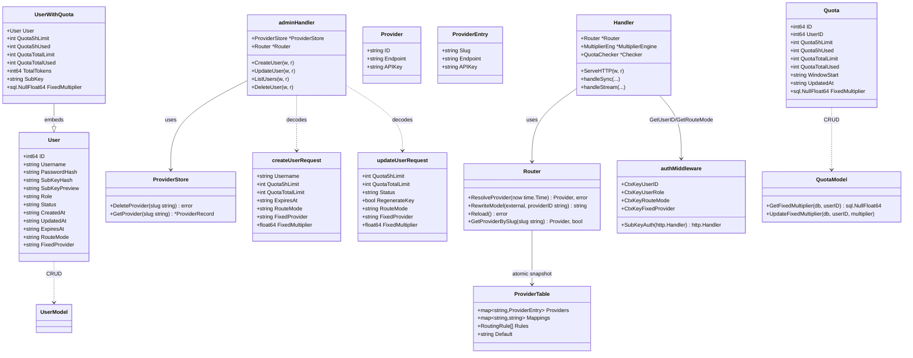
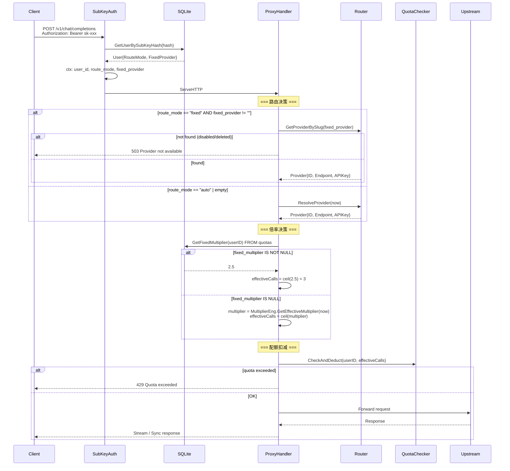
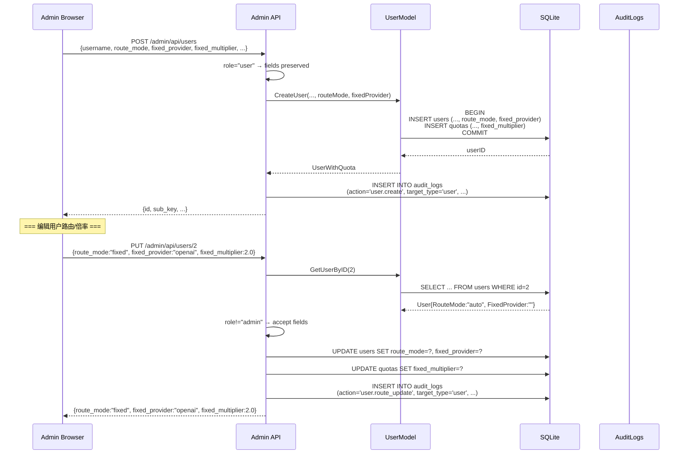
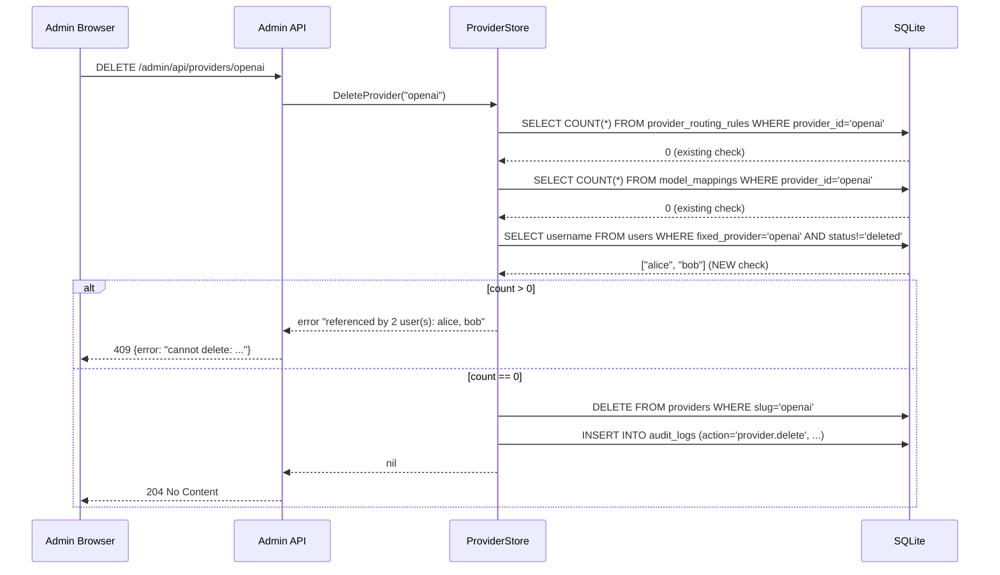
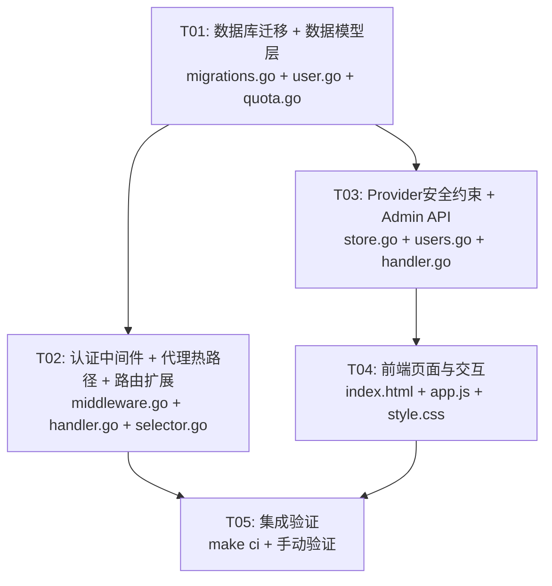

# 系统设计：用户路由模式与倍率解耦

| 字段 | 内容 |
|------|------|
| 架构师 | Bob（高见远） |
| 日期 | 2025-07-13 |
| 基于 | PRD: 用户路由模式与倍率解耦 |

---

## Part A: 系统设计

### 1. 实现方案

#### 1.1 核心技术挑战

| 挑战 | 分析 |
|------|------|
| **热路径零额外 DB 查询** | `route_mode` / `fixed_provider` 由中间件在认证时从 User 表一并加载并注入 context；`fixed_multiplier` 需额外查 quotas 表（1次索引查询，可接受） |
| **Router 快照即权限检查** | `ProviderTable.Providers` 仅含 `enabled=1` 的上游 —— 禁用/删除的 provider 天然不在快照中，`GetProviderBySlug` 返回 false → 503 |
| **Admin 强制约束** | 写入时 `role=admin` → `route_mode='auto'` + `fixed_provider=''`；读取时不校验 `fixed_multiplier` |
| **Provider 删除保护** | `DeleteProvider` 新增检查：`SELECT username FROM users WHERE fixed_provider=?`，有结果则阻止并列出用户名 |
| **幂等迁移** | 复用已有 `columnExists()` 辅助函数，3 条 ALTER TABLE 均 idempotent |

#### 1.2 技术栈与架构

- **后端**：Go 1.22, 零 CGO, SQLite (`modernc.org/sqlite`), 标准库 `net/http` (Go 1.22 路由)
- **前端**：Vanilla HTML/CSS/JS，Go embed 内嵌
- **路由决策**：`proxy.Handler.ServeHTTP` 中新增 "fixed" 分支，绕过 `Router.ResolveProvider`
- **倍率决策**：`ServeHTTP` 中优先检查 `fixed_multiplier`，为 NULL 时回退 `MultiplierEng.GetEffectiveMultiplier`
- **审计日志**：复用已有 `audit_logs` 表，`action="user.route_update"`, `target_type="user"`

#### 1.3 模块改动清单

```
internal/db/migrations.go        → +3 ALTER TABLE (idempotent via columnExists)
internal/models/user.go          → User +RouteMode/+FixedProvider, 全部 query/scan, +GetUsersByFixedProvider()
internal/models/quota.go         → Quota +FixedMultiplier, +GetFixedMultiplier()
internal/auth/middleware.go      → SubKeyAuth 注入 route_mode/fixed_provider 到 context
internal/proxy/handler.go        → ServeHTTP: fixed 路由分支 + fixed 倍率分支
internal/router/selector.go      → +GetProviderBySlug() 公开方法
internal/provider/store.go       → DeleteProvider: 检查 fixed 用户引用
internal/admin/users.go          → Create/Update 请求结构体 + 处理逻辑 + audit 写入
internal/admin/handler.go        → RegisterRoutes 无需新增路由（复用现有 PUT /api/users/{id}）
web/admin/index.html             → 创建/编辑弹窗增加路由模式、固定上游、倍率字段
web/admin/app.js                 → createUser/loadUsers/editUser/updateUser 更新
web/admin/style.css              → 无需大改（复用现有样式体系）
```

---

### 2. 文件列表

```
internal/db/migrations.go          # 修改：ALTER TABLE users +route_mode, +fixed_provider; ALTER TABLE quotas +fixed_multiplier
internal/models/user.go            # 修改：User struct +RouteMode/FixedProvider, 全部 SQL query/scan 更新, +GetUsersByFixedProvider()
internal/models/quota.go           # 修改：Quota struct +FixedMultiplier, +GetFixedMultiplier()
internal/auth/middleware.go        # 修改：SubKeyAuth 注入 CtxKeyRouteMode/CtxKeyFixedProvider, GetUserBySubKeyHash SQL 增加 route_mode/fixed_provider
internal/proxy/handler.go          # 修改：ServeHTTP 增加 fixed 路由分支 + fixed 倍率分支
internal/router/selector.go        # 修改：+GetProviderBySlug() 公开方法
internal/provider/store.go         # 修改：DeleteProvider 增加 fixed 用户引用检查
internal/admin/users.go            # 修改：createUserRequest/updateUserRequest 增加新字段, CreateUser/UpdateUser/ListUsers 处理新字段, audit 写入
internal/admin/handler.go          # 无需新增路由（复用现有 PUT /api/users/{id}）
web/admin/index.html               # 修改：创建用户弹窗 + 编辑用户弹窗 增加路由模式/固定上游/倍率
web/admin/app.js                   # 修改：createUser/loadUsers/editUser/updateUser 支持新字段
```

---

### 3. 数据结构与接口



#### 3.1 API 契约

**POST /admin/api/users** (修改)
```json
Request: {
  "username": "alice",
  "quota_5h_limit": 100,
  "quota_total_limit": 10000,
  "expires_at": "2026-01-15T00:00:00+08:00",
  "route_mode": "fixed",
  "fixed_provider": "openai",
  "fixed_multiplier": 2.5
}
```
- `route_mode`: 可选，默认 `"auto"`。若 `role=admin` → 强制 `"auto"`
- `fixed_provider`: 可选，默认 `""`。若 `role=admin` → 强制 `""`
- `fixed_multiplier`: 可选，默认 `null`（走全局倍率）。范围 `0.1~100.0`

**PUT /admin/api/users/{id}** (修改)
```json
Request: {
  "route_mode": "auto",
  "fixed_provider": "",
  "fixed_multiplier": null
}
```
- 新增三个可选字段。若 `role=admin` → route_mode/fixed_provider 忽略

**GET /admin/api/users** (修改)
```json
Response: {
  "data": [{
    "id": 1, "username": "alice", ...,
    "route_mode": "fixed",
    "fixed_provider": "openai",
    "fixed_multiplier": 2.5
  }, ...]
}
```
- `fixed_multiplier` 为 null 时 JSON 序列化为 `null`

**DELETE /admin/api/providers/{slug}** (修改)
```json
Response 409: {
  "error": "cannot delete provider \"openai\": referenced by 2 user(s) as fixed provider: alice, bob"
}
```

**503 错误响应格式**（proxy handler — 新增）
```json
{"error":{"message":"Provider not available","type":"provider_not_available","code":"provider_not_available"}}
```

---

### 4. 程序调用流

#### 4.1 请求主流程（fixed 路由 + fixed 倍率）



#### 4.2 管理员创建用户（含路由模式 + 固定倍率）



#### 4.3 删除 Provider 前检查 fixed 用户引用



---

### 5. 待明确事项

无。所有关键决策已锁定：

| Q | 决策 | 实现方式 |
|---|------|---------|
| Q1 | admin 强制约束 | 写入时 role=admin → route_mode='auto', fixed_provider=''；不校验 fixed_multiplier |
| Q2 | fixed provider 不可用 → 503 | 禁用/删除的 provider 不在 ProviderTable 快照中，`GetProviderBySlug` 返回 false |
| Q3 | 删除 provider 阻止 | `DeleteProvider` 新增 `SELECT username FROM users WHERE fixed_provider=?` 检查 |
| Q4 | 不暴露给自助面板 | /user/ 路由不变，返回数据不含新字段 |
| Q5 | Router 为 nil 时 fixed 路由 | 直接返回 503（fixed 路由依赖 Router 快照） |
| Q6 | fixed_multiplier NULL→全局 | `sql.NullFloat64`，Valid=false 时走 `MultiplierEng.GetEffectiveMultiplier` |

---

## Part B: 任务分解

### 6. 所需依赖包

无新增第三方依赖。`database/sql` 的 `sql.NullFloat64` 已在标准库中。

---

### 7. 任务列表

| Task ID | 任务名称 | 源文件 | 依赖 | 优先级 |
|---------|---------|--------|------|--------|
| **T01** | 数据库迁移 + 数据模型层 | `internal/db/migrations.go`, `internal/models/user.go`, `internal/models/quota.go` | 无 | P0 |
| **T02** | 认证中间件 + 代理热路径 + 路由扩展 | `internal/auth/middleware.go`, `internal/proxy/handler.go`, `internal/router/selector.go` | T01 | P0 |
| **T03** | Provider 安全约束 + Admin API | `internal/provider/store.go`, `internal/admin/users.go`, `internal/admin/handler.go` | T01 | P0 |
| **T04** | 前端页面与交互 | `web/admin/index.html`, `web/admin/app.js`, `web/admin/style.css` | T03 | P0 |
| **T05** | 集成验证 | `make ci` + 手动功能验证 | T02, T03, T04 | P0 |

#### T01 详情：数据库迁移 + 数据模型层

**范围**：

- **`migrations.go`**：在 `RunMigrations()` 末尾（`expires_at` 迁移之后）添加 3 条幂等迁移：
  ```go
  // route_mode (user routing mode: "auto" | "fixed")
  if !columnExists(conn, "users", "route_mode") {
      _, err := conn.Conn.Exec(`ALTER TABLE users ADD COLUMN route_mode TEXT NOT NULL DEFAULT 'auto'`)
  }
  // fixed_provider (target provider slug when route_mode=fixed)
  if !columnExists(conn, "users", "fixed_provider") {
      _, err := conn.Conn.Exec(`ALTER TABLE users ADD COLUMN fixed_provider TEXT NOT NULL DEFAULT ''`)
  }
  // fixed_multiplier (per-user multiplier override, NULL=global)
  if !columnExists(conn, "quotas", "fixed_multiplier") {
      _, err := conn.Conn.Exec(`ALTER TABLE quotas ADD COLUMN fixed_multiplier REAL`)
  }
  ```

- **`user.go`**：
  - `User` struct 新增：
    ```go
    RouteMode     string `json:"route_mode"`     // "auto" | "fixed"
    FixedProvider string `json:"fixed_provider"`  // provider slug
    ```
  - `UserWithQuota` struct 新增：
    ```go
    FixedMultiplier *float64 `json:"fixed_multiplier"` // nil = global
    ```
  - **所有 SQL 查询和 Scan 更新**：
    - `GetUserBySubKeyHash()`: SELECT 增加 `u.route_mode, u.fixed_provider`，Scan 增加 `&u.RouteMode, &u.FixedProvider`
    - `GetUserByID()`: 同上
    - `GetUserByUsername()`: 同上
    - `ListUsers()`: SELECT 增加 `u.route_mode, u.fixed_provider, q.fixed_multiplier`，Scan 增加对应字段
  - `CreateUser()`: 签名增加 `routeMode, fixedProvider string`；INSERT users 增加 `route_mode, fixed_provider`；INSERT quotas 增加 `fixed_multiplier` 列（传入值或 NULL）；若 `role="admin"` → 强写 `route_mode='auto', fixed_provider=''`
  - 新增 `GetUsersByFixedProvider(db *sql.DB, providerSlug string) ([]string, error)`:
    ```sql
    SELECT username FROM users WHERE fixed_provider = ? AND status != 'deleted'
    ```
  - 新增 `UpdateUserRoute(db *sql.DB, userID int64, routeMode, fixedProvider string) error`
  - 新增 `UpdateFixedMultiplier(db *sql.DB, userID int64, multiplier *float64) error`:
    ```sql
    UPDATE quotas SET fixed_multiplier = ? WHERE user_id = ?
    ```

- **`quota.go`**：
  - `Quota` struct 新增：
    ```go
    FixedMultiplier sql.NullFloat64 `json:"fixed_multiplier"`
    ```
  - `GetQuota()`: SELECT/Scan 增加 `fixed_multiplier`
  - 新增 `GetFixedMultiplier(db *sql.DB, userID int64) (sql.NullFloat64, error)`:
    ```sql
    SELECT fixed_multiplier FROM quotas WHERE user_id = ?
    ```

**产出物**：`make test` 通过（已有 user_test.go 需适配新签名）。

#### T02 详情：认证中间件 + 代理热路径 + 路由扩展

**范围**：

- **`middleware.go`**：
  - 新增 context keys：
    ```go
    CtxKeyRouteMode     contextKey = "route_mode"
    CtxKeyFixedProvider contextKey = "fixed_provider"
    ```
  - `SubKeyAuth()` 中，在 context 注入 user_id/user_role 之后，增加：
    ```go
    ctx = context.WithValue(ctx, CtxKeyRouteMode, user.RouteMode)
    ctx = context.WithValue(ctx, CtxKeyFixedProvider, user.FixedProvider)
    ```
  - 新增辅助函数：
    ```go
    func GetRouteMode(r *http.Request) string { ... }
    func GetFixedProvider(r *http.Request) string { ... }
    ```

- **`handler.go`** (`internal/proxy/handler.go`)：
  - `ServeHTTP` 方法改造 —— 在解析请求体之后、路由决策之前，修改路由逻辑：
    ```go
    routeMode := auth.GetRouteMode(r)
    fixedProvider := auth.GetFixedProvider(r)

    if routeMode == "fixed" && fixedProvider != "" {
        if h.Router == nil {
            writeProxyError(w, 503, "Provider not available", "provider_not_available")
            return
        }
        prov, ok := h.Router.GetProviderBySlug(fixedProvider)
        if !ok {
            writeProxyError(w, 503, "Provider not available", "provider_not_available")
            return
        }
        providerID = prov.ID
        endpoint = prov.Endpoint
        apiKey = prov.APIKey
    } else {
        // 原有 Router.ResolveProvider 逻辑
    }
    ```
  - 倍率决策改造（在 quota check 之前）：
    ```go
    // Get effective multiplier
    var effectiveCalls int
    fixedMult, _ := models.GetFixedMultiplier(h.QuotaChecker.DB(), userID)
    if fixedMult.Valid {
        effectiveCalls = int(math.Ceil(fixedMult.Float64))
    } else {
        multiplier := h.MultiplierEng.GetEffectiveMultiplier(time.Now())
        effectiveCalls = int(math.Ceil(1.0 * multiplier))
    }
    ```
  - 注意：重构现有 multiplier 变量为有效倍率值（用于 call_log 记录）

- **`selector.go`** (`internal/router/selector.go`)：
  - 新增公开方法 `GetProviderBySlug`:
    ```go
    func (r *Router) GetProviderBySlug(slug string) (Provider, bool) {
        table := r.table.Load().(*provider.ProviderTable)
        prov, ok := table.Providers[slug]
        if !ok {
            return Provider{}, false
        }
        return Provider{
            ID:       prov.Slug,
            Endpoint: prov.Endpoint,
            APIKey:   prov.APIKey,
        }, true
    }
    ```

**产出物**：固定路由 + 固定倍率热路径可用，`make vet` 通过。

#### T03 详情：Provider 安全约束 + Admin API

**范围**：

- **`store.go`** (`internal/provider/store.go`)：
  - `DeleteProvider()` 方法：在现有 routing rules + model mappings 检查之后、实际 DELETE 之前，新增：
    ```go
    // Check fixed-provider user references.
    usernames, err := models.GetUsersByFixedProvider(s.db, slug)
    if err != nil {
        return fmt.Errorf("check fixed users: %w", err)
    }
    if len(usernames) > 0 {
        return fmt.Errorf("cannot delete provider %q: referenced by %d user(s) as fixed provider: %s",
            slug, len(usernames), strings.Join(usernames, ", "))
    }
    ```

- **`users.go`** (`internal/admin/users.go`)：
  - `createUserRequest` struct 新增：
    ```go
    RouteMode       string   `json:"route_mode"`
    FixedProvider   string   `json:"fixed_provider"`
    FixedMultiplier *float64 `json:"fixed_multiplier"`
    ```
  - `updateUserRequest` struct 新增（使用指针以区分"不传"和"传0"）：
    ```go
    RouteMode       *string  `json:"route_mode"`
    FixedProvider   *string  `json:"fixed_provider"`
    FixedMultiplier *float64 `json:"fixed_multiplier"`
    ```
  - `CreateUser()`: 
    - 默认 `route_mode` 为 `"auto"` 当为空时
    - 传入新字段给 `models.CreateUser()`
    - 若 `route_mode != "auto" || fixed_provider != "" || fixed_multiplier != nil`，写入 audit log
  - `UpdateUser()`:
    - 若 `user.Role == "admin"` → 忽略 `route_mode` / `fixed_provider`（WARNING 日志但不报错）
    - 更新 `route_mode` / `fixed_provider` 时调用 `models.UpdateUserRoute()`
    - 更新 `fixed_multiplier` 时调用 `models.UpdateFixedMultiplier()`
    - 写入 audit log：`action="user.route_update"`, `target_type="user"`, detail=变化的字段
  - `ListUsers()`: 响应已由 T01 的 `UserWithQuota` 结构自动包含新字段

- **`handler.go`** (`internal/admin/handler.go`)：
  - 无需新增路由 — 复用现有 `PUT /admin/api/users/{id}` 和 `POST /admin/api/users`

**产出物**：Admin API 完整支持新字段，provider 删除保护生效。

#### T04 详情：前端页面与交互

**范围**：

- **`index.html`**：
  - **创建用户弹窗**（`#create-user-modal`）：在有效期选择器之后、提交按钮之前，增加：
    ```html
    <div class="form-group">
        <label for="new-route-mode">路由模式</label>
        <select id="new-route-mode">
            <option value="auto">自动（全局路由）</option>
            <option value="fixed">固定上游</option>
        </select>
    </div>
    <div class="form-group" id="new-fixed-provider-group" style="display:none">
        <label for="new-fixed-provider">固定上游</label>
        <select id="new-fixed-provider"></select>
    </div>
    <div class="form-group">
        <label for="new-fixed-multiplier">固定倍率（留空=全局）</label>
        <input type="number" id="new-fixed-multiplier" min="0.1" max="100.0" step="0.1" placeholder="留空使用全局倍率">
    </div>
    ```
  - **编辑用户弹窗**（`#update-user-modal`）：在现有字段之后、提交按钮之前，增加：
    ```html
    <div class="form-group">
        <label for="update-route-mode">路由模式</label>
        <select id="update-route-mode">
            <option value="">不修改</option>
            <option value="auto">自动（全局路由）</option>
            <option value="fixed">固定上游</option>
        </select>
    </div>
    <div class="form-group" id="update-fixed-provider-group" style="display:none">
        <label for="update-fixed-provider">固定上游</label>
        <select id="update-fixed-provider"></select>
    </div>
    <div class="form-group">
        <label for="update-fixed-multiplier">固定倍率（不填=不修改，0=清除）</label>
        <input type="number" id="update-fixed-multiplier" min="0" max="100.0" step="0.1" placeholder="不填则不修改">
    </div>
    ```

- **`app.js`**：
  - `createUser()`: 读取 `#new-route-mode`, `#new-fixed-provider`, `#new-fixed-multiplier`，加入 request body
  - `editUser()`: 从行数据读取 `route_mode`, `fixed_provider`, `fixed_multiplier` 并填入编辑弹窗
  - `updateUser()`: 读取 `#update-route-mode`, `#update-fixed-provider`, `#update-fixed-multiplier`，加入 request body
  - `loadUsers()`: 表格增加"路由/倍率"列，显示 `route_mode` + `fixed_multiplier` 缩略信息
  - 新增事件处理：`#new-route-mode` change → 选 `fixed` 时显示 `#new-fixed-provider-group`
  - 新增事件处理：`#update-route-mode` change → 选 `fixed` 时显示 `#update-fixed-provider-group`
  - `loadProviders()` 后更新所有 provider 下拉选项（复用现有 `providerMap`）

- **`style.css`**：无需新增样式（复用现有 `.form-group`, `select`, `input` 体系）

**产出物**：前端完整支持路由模式 + 倍率配置。

#### T05 详情：集成验证

**范围**：
- 运行 `make ci`（fmt + vet + test + build-linux + shellcheck），确保无回归
- 手动验证关键路径：
  1. 创建 fixed 路由用户 → API 请求走到指定上游
  2. 创建 fixed 倍率用户 → 配额扣除按固定倍率计算
  3. 禁用 fixed_provider 指向的上游 → 用户请求返回 503
  4. 删除有 fixed 用户的 provider → 阻止并提示用户名
  5. admin 用户创建/编辑时 route_mode 强制 auto
  6. 审计日志记录 route_mode/fixed_provider/fixed_multiplier 变更

**产出物**：`make ci` 通过，手动验证清单完成。

---

### 8. 共享约定

```
- 路由模式值："auto" | "fixed"，默认 "auto"
- 固定上游值：空字符串 "" 表示未设置
- 固定倍率：sql.NullFloat64 — Valid=false 时走全局 GetEffectiveMultiplier
- 倍率范围：0.1 ~ 100.0（与全局 time_multipliers 保持一致的语义）
- admin 角色保护：两处 — 写入时强写 route_mode='auto', fixed_provider=''；读取时 role=admin 忽略 route check
- 审计日志 action：
  - 创建时含路由/倍率 → action="user.create"，detail 包含 JSON
  - 修改路由/倍率 → action="user.route_update"，detail 描述变化字段
- 时间格式：统一使用 RFC3339 (time.RFC3339)
- 时区：所有服务器时间比较使用 time.Now().In(timeutil.ShanghaiTZ)
- 503 code：provider_not_available（在 error.code 和 error.type 中返回）
- 热路径：route_mode/fixed_provider 从 context 读取（零额外 DB 查询）；fixed_multiplier 1次 索引查询
- 前端日期计算：使用客户端 Date 对象
- 现有测试：T01/T02 完成后必须 make test 通过，不引入回归
- Router nil 保护：fixed 路由需要 Router 实例，nil 时直接返回 503
```

---

### 9. 任务依赖图


