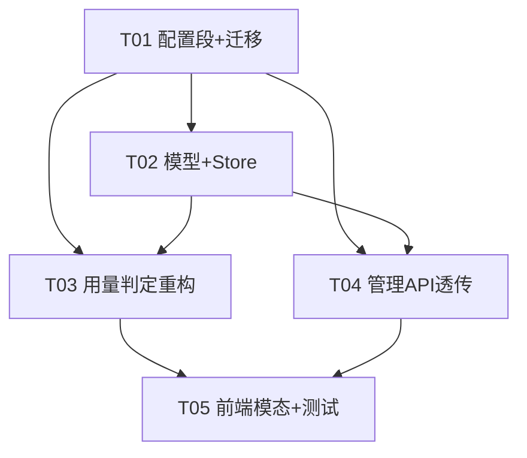

# 增量系统设计：上游 Provider 月度额度可见性 · P2 阈值可配置

> 范围：在既有「上游 Provider 月度额度可见性」功能上，将**低余额阈值**由硬编码常量
> `LowBalanceRatio = 0.9` 改为「config 全局默认 + DB 每 provider 覆盖」，且
> **token 与调用次数各自独立配置两个阈值比例**。
> 本次**只改阈值可配置性**：不动用量聚合、不改三处前端渲染逻辑（仍只读 `token_low`/`call_low` 布尔）。

---

## 1. 实现方案 + 框架选型

- **技术栈**：纯 Go（1.22）+ 嵌入式静态前端（原生 HTML/JS/CSS），**沿用现状，无新第三方依赖**。
- **核心难点**：
  1. 阈值来源从常量 → 配置 + DB 双源，且 token/call 各自独立。
  2. `IsLowBalance` / `BuildProviderUsageView` 签名变更，波及全部调用方与单测（编译阻断）。
  3. 比例单位一致性：config/DB/后端接口用**比例（0.10）**；前端输入用**百分比整数（10）**，提交时 `/100`。
- **框架/库**：沿用 `gopkg.in/yaml.v3`（config 解析）、`database/sql` + SQLite（迁移用 `columnExists` 守卫保证幂等）。
- **架构模式**：无新架构，仍沿用分层（models / provider store / admin handler / 静态前端）。阈值「单一真相源」收敛在 `models.BuildProviderUsageView`。

---

## 2. 文件列表（新增 / 修改）

### 修改（后端）
| 文件 | 改动 |
|---|---|
| `internal/config/config.go` | 新增 `ProviderQuotaConfig` 结构体（含 `DefaultTokenLowRatio`/`DefaultCallLowRatio`，默认 0.10）；`Config` 嵌入 `ProviderQuota`；`Load()` 设置默认并容错 |
| `internal/db/migrations.go` | 末尾幂等加两列 `monthly_token_low_ratio REAL NOT NULL DEFAULT 0`、`monthly_call_low_ratio REAL NOT NULL DEFAULT 0`（`columnExists` 守卫） |
| `internal/models/provider.go` | `ProviderRecord` 与 `ProviderWithMaskedKey` 增加 `MonthlyTokenLowRatio float64`、`MonthlyCallLowRatio float64`（json 含，`0=继承全局`） |
| `internal/provider/store.go` | `ListProviders`/`GetProvider` SELECT+Scan 加两列；`CreateProvider` 签名加两 `float64` 参数并写入；`UpdateProvider` 动态更新两列；`BuildMaskedProviders` 透传两字段；`SeedFromConfig` 两列由 DB DEFAULT 0 落地（无需改 INSERT） |
| `internal/models/provider_usage.go` | `IsLowBalance(used, limit int64, ratio float64) bool`；移除 `LowBalanceRatio` 常量；`BuildProviderUsageView` 增加 `globalTokenRatio, globalCallRatio float64` 两参并解析 effectiveRatio |
| `internal/admin/provider_usage.go` | 两处 `BuildProviderUsageView` 调用注入全局比例；`Handler` 增加 `globalTokenLowRatio()/globalCallLowRatio()` 回退 helper（Config 为 nil 时回退 0.10） |
| `internal/admin/providers.go` | `createProviderRequest`/`updateProviderRequest` 增加 `monthly_token_low_ratio`/`monthly_call_low_ratio`；`HandleCreateProvider`/`HandleUpdateProvider` 透传（0 合法=继承全局；update 仅非 nil 写入） |
| `internal/admin/handler.go` | `Handler` 结构体增加 `Config *config.Config` 字段 |
| `main.go` | 构造 `admin.Handler` 时接线 `Config: cfg` |

### 修改（前端）
| 文件 | 改动 |
|---|---|
| `web/admin/index.html` | provider 编辑模态「月度额度」段下加两个 number 输入：`prov-monthly-token-low-ratio`、`prov-monthly-call-low-ratio`，placeholder `0 = 继承全局默认 10%` |
| `web/admin/app.js` | `openProviderModal`/`editProvider` 读写两输入（编辑时 ratio→百分比显示，0 显示为空白）；`saveProvider` 读取百分比并 `/100` 后以 ratio 提交 |

### 配置（运维）
| 文件 | 改动 |
|---|---|
| `config.yaml`（部署配置） | 新增 `provider_quota:` 段：`default_token_low_ratio: 0.10`、`default_call_low_ratio: 0.10` |

### 修改（测试，须同步适配新签名）
| 文件 | 改动 |
|---|---|
| `internal/models/provider_usage_test.go` | `TestIsLowBalance` 调用补第 3 参 ratio；`TestBuildProviderUsageView` 调用补两 ratio 参并改写断言以校验 effectiveRatio 解析 |
| `internal/provider/store_test.go` | 7 处 `CreateProvider` 调用补两 `float64` 实参（传 `0`） |
| `internal/provider/store_passthrough_test.go` | 2 处 `CreateProvider` 调用补两 `float64` 实参 |
| `internal/proxy/passthrough_test.go`、`internal/proxy/passthrough_qa_test.go` | 各 1 处 `CreateProvider` 调用补两 `float64` 实参（**编译阻断项**） |
| `internal/admin/provider_usage_test.go` | 构造 `&Handler{...}` 已含 `Config` 字段（nil→回退 0.10），断言不变仍成立；建议补一条注入 `Config.ProviderQuota` 验证 per-provider 覆盖生效 |
| `internal/models/provider_usage_edge_test.go` | 仅聚合测试，不调用上述函数，**无需改动** |

---

## 3. 数据结构与接口变更（关键片段）

### 3.1 config.go — 新增 `ProviderQuotaConfig`
```go
// ProviderQuotaConfig 低余额阈值全局默认（比例，0.10 = 10%）。
// token 与 调用次数 各自独立；每 provider 可用 DB 列覆盖（0=继承全局）。
type ProviderQuotaConfig struct {
    DefaultTokenLowRatio float64 `yaml:"default_token_low_ratio"`
    DefaultCallLowRatio  float64 `yaml:"default_call_low_ratio"`
}

// Config 内嵌入：
type Config struct {
    // ... 既有字段 ...
    ProviderQuota ProviderQuotaConfig `yaml:"provider_quota"`
}

// Load() 中，在 yaml.Unmarshal 之前设置默认（缺失段时保留默认）：
cfg.ProviderQuota.DefaultTokenLowRatio = 0.10
cfg.ProviderQuota.DefaultCallLowRatio  = 0.10
// yaml.Unmarshal 仅覆盖 YAML 中存在的子字段，缺失段/字段则保留 0.10。
```

### 3.2 migrations.go — 末尾幂等加两列
```go
// ── Provider 低余额阈值（idempotent）──
// 比例（0.10 = 10%）；0 = 继承全局默认。token 与 call 各自独立。
if !columnExists(conn, "providers", "monthly_token_low_ratio") {
    if _, err := conn.Conn.Exec(
        `ALTER TABLE providers ADD COLUMN monthly_token_low_ratio REAL NOT NULL DEFAULT 0`,
    ); err != nil {
        return fmt.Errorf("migration alter providers.monthly_token_low_ratio failed: %w", err)
    }
}
if !columnExists(conn, "providers", "monthly_call_low_ratio") {
    if _, err := conn.Conn.Exec(
        `ALTER TABLE providers ADD COLUMN monthly_call_low_ratio REAL NOT NULL DEFAULT 0`,
    ); err != nil {
        return fmt.Errorf("migration alter providers.monthly_call_low_ratio failed: %w", err)
    }
}
```
> `SeedFromConfig` 的 INSERT 不列出这两列，由 DB `DEFAULT 0` 落地（即「写 0 = 继承全局」），无需改 INSERT。

### 3.3 provider.go — 模型加两字段
```go
type ProviderRecord struct {
    // ... 既有字段 ...
    MonthlyTokenLimit int64   `json:"monthly_token_limit"` // 0 = unlimited
    MonthlyCallLimit  int64   `json:"monthly_call_limit"`  // 0 = unlimited
    MonthlyTokenLowRatio float64 `json:"monthly_token_low_ratio"` // 0 = 继承全局
    MonthlyCallLowRatio  float64 `json:"monthly_call_low_ratio"`  // 0 = 继承全局
}

type ProviderWithMaskedKey struct {
    // ... 既有字段 ...
    MonthlyTokenLimit int64   `json:"monthly_token_limit"`
    MonthlyCallLimit  int64   `json:"monthly_call_limit"`
    MonthlyTokenLowRatio float64 `json:"monthly_token_low_ratio"`
    MonthlyCallLowRatio  float64 `json:"monthly_call_low_ratio"`
}
```

### 3.4 store.go — 读写两列 + 签名扩展
```go
// ListProviders / GetProvider SELECT 增加列：
//   monthly_token_low_ratio, monthly_call_low_ratio
// Scan 增加两个 float64：var monthlyTokenLowRatio, monthlyCallLowRatio float64
// 并赋值 p.MonthlyTokenLowRatio = monthlyTokenLowRatio; p.MonthlyCallLimit...

// CreateProvider 签名扩展（末尾加两参数）：
func (s *ProviderStore) CreateProvider(name, slug, endpoint, apiKey string, isDefault, allowPassthrough bool,
    authHeader, authScheme string, extraHeaders map[string]string,
    monthlyTokenLimit, monthlyCallLimit int64,
    monthlyTokenLowRatio, monthlyCallLowRatio float64) (*models.ProviderRecord, error) {
    // INSERT 列增加 monthly_token_low_ratio, monthly_call_low_ratio
    // VALUES 增加 ?, ? 并传 monthlyTokenLowRatio, monthlyCallLowRatio
    // 返回 record 也填两字段
}

// UpdateProvider 动态更新（与 monthly_token_limit 同款写法）：
if v, ok := updates["monthly_token_low_ratio"]; ok {
    if n, ok := v.(float64); ok {
        setClauses = append(setClauses, "monthly_token_low_ratio = ?")
        args = append(args, n)
    }
}
if v, ok := updates["monthly_call_low_ratio"]; ok {
    if n, ok := v.(float64); ok {
        setClauses = append(setClauses, "monthly_call_low_ratio = ?")
        args = append(args, n)
    }
}

// BuildMaskedProviders 透传：
result = append(result, models.ProviderWithMaskedKey{
    // ... 既有字段 ...
    MonthlyTokenLowRatio: p.MonthlyTokenLowRatio,
    MonthlyCallLowRatio:  p.MonthlyCallLowRatio,
})
```

### 3.5 provider_usage.go — 阈值判定重构
```go
// 移除旧的 const LowBalanceRatio = 0.9（不再使用，避免死代码）。

// IsLowBalance 现带 ratio 参数：limit<=0 永不标红；否则 used/limit >= ratio 即标红。
func IsLowBalance(used, limit int64, ratio float64) bool {
    if limit <= 0 {
        return false
    }
    return float64(used)/float64(limit) >= ratio
}

// BuildProviderUsageView 增加全局比例两参，解析 effectiveRatio（单一真相源）。
func BuildProviderUsageView(p ProviderRecord, used *ProviderMonthlyUsage, windowStart string,
    globalTokenRatio, globalCallRatio float64) ProviderUsageView {
    // ... 既有 remaining/unlimited 逻辑不变 ...

    tokenRatio := globalTokenRatio
    if p.MonthlyTokenLowRatio > 0 {
        tokenRatio = p.MonthlyTokenLowRatio
    }
    callRatio := globalCallRatio
    if p.MonthlyCallLowRatio > 0 {
        callRatio = p.MonthlyCallLowRatio
    }

    view.TokenLow = IsLowBalance(tokenUsed, p.MonthlyTokenLimit, tokenRatio)
    view.CallLow  = IsLowBalance(callUsed,  p.MonthlyCallLimit,  callRatio)
    return view
}
```
> 行为语义：limit>0 且 `used/limit >= effectiveRatio` 才标红；limit<=0 永不标红；超限仍仅可见不拦截（真实负值标红）。
> effectiveRatio = 每 provider >0 ? 各自 : 全局默认；0 = 继承全局。

### 3.6 admin/provider_usage.go — 注入全局比例 + Handler 回退 helper
```go
// Handler 在 handler.go 中增加字段：
// Config *config.Config

// 回退 helper（Config 为 nil 时回退 0.10，保证单测与缺省安全）：
func (h *Handler) globalTokenLowRatio() float64 {
    if h.Config != nil {
        return h.Config.ProviderQuota.DefaultTokenLowRatio
    }
    return 0.10
}
func (h *Handler) globalCallLowRatio() float64 {
    if h.Config != nil {
        return h.Config.ProviderQuota.DefaultCallLowRatio
    }
    return 0.10
}

// HandleListProviderUsage：
views = append(views, models.BuildProviderUsageView(p, usage[p.Slug], windowStart,
    h.globalTokenLowRatio(), h.globalCallLowRatio()))

// HandleGetProviderUsage：
view := models.BuildProviderUsageView(*p, used, windowStart,
    h.globalTokenLowRatio(), h.globalCallLowRatio())
```

### 3.7 admin/providers.go — 请求结构体 + 透传
```go
type createProviderRequest struct {
    // ... 既有字段 ...
    MonthlyTokenLimit int64   `json:"monthly_token_limit"`
    MonthlyCallLimit  int64   `json:"monthly_call_limit"`
    MonthlyTokenLowRatio float64 `json:"monthly_token_low_ratio"` // 比例；0 = 继承全局
    MonthlyCallLowRatio  float64 `json:"monthly_call_low_ratio"`  // 比例；0 = 继承全局
}
type updateProviderRequest struct {
    // ... 既有字段 ...
    MonthlyTokenLimit *int64  `json:"monthly_token_limit"`
    MonthlyCallLimit  *int64  `json:"monthly_call_limit"`
    MonthlyTokenLowRatio *float64 `json:"monthly_token_low_ratio"`
    MonthlyCallLowRatio  *float64 `json:"monthly_call_low_ratio"`
}

// HandleCreateProvider 调用 CreateProvider 末尾补两参：
req.MonthlyTokenLowRatio, req.MonthlyCallLowRatio

// HandleUpdateProvider 加入 updates（与 monthly_token_limit 同款；0 非 nil 会写入=继承全局，与现状一致）：
if req.MonthlyTokenLowRatio != nil {
    updates["monthly_token_low_ratio"] = *req.MonthlyTokenLowRatio
}
if req.MonthlyCallLowRatio != nil {
    updates["monthly_call_low_ratio"] = *req.MonthlyCallLowRatio
}
```

### 3.8 前端 — index.html 模态输入
在「月度额度（可选，0 = 不限制）」段、`prov-monthly-call-limit` 之后、`保存` 按钮之前插入：
```html
<div class="form-group">
    <label for="prov-monthly-token-low-ratio">Token 低余额阈值(%)</label>
    <input type="number" id="prov-monthly-token-low-ratio" min="0" max="100" step="1" placeholder="0 = 继承全局默认 10%">
    <small class="form-hint">滚动窗口内 Token 用量达到该百分比即标红；0 或留空 = 继承全局默认 10%。</small>
</div>
<div class="form-group">
    <label for="prov-monthly-call-low-ratio">调用低余额阈值(%)</label>
    <input type="number" id="prov-monthly-call-low-ratio" min="0" max="100" step="1" placeholder="0 = 继承全局默认 10%">
    <small class="form-hint">滚动窗口内调用次数达到该百分比即标红；0 或留空 = 继承全局默认 10%。</small>
</div>
```

### 3.9 前端 — app.js 读写（百分比 ↔ 比例）
```js
// openProviderModal（新增分支，默认空白=继承）：
document.getElementById('prov-monthly-token-low-ratio').value = '';
document.getElementById('prov-monthly-call-low-ratio').value = '';

// editProvider（编辑时 ratio→百分比；0 显示为空白）：
const tkRatio = (p.monthly_token_low_ratio > 0) ? (p.monthly_token_low_ratio * 100) : '';
const clRatio = (p.monthly_call_low_ratio  > 0) ? (p.monthly_call_low_ratio  * 100) : '';
document.getElementById('prov-monthly-token-low-ratio').value = tkRatio;
document.getElementById('prov-monthly-call-low-ratio').value  = clRatio;

// saveProvider（读取百分比并 /100 以比例提交）：
const tkRaw = document.getElementById('prov-monthly-token-low-ratio').value.trim();
const clRaw = document.getElementById('prov-monthly-call-low-ratio').value.trim();
const monthlyTokenLowRatio = tkRaw === '' ? 0 : (parseFloat(tkRaw) / 100);
const monthlyCallLowRatio  = clRaw === '' ? 0 : (parseFloat(clRaw) / 100);
// PUT body 增加： monthly_token_low_ratio: monthlyTokenLowRatio, monthly_call_low_ratio: monthlyCallLowRatio
// POST body 同样增加这两字段
```

---

## 4. 程序调用流程（简述）

```
[启动] Load(config.yaml) ──► Config.ProviderQuota.DefaultTokenLowRatio/DefaultCallLowRatio = 0.10
                              │
[编辑/创建 provider] 前端模态填两 ratio(百分比)
       ──POST/PUT /api/providers──► HandleCreate/UpdateProvider
       ──► ProviderStore.Create/UpdateProvider ──► DB providers(monthly_*_low_ratio REAL)
                              │
[用量面板/列表加载] GET /api/provider-usage (或 /api/providers/{slug}/usage)
       ──► HandleList/GetProviderUsage
       ──► ListProviders/GetProvider 读出两 ratio 列
       ──► models.BuildProviderUsageView(p, used, window, globalTokenRatio, globalCallRatio)
              │  解析 effectiveRatio = p.ratio>0 ? p.ratio : global
              │  TokenLow/CallLow = IsLowBalance(used, limit, effRatio)
       ──► 返回 ProviderUsageView{token_low, call_low}
       ──► 前端 renderUsageCell 读 token_low/call_low 布尔标红（不自算阈值）
```

---

## 5. 任务列表（按实现顺序，依赖链清晰）

> 约束：≤5 个任务；每组 ≥3 文件；T01 为基础设施。所有 `CreateProvider` 调用方须同步补两参（编译阻断）。

### T01 · 配置段 + 数据库迁移（基础设施）
- **源文件**：`internal/config/config.go`、`internal/db/migrations.go`、`config.yaml`
- **依赖**：无
- **优先级**：P0
- **改动**：新增 `ProviderQuotaConfig` 与 `Config.ProviderQuota`；`Load()` 设默认 0.10 并容错；迁移幂等加两 REAL 列。

### T02 · 数据模型 + Provider Store
- **源文件**：`internal/models/provider.go`、`internal/provider/store.go`、`internal/provider/store_test.go`
- **依赖**：T01
- **优先级**：P0
- **改动**：模型加两字段；`ListProviders`/`GetProvider`/`CreateProvider`(签名扩展)/`UpdateProvider`/`BuildMaskedProviders` 读写两列；`store_test.go` 7 处 `CreateProvider` 补参（传 0）。
- **注意**：`CreateProvider` 签名变更是**编译阻断**，须同步更新 `internal/proxy/passthrough_test.go`、`passthrough_qa_test.go`、`internal/provider/store_passthrough_test.go`（各 1~2 处，T05 收口，但需在 T02 后立即改以保 `go build ./...` 通过）。

### T03 · 用量判定重构
- **源文件**：`internal/models/provider_usage.go`、`internal/admin/provider_usage.go`、`internal/admin/handler.go`
- **依赖**：T01、T02
- **优先级**：P0
- **改动**：`IsLowBalance` 加 ratio 参、删 `LowBalanceRatio`；`BuildProviderUsageView` 加两全局比例参并解析 effectiveRatio；`Handler` 增 `Config` 字段 + `globalTokenLowRatio/globalCallLowRatio` 回退 helper；两处 handler 注入全局比例。

### T04 · 管理 API 透传
- **源文件**：`internal/admin/providers.go`、`main.go`
- **依赖**：T01、T02
- **优先级**：P0
- **改动**：`create/updateProviderRequest` 加两 ratio 字段；`HandleCreate/UpdateProvider` 透传（0 合法=继承全局；update 仅非 nil 写入）；`main.go` 接线 `Config: cfg`。

### T05 · 前端模态 + 测试适配
- **源文件**：`web/admin/index.html`、`web/admin/app.js`、`internal/models/provider_usage_test.go`、`internal/models/provider_usage_edge_test.go`（无需改）、`internal/admin/provider_usage_test.go`、`internal/provider/store_passthrough_test.go`、`internal/proxy/passthrough_test.go`、`internal/proxy/passthrough_qa_test.go`
- **依赖**：T03、T04
- **优先级**：P1
- **改动**：模态加两百分比输入；`app.js` 读写并 `/100` 提交；模型单测适配新签名（改写 `TestBuildProviderUsageView` 断言以校验 effectiveRatio）；proxy/passthrough 单测补 `CreateProvider` 两参；建议 admin 单测补一条注入 `Config.ProviderQuota` 验证 per-provider 覆盖。

### 依赖图（Mermaid）


---

## 6. 依赖包
**无新依赖**（沿用 `gopkg.in/yaml.v3`、`database/sql` + SQLite 驱动、`net/http`）。

---

## 7. 共享知识（跨文件约定）

- **比例单位**：config / DB / 后端接口字段均存**比例**（如 `0.10` = 10%）。前端输入框用**百分比整数**（如 `10`）；提交时 `/100` 转比例。约定：`frontend% / 100 == backend ratio == DB REAL`。
- **effectiveRatio 单一真相源**：只在 `models.BuildProviderUsageView` 内解析（`p.ratio>0 ? p.ratio : global`）；其余调用方（前端渲染、handler）一律不重算阈值。
- **0 = 继承全局**：DB 列 `DEFAULT 0`；provider 记录 `MonthlyTokenLowRatio==0` 表示继承 `Config.ProviderQuota.DefaultTokenLowRatio`。`SeedFromConfig` 落 0 即继承。
- **无限语义延续**：`limit<=0` 永不标红（`IsLowBalance` 直接 false）；超限仅可见不拦截（真实负值标红）。
- **前后端字段名**：`monthly_token_low_ratio` / `monthly_call_low_ratio`（比例）。前端读 `providerDetail` JSON 同名（由 `ProviderWithMaskedKey` 序列化），编辑时 `*100` 显示、保存时 `/100` 提交。
- **不拦截原则延续**：本次仅改变「何时标红」，不影响路由/配额拦截行为。
- **全局默认仅 config.yaml（非 UI）**：`provider_quota` 段不提供前端编辑入口（按已确认决策）。

---

## 8. 待明确事项（PRD 待确认 + 我的默认假设）

| # | 事项 | 我的默认假设（非阻塞，已按此设计） | 需用户拍板？ |
|---|---|---|---|
| 1 | 全局默认阈值是否提供 UI 编辑 | 否，仅 `config.yaml` 的 `provider_quota` 段（按确认决策） | 否（已确认） |
| 2 | `REAL` 精度是否够 | 够；比例 0.001~1.0 远大于 float64/REAL 精度，无问题 | 否 |
| 3 | 百分比↔比例转换点 | 前端输入百分比、提交 `/100`；后端/DB 全程比例 | 否 |
| 4 | `ratio > 1` 是否拒绝 | 不拒绝（语义=「用量超过上限即标红」，如 1.5 表示 150% 才标红，合法且罕见）；前端 `max=100` 软约束，后端不做上限校验 | **建议确认**：是否要后端对 >1 返回 400 |
| 5 | 负 ratio / 非数值 | 前端 `min=0` 拦截；后端收到负 REAL 时 `used/limit >= 负` 恒 true（即永远标红）——属异常配置，不在本次防护范围 | 否（异常输入） |
| 6 | update 时传 `0` 的语义 | 与现状一致：`0` 非 nil **会写入**（即显式设为 0 = 继承全局）。前端「留空」才不传该字段（不覆盖） | 否（与现状一致） |
| 7 | `LowBalanceRatio` 常量 | 移除（无引用，避免死代码）；如其他包另有引用需保留——已 grep 确认仅本文件使用 | 否 |

> 唯一建议用户拍板项：**#4 是否对 `ratio > 1`（或 <0）做后端拒绝**。当前设计为「不拒绝、合法透传」；若需强校验，建议在 `HandleCreate/UpdateProvider` 增加 `if r > 1 { 400 }`。
