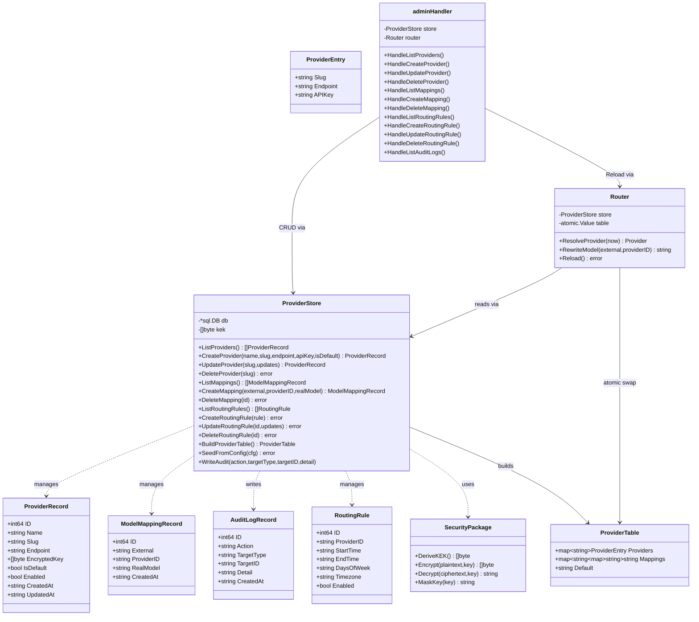
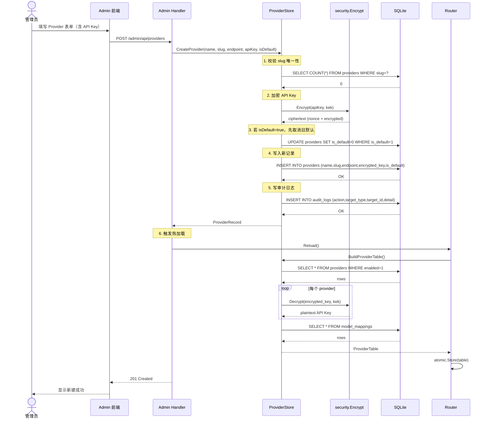
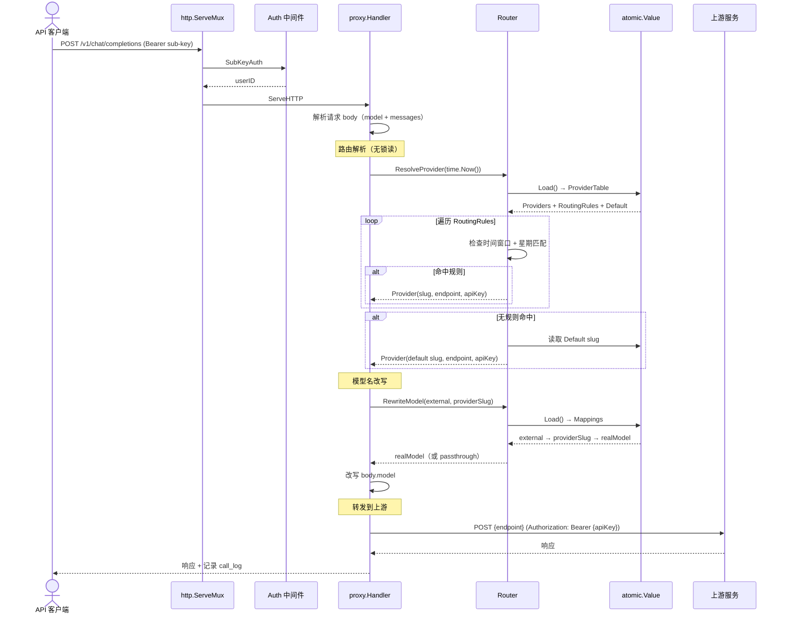
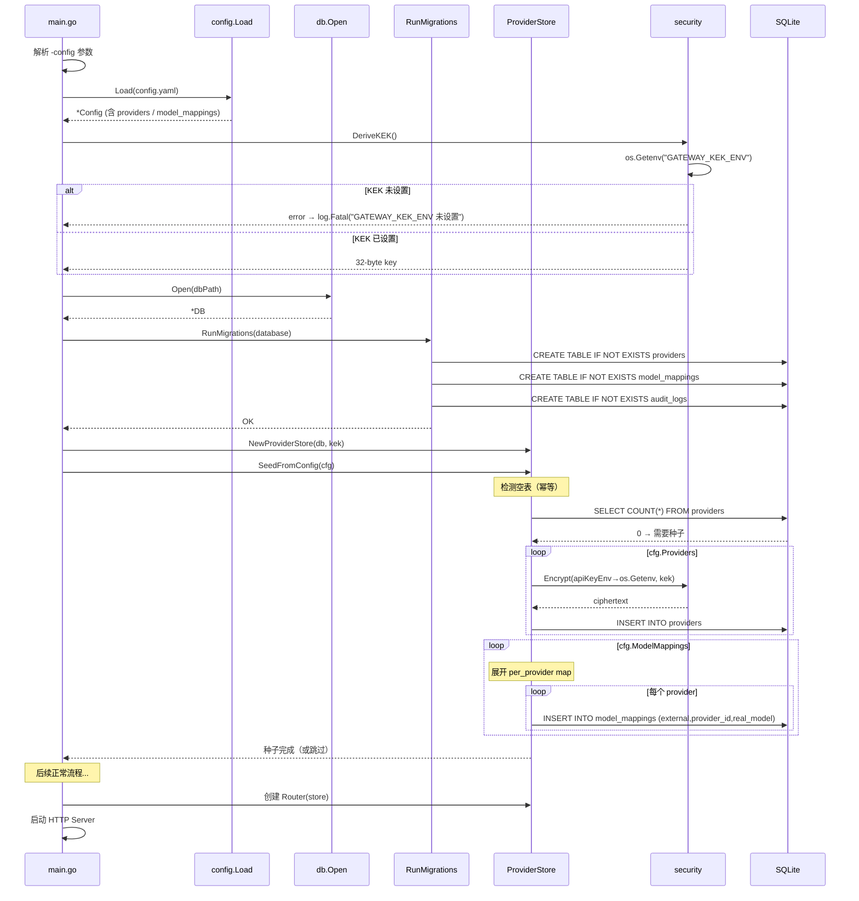
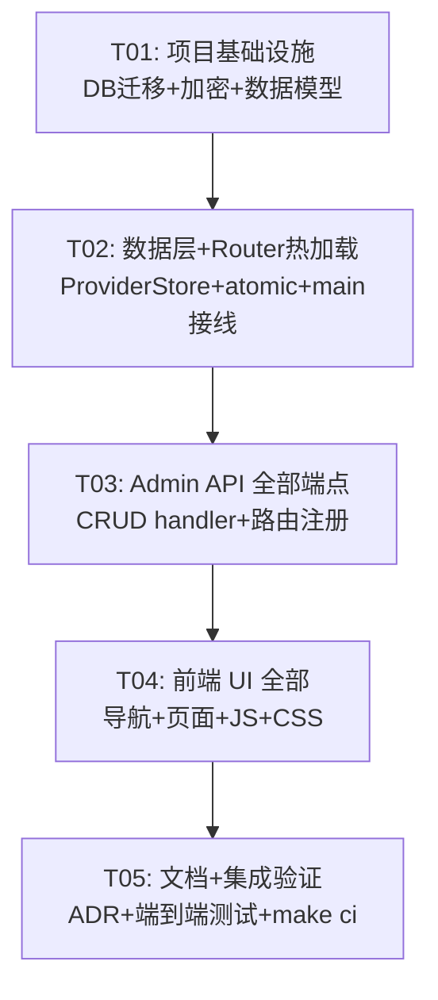

# LLM API Gateway — Admin 后台多上游动态管理 系统架构设计

> **架构师**：高见远（Bob）
> **日期**：2026-07-11
> **基于**：PRD v1 + 7 条已确认产品决策

---

## Part A: 系统设计

### 1. 实施方案

#### 1.1 核心技术挑战

| 挑战 | 分析 | 方案 |
|------|------|------|
| **Key 安全存储** | 当前 Key 仅存内存+环境变量，无法在 Admin 后台持久化管理多个 provider 的 Key | AES-256-GCM 加密落库，KEK 从 `GATEWAY_KEK_ENV` 环境变量注入 |
| **热加载** | 当前 Router 在 `NewRouter` 时一次性构建，后续无法感知 provider/mapping 变更 | `sync/atomic.Value` 持有 ProviderTable 快照，Admin CRUD 后调用 `Router.Reload()` 原子替换 |
| **数据迁移** | 现有 providers/model_mappings 在 config.yaml 中定义，需迁移到 DB | 首次启动时检测 DB 空表 → 从 config.yaml 种子化（幂等） |
| **DB 优先** | 迁移后运行期不再读 config.yaml 的 providers/mappings | Router 只从 DB 读，config.go 的 Load 函数不再注入默认 provider |
| **最小破坏** | 不能破坏现有路由、代理、倍率等功能 | Router 接口保持不变（`ResolveProvider` / `RewriteModel`），仅内部数据源切换 |

#### 1.2 框架与库选型

| 层级 | 技术选择 | 理由 |
|------|----------|------|
| **加密** | Go 标准库 `crypto/aes` + `crypto/cipher` (GCM 模式) | 零 CGO，Go 1.22 原生支持，无需第三方依赖；AES-256-GCM 是 NIST 推荐认证加密 |
| **KEK 派生** | `crypto/sha256` 对 `GATEWAY_KEK_ENV` 哈希 → 32 字节 AES-256 密钥 | 允许任意长度 KEK 字符串，标准密钥派生 |
| **热加载** | `sync/atomic.Value` | Go 零锁读，Router 热路径无竞争；写路径仅在 Admin CRUD 时触发（低频） |
| **API 风格** | RESTful，延续现有 Go 1.22 `ServeMux` 模式 (`METHOD /path` + `PathValue`) | 与现有 `/admin/api/users`、`/admin/api/multipliers` 风格一致 |
| **前端** | 原生 HTML/CSS/JS，无框架 | 产品决策 Q5：改动范围可控，延续现有风格 |
| **DB** | modernc.org/sqlite（已在使用） | 零 CGO，纯 Go 实现 |

#### 1.3 架构模式

```
┌──────────────────────────────────────────────────────────┐
│  main.go                                                  │
│  ┌─────────┐  ┌──────────┐  ┌──────────────────────────┐ │
│  │ KEK     │  │ Router   │  │ Admin Handler            │ │
│  │ (env)   │  │ (atomic) │  │ ┌──────────────────────┐ │ │
│  └────┬────┘  └────┬─────┘  │ │ ProvidersHandler     │ │ │
│       │            │        │ │ MappingsHandler      │ │ │
│  ┌────▼────────────▼─────┐  │ │ RoutingRulesHandler  │ │ │
│  │   ProviderStore       │◄─┤ │ AuditLogHandler      │ │ │
│  │  (DB CRUD + 加解密)    │  │ └──────────────────────┘ │ │
│  └───────────────────────┘  └──────────────────────────┘ │
└──────────────────────────────────────────────────────────┘
```

- **ProviderStore**：唯一的数据访问层，封装 DB CRUD + 加密/解密，Router 和 Admin Handler 都通过它操作数据
- **Router**：持有 `atomic.Value`，提供 `ResolveProvider` / `RewriteModel` 接口不变；新增 `Reload()` 方法供 Admin 调用
- **Admin Handler**：新增 4 个 handler 文件，在 `handler.go` 中注册路由

---

### 2. 文件列表

#### 2.1 新增文件

| # | 相对路径 | 用途 |
|---|----------|------|
| 1 | `internal/security/encrypt.go` | AES-256-GCM 加密/解密函数 + KEK 派生 |
| 2 | `internal/security/encrypt_test.go` | 加密模块单元测试 |
| 3 | `internal/provider/store.go` | Provider + ModelMapping + RoutingRule + AuditLog 的 DB CRUD |
| 4 | `internal/provider/store_test.go` | Store 单元测试 |
| 5 | `internal/admin/providers.go` | Provider CRUD API handler（列表/创建/更新/删除） |
| 6 | `internal/admin/mappings.go` | ModelMapping CRUD API handler |
| 7 | `internal/admin/routing.go` | RoutingRules CRUD API handler |
| 8 | `internal/admin/audit.go` | AuditLog 查询 API handler |
| 9 | `docs/adr/0007-key-encryption-db-hot-reload.md` | ADR：Key 加密落库 + 热加载架构决策 |

#### 2.2 修改文件

| # | 相对路径 | 操作 | 用途 |
|---|----------|------|------|
| 10 | `internal/db/migrations.go` | 修改 | 新增 providers、model_mappings、audit_logs 三张表 DDL + 种子迁移函数 |
| 11 | `internal/router/selector.go` | 修改 | Router 改为从 ProviderStore 加载数据，使用 atomic.Value 热加载 |
| 12 | `internal/config/config.go` | 修改 | Load 函数移除 providers/model_mappings 默认注入逻辑（仅首次种子用） |
| 13 | `main.go` | 修改 | 加载 KEK、创建 ProviderStore、注入 Router/AdminHandler |
| 14 | `internal/admin/handler.go` | 修改 | Handler 结构体新增字段 + RegisterRoutes 注册新路由 |
| 15 | `web/admin/index.html` | 修改 | 左侧导航重构 + 新增「上游管理」「模型映射」「路由规则」「审计日志」页面区域 |
| 16 | `web/admin/app.js` | 修改 | 新增 Provider/Mapping/Routing/Audit 的前端逻辑 |
| 17 | `web/admin/style.css` | 修改 | 新增 Tab 导航、密钥掩码展示等样式 |
| 18 | `go.mod` | 修改 | 依赖声明（无需新增第三方包） |

---

### 3. 数据结构与接口

#### 3.1 Go 结构体（核心）

```go
// —— internal/provider/store.go ——

// ProviderRecord 是 providers 表的 DB 行模型
type ProviderRecord struct {
    ID        int64  `json:"id"`
    Name      string `json:"name"`       // 显示名，如 "智谱 GLM"
    Slug      string `json:"slug"`       // 唯一标识，如 "zhipu"（对应路由中 provider_id）
    Endpoint  string `json:"endpoint"`   // 上游 chat-completions 端点
    EncryptedKey []byte `json:"-"`       // AES-256-GCM 密文（JSON 不输出）
    IsDefault bool   `json:"is_default"`
    Enabled   bool   `json:"enabled"`
    CreatedAt string `json:"created_at"`
    UpdatedAt string `json:"updated_at"`
}

// ModelMappingRecord 是 model_mappings 表的 DB 行模型
type ModelMappingRecord struct {
    ID         int64  `json:"id"`
    External   string `json:"external"`   // 对外模型名，如 "glm-5.2"
    ProviderID string `json:"provider_id"` // provider slug
    RealModel  string `json:"real_model"`  // 该 provider 的真实模型名
    CreatedAt  string `json:"created_at"`
}

// AuditLogRecord 是 audit_logs 表的 DB 行模型
type AuditLogRecord struct {
    ID         int64  `json:"id"`
    Action     string `json:"action"`     // "provider.create", "provider.update", "mapping.delete"...
    TargetType string `json:"target_type"` // "provider", "model_mapping", "routing_rule"
    TargetID   string `json:"target_id"`
    Detail     string `json:"detail"`      // JSON 摘要
    CreatedAt  string `json:"created_at"`
}

// RoutingRuleRecord 是 provider_routing_rules 表的 DB 行模型（扩展现有）
// 字段与现有 router.RoutingRule 兼容，新增 provider_id FK 关联
```

```go
// —— internal/security/encrypt.go ——

// DeriveKEK 从 GATEWAY_KEK_ENV 环境变量派生 32 字节 AES-256 密钥
func DeriveKEK() ([]byte, error)

// Encrypt 使用 AES-256-GCM 加密明文，返回 ciphertext（含 nonce 前缀）
func Encrypt(plaintext string, key []byte) ([]byte, error)

// Decrypt 使用 AES-256-GCM 解密密文（nonce 前缀），返回明文
func Decrypt(ciphertext []byte, key []byte) (string, error)

// MaskKey 对明文 Key 做前端脱敏显示：保留前4后4字符，中间用 * 替换
func MaskKey(key string) string
```

```go
// —— internal/provider/store.go ——

// ProviderStore 是 providers / model_mappings / routing_rules / audit_logs 的数据访问层
type ProviderStore struct {
    db  *sql.DB
    kek []byte // 加密主密钥（内存态，从环境变量注入）
}

// NewProviderStore 创建 store（kek 不能为空，否则 panic）
func NewProviderStore(db *sql.DB, kek []byte) *ProviderStore

// —— Provider CRUD ——
func (s *ProviderStore) ListProviders() ([]ProviderRecord, error)
func (s *ProviderStore) GetProvider(slug string) (*ProviderRecord, error)
func (s *ProviderStore) CreateProvider(name, slug, endpoint, apiKey string, isDefault bool) (*ProviderRecord, error)
func (s *ProviderStore) UpdateProvider(slug string, updates map[string]any) (*ProviderRecord, error)
func (s *ProviderStore) DeleteProvider(slug string) error
func (s *ProviderStore) SetDefaultProvider(slug string) error

// —— ModelMapping CRUD ——
func (s *ProviderStore) ListMappings() ([]ModelMappingRecord, error)
func (s *ProviderStore) CreateMapping(external, providerID, realModel string) (*ModelMappingRecord, error)
func (s *ProviderStore) UpdateMapping(id int64, updates map[string]any) error
func (s *ProviderStore) DeleteMapping(id int64) error

// —— RoutingRules CRUD ——
func (s *ProviderStore) ListRoutingRules() ([]router.RoutingRule, error)
func (s *ProviderStore) CreateRoutingRule(rule *router.RoutingRule) error
func (s *ProviderStore) UpdateRoutingRule(id int64, updates map[string]any) error
func (s *ProviderStore) DeleteRoutingRule(id int64) error

// —— Audit ——
func (s *ProviderStore) ListAuditLogs(page, limit int) ([]AuditLogRecord, int, error)
func (s *ProviderStore) WriteAudit(action, targetType, targetID, detail string)

// —— Seed ——
// SeedFromConfig 从 config.yaml 种子化 providers/model_mappings（幂等：仅空表时执行）
func (s *ProviderStore) SeedFromConfig(cfg *config.Config) error

// —— Snapshot（供 Router 热加载） ——
// BuildProviderTable 查询所有 enabled provider + mapping，解密 Key，构建原子快照
func (s *ProviderStore) BuildProviderTable() (*ProviderTable, error)
```

```go
// —— internal/router/selector.go（改造后） ——

// ProviderTable 是 Router 的原子快照，通过 atomic.Value 热加载
type ProviderTable struct {
    Providers map[string]ProviderEntry  // slug -> entry
    Mappings  map[string]map[string]string // external -> providerSlug -> realModel
    Default   string                     // 默认 provider slug
}

// ProviderEntry 是快照中的单个 provider
type ProviderEntry struct {
    Slug     string
    Endpoint string
    APIKey   string // 已解密的明文 Key（仅内存，绝不落盘/日志）
}

// Router 结构体改造
type Router struct {
    db    *sql.DB
    store *provider.ProviderStore // 新增：数据访问
    table atomic.Value            // *ProviderTable（原子读写）
}

// NewRouter 创建 Router（初始加载一次）
func NewRouter(db *sql.DB, store *provider.ProviderStore) *Router

// Reload 从 DB 重新加载 provider 表并原子替换（Admin CRUD 后调用）
func (r *Router) Reload() error

// ResolveProvider 接口不变（从 atomic.Value 读）
func (r *Router) ResolveProvider(now time.Time) (Provider, error)

// RewriteModel 接口不变（从 atomic.Value 读）
func (r *Router) RewriteModel(external, providerID string) string
```

#### 3.2 DB Schema（新增三张表）

```sql
-- providers 表：上游 LLM 提供商
CREATE TABLE IF NOT EXISTS providers (
    id             INTEGER PRIMARY KEY AUTOINCREMENT,
    name           TEXT    NOT NULL,                          -- 显示名，如 "智谱 GLM"
    slug           TEXT    NOT NULL UNIQUE,                   -- 唯一标识，如 "zhipu"
    endpoint       TEXT    NOT NULL,                          -- 上游端点 URL
    encrypted_key  BLOB    NOT NULL,                          -- AES-256-GCM 密文
    is_default     INTEGER NOT NULL DEFAULT 0,                -- 是否为默认 provider
    enabled        INTEGER NOT NULL DEFAULT 1,                -- 是否启用
    created_at     TEXT    NOT NULL DEFAULT (datetime('now')),
    updated_at     TEXT    NOT NULL DEFAULT (datetime('now'))
);

CREATE UNIQUE INDEX IF NOT EXISTS idx_providers_slug ON providers(slug);
CREATE INDEX IF NOT EXISTS idx_providers_enabled ON providers(enabled);

-- model_mappings 表：外部模型名 → 各 provider 真实模型名
CREATE TABLE IF NOT EXISTS model_mappings (
    id          INTEGER PRIMARY KEY AUTOINCREMENT,
    external    TEXT    NOT NULL,                             -- 对外模型名，如 "glm-5.2"
    provider_id TEXT    NOT NULL,                             -- provider slug
    real_model  TEXT    NOT NULL,                             -- 该 provider 的真实模型名
    created_at  TEXT    NOT NULL DEFAULT (datetime('now')),
    FOREIGN KEY (provider_id) REFERENCES providers(slug) ON DELETE CASCADE
);

-- 联合唯一约束：(external, provider_id)
CREATE UNIQUE INDEX IF NOT EXISTS idx_model_mappings_ext_prov 
    ON model_mappings(external, provider_id);

-- audit_logs 表：操作审计日志
CREATE TABLE IF NOT EXISTS audit_logs (
    id          INTEGER PRIMARY KEY AUTOINCREMENT,
    action      TEXT    NOT NULL,                             -- "provider.create" 等
    target_type TEXT    NOT NULL,                             -- "provider" / "model_mapping" / "routing_rule"
    target_id   TEXT    NOT NULL,                             -- 操作对象标识
    detail      TEXT    NOT NULL DEFAULT '',                  -- JSON 摘要
    created_at  TEXT    NOT NULL DEFAULT (datetime('now'))
);

CREATE INDEX IF NOT EXISTS idx_audit_logs_created_at ON audit_logs(created_at);
CREATE INDEX IF NOT EXISTS idx_audit_logs_action ON audit_logs(action);
```

#### 3.3 API 契约

**所有 API 前缀**：`/admin/api/`（沿用现有约定）

##### Provider API

| Method | Path | Request Body | Response | 说明 |
|--------|------|-------------|----------|------|
| `GET` | `/admin/api/providers` | — | `{"data": [ProviderRecord, ...]}` | 列表，Key 字段脱敏 |
| `POST` | `/admin/api/providers` | `{"name":"智谱","slug":"zhipu","endpoint":"https://...","api_key":"sk-xxx","is_default":true}` | `ProviderRecord` | 创建，Key 加密落库 |
| `PUT` | `/admin/api/providers/{slug}` | `{"name":"...","endpoint":"...","api_key":"...","enabled":true}` | `ProviderRecord` | 更新（api_key 可选，不传则保留旧 Key） |
| `DELETE` | `/admin/api/providers/{slug}` | — | `204 No Content` | 删除（关联校验：有 mapping/routing 引用时拒绝） |

##### ModelMapping API

| Method | Path | Request Body | Response | 说明 |
|--------|------|-------------|----------|------|
| `GET` | `/admin/api/mappings` | — | `{"data": [ModelMappingRecord, ...]}` | 列表 |
| `POST` | `/admin/api/mappings` | `{"external":"glm-5.2","provider_id":"zhipu","real_model":"glm-5.2"}` | `ModelMappingRecord` | 创建（external+provider_id 唯一约束） |
| `PUT` | `/admin/api/mappings/{id}` | `{"real_model":"glm-4-flash"}` | `ModelMappingRecord` | 更新 |
| `DELETE` | `/admin/api/mappings/{id}` | — | `204 No Content` | 删除 |

##### RoutingRules API

| Method | Path | Request Body | Response | 说明 |
|--------|------|-------------|----------|------|
| `GET` | `/admin/api/routing-rules` | — | `{"data": [RoutingRule, ...]}` | 列表（含 enabled 和 disabled） |
| `POST` | `/admin/api/routing-rules` | `{"provider_id":"openai","start_time":"14:00","end_time":"18:01","days_of_week":"*","enabled":true}` | `RoutingRule` | 创建 |
| `PUT` | `/admin/api/routing-rules/{id}` | `{"enabled":false}` | `RoutingRule` | 更新 |
| `DELETE` | `/admin/api/routing-rules/{id}` | — | `204 No Content` | 删除 |

##### AuditLog API

| Method | Path | Request Body | Response | 说明 |
|--------|------|-------------|----------|------|
| `GET` | `/admin/api/audit-logs?page=1&limit=50` | — | `{"data":[...], "total": N}` | 分页查询 |

##### 统一响应格式

```json
// 成功
{"data": {...}} 或 {"data": [...], "total": 100}

// 错误
{"error": "错误描述"}
```

#### 3.4 Mermaid 类图



---

### 4. 程序调用流程

#### 4.1 (a) 管理员新增 Provider → 加密 Key → 存 DB → 热加载



#### 4.2 (b) API 请求到达 → Router 基于 DB 解析 Provider



#### 4.3 (c) 首次启动 → 检测 DB 空表 → 种子迁移 yaml → DB



---

### 5. 待明确事项

| # | 事项 | 假设/处理 |
|---|------|----------|
| 1 | **KEK 轮换策略** | P2 不做，KEK 仅从 `GATEWAY_KEK_ENV` 读取一次。如需轮换，需重新加密所有 Key（离线脚本） |
| 2 | **旧 `provider_routing_rules` 表的 `default_provider_id` 列** | 保留但继续不使用（P2 预留），全局默认由 `providers.is_default=1` 决定 |
| 3 | **`config.yaml` 中的 `api.zhipu_endpoint` / `api.zhipu_api_key`** | 种子迁移后不再读取（DB 优先），但保留在 config 结构体中防止解析失败 |
| 4 | **`admin.Handler` 的 `APIKeyGetter` / `APIKeySetter` / `EndpointGetter` 字段** | 保留但不再使用（Router 接管），标记 `// Deprecated` |
| 5 | **审计日志保留策略** | 不做自动清理（P2），表大小由 SQLite 自行管理；后续可加 `DELETE FROM audit_logs WHERE created_at < date('now','-90 day')` |

---

## Part B: 任务分解

### 6. 依赖包列表

```
- golang.org/x/crypto v0.24.0      (已有 — bcrypt)
- gopkg.in/yaml.v3 v3.0.1          (已有 — 配置解析)
- modernc.org/sqlite v1.30.0       (已有 — SQLite 驱动)
```

**无需新增任何第三方依赖**。AES-256-GCM 使用 Go 标准库 `crypto/aes` + `crypto/cipher`。

### 7. 任务列表

| 任务 ID | 任务名称 | 描述 | 依赖 | 优先级 | 涉及文件 |
|---------|----------|------|------|--------|----------|
| **T01** | **项目基础设施** | DB 迁移（三张新表 DDL + 幂等列检测）、AES-256-GCM 加密/解密模块（含单元测试）、Go 数据模型定义（ProviderRecord / ModelMappingRecord / AuditLogRecord）、go.mod 依赖确认 | — | P0 | `internal/db/migrations.go`(改), `internal/security/encrypt.go`(新), `internal/security/encrypt_test.go`(新), `internal/models/provider.go`(新), `go.mod`(改) |
| **T02** | **数据层 + Router 热加载** | ProviderStore 完整 CRUD（含加密存储/解密读取）、种子迁移函数 SeedFromConfig、Router 改造为 atomic.Value + ProviderTable 快照、config.go 调整（移除 Load 中默认 provider 注入）、main.go 接线（KEK 加载 + ProviderStore 创建 + Router 注入 Admin） | T01 | P0 | `internal/provider/store.go`(新), `internal/provider/store_test.go`(新), `internal/router/selector.go`(改), `internal/config/config.go`(改), `main.go`(改) |
| **T03** | **Admin API 全部端点** | Provider CRUD handler、ModelMapping CRUD handler、RoutingRules CRUD handler、AuditLog 查询 handler、admin/handler.go 路由注册 + 结构体字段扩展 | T02 | P0 | `internal/admin/providers.go`(新), `internal/admin/mappings.go`(新), `internal/admin/routing.go`(新), `internal/admin/audit.go`(新), `internal/admin/handler.go`(改) |
| **T04** | **前端 UI 全部** | 左侧导航重构（新增「上游管理」「模型映射」「路由规则」「审计日志」入口，过渡期隐藏旧「设置」入口）、Provider 列表/创建/编辑/删除表单、ModelMapping 矩阵表格+新增/删除、RoutingRules 时间窗口编辑器（复用 multipliers 模式）、审计日志分页表格、Key 掩码脱敏显示、全局样式补充 | T03 | P1 | `web/admin/index.html`(改), `web/admin/app.js`(改), `web/admin/style.css`(改) |
| **T05** | **文档 + 集成验证** | ADR-0007 编写（Key 加密落库 + 热加载架构决策）、端到端手动集成验证（启动→种子迁移→CRUD→热加载→API 路由正确）、`make ci` 确保 fmt/vet/test/build 全通过 | T04 | P1 | `docs/adr/0007-key-encryption-db-hot-reload.md`(新), `docs/system_design.md`(改) |

### 8. 共享知识（跨文件约定）

```
1. KEK 加载：
   - 环境变量名：GATEWAY_KEK_ENV
   - KEK 未设置 → 服务启动时 log.Fatal，不允许明文降级
   - DeriveKEK() = SHA-256(GATEWAY_KEK_ENV)，输出 32 字节固定密钥
   - KEK 在 main.go 中加载一次，通过参数传入 ProviderStore，之后不再读取环境变量

2. 加密格式：
   - AES-256-GCM，nonce 12 字节（随机生成），附加到密文头部
   - 密文格式：[12字节 nonce][GCM密文+16字节 tag]
   - 解密时从头部提取 nonce，余下为密文

3. API 响应格式：
   - 列表接口统一 {"data": [...]}
   - 单条接口统一 {"data": {...}} 或直接返回对象（保持与现有 multiplier 风格一致）
   - 错误统一 {"error": "描述"}
   - 删除成功返回 204 No Content（保持与现有 multiplier 风格一致）

4. 数据库约定：
   - 时间字段统一使用 TEXT 类型，格式 RFC3339（与现有 users/call_logs 一致）
   - enabled 字段用 INTEGER (0/1)，查询时转 bool
   - 外键使用 provider slug（TEXT），而非自增 ID（便于人工识别）

5. 日志红线：
   - 禁止在任何日志、错误信息、响应中输出明文 API Key
   - encrypted_key BLOB 字段不参与 JSON 序列化（json:"-"）
   - 前端显示使用 MaskKey() 脱敏（保留前4后4字符）

6. 路由热加载安全：
   - Router.Reload() 使用 atomic.Value.Store，不持锁
   - 热路径（ResolveProvider/RewriteModel）使用 atomic.Value.Load，零锁竞争
   - Reload 仅在 Admin CRUD 成功后调用（低频），失败不影响现有快照

7. 种子迁移幂等性：
   - SeedFromConfig 先检查 providers 表是否为空（SELECT COUNT）
   - 仅空表时执行种子（INSERT），非空直接返回
   - config.yaml 中的 api_key_env 引用的环境变量需在种子时可用（否则种子 Key 为空，后续通过 Admin 手动设置）

8. 删除校验：
   - 删除 provider 前检查 model_mappings 和 provider_routing_rules 是否有引用
   - 有引用时返回 409 Conflict + 引用详情，不静默级联删除
```

### 9. 任务依赖图



---

> **完整类图** 见 `docs/class-diagram.mermaid`
> **完整时序图** 见 `docs/sequence-diagram.mermaid`
