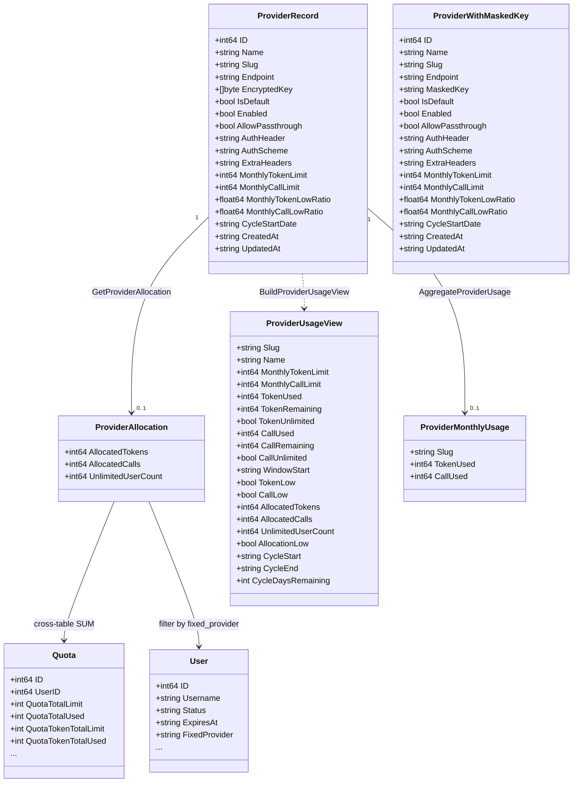
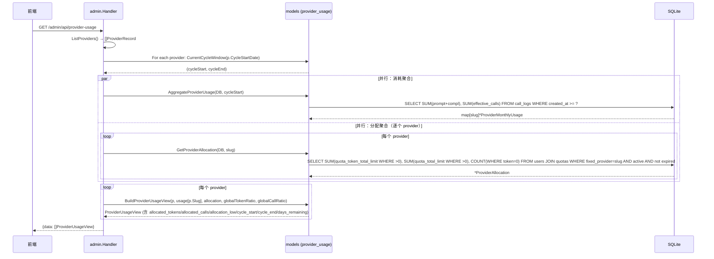
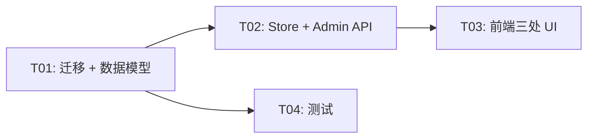

# 上游额度跟踪 V3 — 增量系统设计

> 架构师：高见远（Bob）  
> 基于 main@9e8a373 源码核实  
> 增量 PRD 版本：许清楚已确认

---

## Part A：系统设计

### 1. 实现方案 + 框架选型

#### 1.1 核心技术挑战

| 挑战 | 说明 |
|------|------|
| **滚动窗口 → 固定周期** | 将 `now-30d` 的动态窗口替换为基于 `cycle_start_date` 的固定 30 天周期，跨周期自动归零 |
| **跨表分配聚合** | 从 `users JOIN quotas` 跨表 SUM，需正确处理 Token/Call 的 0 语义差异（PR #14 确立） |
| **0 语义双轨** | Token: `quota_token_total_limit = 0` → 无限；Call: `quota_total_limit = 0` → 无效/锁死。两个维度独立统计 |
| **前端三处并排** | 列表 4 列、仪表盘 4 行、开账号提示加分配行，需统一分配超额标红逻辑 |

#### 1.2 框架与库

无新增依赖。所有变更在现有技术栈内完成：

- **后端**：Go 1.22+，`database/sql` + SQLite（modernc.org/sqlite）
- **前端**：原生 JavaScript（无框架），现有 CSS 变量体系
- **周期计算**：纯 Go `time` 包 + `timeutil.ShanghaiTZ`

#### 1.3 架构模式

保持现有分层不变：

```
┌─────────────────────────────┐
│  web/admin/ (SPA 前端)       │  ← 三处 UI 改动
├─────────────────────────────┤
│  internal/admin/ (HTTP API)  │  ← 返回值加 allocation 字段
├─────────────────────────────┤
│  internal/provider/ (Store)  │  ← CRUD 透传 cycle_start_date
├─────────────────────────────┤
│  internal/models/ (数据层)   │  ← 核心变更：周期计算 + 分配聚合
├─────────────────────────────┤
│  internal/db/ (迁移)         │  ← 加列 + 存量回填
└─────────────────────────────┘
```

---

### 2. 文件列表

#### 新增文件

无。

#### 修改文件

| # | 文件 | 变更类型 |
|---|------|----------|
| 1 | `internal/db/migrations.go` | 新增 `cycle_start_date` 迁移（columnExists 守卫 + 存量回填） |
| 2 | `internal/models/provider.go` | `ProviderRecord` / `ProviderWithMaskedKey` 加 `CycleStartDate` |
| 3 | `internal/models/provider_usage.go` | 新增 `CurrentCycleWindow`、`ProviderAllocation`、`GetProviderAllocation`；`ProviderUsageView` 加 4 字段；`BuildProviderUsageView` 重构 |
| 4 | `internal/provider/store.go` | 全部 CRUD + Seed + BuildMaskedProviders 读写 `cycle_start_date` |
| 5 | `internal/admin/providers.go` | create/update 请求体加 `cycle_start_date` |
| 6 | `internal/admin/provider_usage.go` | HandleList/Get 加 allocation + cycle 信息 |
| 7 | `internal/models/provider_usage_test.go` | 更新现有测试 + 新增周期/分配聚合测试 |
| 8 | `web/admin/app.js` | 列表 4 列、仪表盘 4 行+周期信息、账号提示加分配行、provider 模态加 date input |
| 9 | `web/admin/index.html` | 表头加列、模态加输入框 |
| 10 | `web/admin/style.css` | 分配超额标红、剩余天数黄色高亮 |

---

### 3. 数据结构与接口变更

#### 3.1 数据库迁移

```sql
-- 位置：internal/db/migrations.go，在现有 providers 列迁移块末尾追加
-- 幂等守卫：columnExists(conn, "providers", "cycle_start_date")

ALTER TABLE providers ADD COLUMN cycle_start_date TEXT NOT NULL DEFAULT '';

-- 存量回填：取 DATE(created_at)
UPDATE providers SET cycle_start_date = DATE(created_at) WHERE cycle_start_date = '';
```

#### 3.2 模型变更

##### 3.2.1 `internal/models/provider.go`

`ProviderRecord` 和 `ProviderWithMaskedKey` 各加一个字段：

```go
// ProviderRecord 新增（在 MonthlyCallLowRatio 之后、CreatedAt 之前）：
CycleStartDate string `json:"cycle_start_date"` // "2006-01-02" DATE string

// ProviderWithMaskedKey 同样位置新增：
CycleStartDate string `json:"cycle_start_date"`
```

##### 3.2.2 `internal/models/provider_usage.go`

```go
// ── 替换 RollingWindowStart ──

// CurrentCycleWindow 根据 cycle_start_date 计算当前 30 天周期的 [start, end)。
// 均为 Asia/Shanghai 时区的 "2006-01-02" DATE 字符串。
// N = FLOOR(DATEDIFF(NOW(), cycleStart) / 30)
// start = cycleStart + N*30d
// end   = cycleStart + (N+1)*30d
func CurrentCycleWindow(cycleStartDate string) (start, end string) { ... }

// ── 新增分配聚合 ──

// ProviderAllocation 是单个 provider 的已分配汇总。
type ProviderAllocation struct {
    AllocatedTokens   int64 `json:"allocated_tokens"`
    AllocatedCalls    int64 `json:"allocated_calls"`
    UnlimitedUserCount int64 `json:"unlimited_user_count"` // Token 维度无限用户数
}

// GetProviderAllocation 跨表聚合已分配额度。
// SQL 逻辑：
//   SELECT
//     COALESCE(SUM(CASE WHEN q.quota_token_total_limit > 0 THEN q.quota_token_total_limit END), 0) AS allocated_tokens,
//     COALESCE(SUM(CASE WHEN q.quota_total_limit > 0 THEN q.quota_total_limit END), 0) AS allocated_calls,
//     COUNT(CASE WHEN q.quota_token_total_limit = 0 THEN 1 END) AS unlimited_user_count
//   FROM users u JOIN quotas q ON u.id = q.user_id
//   WHERE u.fixed_provider = ?
//     AND u.status = 'active'
//     AND (u.expires_at = '' OR u.expires_at > datetime('now'))
//
// 0 语义差异（PR #14 确立，刻意不同）：
//   - Token: quota_token_total_limit = 0 → 无限（不纳入 allocated_tokens，计入 unlimited_user_count）
//   - Call:  quota_total_limit = 0 → 无效/锁死（不纳入 allocated_calls，不计入 unlimited_user_count）
func GetProviderAllocation(db *sql.DB, providerSlug string) (*ProviderAllocation, error) { ... }

// ── ProviderUsageView 加字段 ──

type ProviderUsageView struct {
    // ... 现有字段保持不变 ...
    
    // 新增：
    AllocatedTokens    int64  `json:"allocated_tokens"`
    AllocatedCalls     int64  `json:"allocated_calls"`
    UnlimitedUserCount int64  `json:"unlimited_user_count"`
    AllocationLow      bool   `json:"allocation_low"`       // 分配超额标红
    CycleStart         string `json:"cycle_start"`          // 当前周期起点 DATE
    CycleEnd           string `json:"cycle_end"`            // 当前周期终点 DATE（exclusive）
    CycleDaysRemaining int    `json:"cycle_days_remaining"` // 剩余天数，≤3 时前端黄色高亮
}

// ── BuildProviderUsageView 重构 ──

// 签名增加 cycleStartDate 参数以计算当前窗口：
func BuildProviderUsageView(
    p ProviderRecord,
    used *ProviderMonthlyUsage,
    alloc *ProviderAllocation,
    globalTokenRemainingRatio, globalCallRemainingRatio float64,
) ProviderUsageView {
    // 1. 用 p.CycleStartDate 调 CurrentCycleWindow 得到 start/end
    // 2. 用周期 start 作为消耗聚合窗口（替代原 windowStart 参数）
    // 3. 消耗低余额判定不变（IsLowBalance）
    // 4. 分配超额判定：
    //    - Token: AllocatedTokens > MonthlyTokenLimit 且 MonthlyTokenLimit > 0 → AllocationLow
    //    - Call:  AllocatedCalls  > MonthlyCallLimit  且 MonthlyCallLimit  > 0 → AllocationLow
    //    - 沿用同一 IsLowBalance 逻辑（allocated/limit >= 1-threshold），语义一致
    // 5. 计算 CycleDaysRemaining = end - today（天数）
    ...
}
```

##### 3.2.3 类图



---

### 4. 程序调用流程

#### 4.1 核心流程：列表查询（HandleListProviderUsage）



#### 4.2 单 provider 查询（HandleGetProviderUsage）

流程同上但仅查一个 provider，用于账号创建表单的实时提示。

#### 4.3 周期计算流程

```
CurrentCycleWindow("2026-01-15"):
  today = 2026-08-20 (Asia/Shanghai)
  N = FLOOR(DATEDIFF("2026-08-20", "2026-01-15") / 30) = FLOOR(217/30) = 7
  start = "2026-01-15" + 7*30d = "2026-08-14"
  end   = "2026-01-15" + 8*30d = "2026-09-13"
  remaining = DATEDIFF("2026-09-13", "2026-08-20") = 24 天
```

#### 4.4 分配超额判定

```
AllocationLow = false
if MonthlyTokenLimit > 0:
    tokenRatio = max(MonthlyTokenLowRatio, globalTokenRatio)
    if AllocatedTokens / MonthlyTokenLimit >= (1 - tokenRatio):
        AllocationLow = true
if MonthlyCallLimit > 0:
    callRatio = max(MonthlyCallLowRatio, globalCallRatio)
    if AllocatedCalls / MonthlyCallLimit >= (1 - callRatio):
        AllocationLow = true
```

即：分配超额与消耗超额使用同一 `IsLowBalance` 判定公式，仅输入从 (used, limit) 变为 (allocated, limit)。

---

### 5. 待明确事项

| # | 事项 | 状态 |
|---|------|------|
| 1 | 周期固定 30 天，后续是否预埋 `cycle_days` 字段？ | **已定：暂不预埋**，30 天硬编码。待后续需求再加列（迁移模式成熟） |
| 2 | 调用次数维度是否需要 "无限" 语义？ | **已定：不需要**。PR #14 确立 quota_total_limit=0 为无效/锁死，非无限 |
| 3 | 分配超额是否拦截账号创建？ | **已定：不拦截**，仅前端标红提醒，与现有消耗超额策略一致 |
| 4 | 分配聚合是否需要缓存？ | **已定：不需要**，实时聚合，与消耗聚合策略一致 |

---

## Part B：任务分解

### 6. 依赖包

无新增第三方依赖。所有变更在现有 Go 标准库 + modernc.org/sqlite + 原生前端技术栈内完成。

---

### 7. 任务列表

#### T01：项目基础设施 — 迁移 + 数据模型

| 字段 | 内容 |
|------|------|
| **Task ID** | T01 |
| **Task Name** | 迁移 + 数据模型（cycle_start_date 列 + 周期窗口 + 分配聚合 + ProviderUsageView 扩展） |
| **Source Files** | `internal/db/migrations.go`、`internal/models/provider.go`、`internal/models/provider_usage.go` |
| **Dependencies** | 无 |
| **Priority** | P0 |

**子任务清单**：

1. **migrations.go**：在现有 `providers` 列迁移块末尾追加 `cycle_start_date` 迁移
   - `columnExists` 守卫
   - `ALTER TABLE providers ADD COLUMN cycle_start_date TEXT NOT NULL DEFAULT ''`
   - `UPDATE providers SET cycle_start_date = DATE(created_at) WHERE cycle_start_date = ''`

2. **provider.go**：`ProviderRecord` 和 `ProviderWithMaskedKey` 各加 `CycleStartDate string \`json:"cycle_start_date"\``（在 `MonthlyCallLowRatio` 后、`CreatedAt` 前）

3. **provider_usage.go**：
   - 新增 `CurrentCycleWindow(cycleStartDate string) (start, end string)`：解析 DATE → 计算 N → 返回周期起止（均为 `"2006-01-02"` 格式，Asia/Shanghai）
   - 新增 `ProviderAllocation` 结构体（3 字段）
   - 新增 `GetProviderAllocation(db *sql.DB, providerSlug string) (*ProviderAllocation, error)`：跨表 JOIN + CASE WHEN SUM，正确处理 0 语义差异（Token 无限 vs Call 无效）
   - `ProviderUsageView` 加 7 个新字段
   - `BuildProviderUsageView` 签名改为接收 `*ProviderAllocation` 和 `cycleStartDate`，内部调 `CurrentCycleWindow`；消耗窗口改用周期 start；分配超额沿用 `IsLowBalance`

---

#### T02：Store 层 + Admin API 层

| 字段 | 内容 |
|------|------|
| **Task ID** | T02 |
| **Task Name** | Store CRUD 透传 cycle_start_date + Admin API 返回 allocation |
| **Source Files** | `internal/provider/store.go`、`internal/admin/providers.go`、`internal/admin/provider_usage.go` |
| **Dependencies** | T01 |
| **Priority** | P0 |

**子任务清单**：

1. **store.go**：
   - `CreateProvider` 签名加 `cycleStartDate string` 参数，INSERT 加该列；新建时若为空则默认 `time.Now().Format("2006-01-02")`
   - `UpdateProvider` 的 `updates` map 支持 `"cycle_start_date"` 键
   - `ListProviders` / `GetProvider` 的 SELECT 和 Scan 加 `cycle_start_date` 列
   - `BuildMaskedProviders` 映射加 `CycleStartDate`
   - `SeedFromConfig` INSERT 加 `cycle_start_date` 列（默认当天）

2. **admin/providers.go**：
   - `createProviderRequest` 加 `CycleStartDate string \`json:"cycle_start_date"\``
   - `updateProviderRequest` 加 `CycleStartDate *string \`json:"cycle_start_date"\``
   - `HandleCreateProvider` 传 `req.CycleStartDate` 到 `CreateProvider`
   - `HandleUpdateProvider` 将 `req.CycleStartDate` 写入 `updates["cycle_start_date"]`

3. **admin/provider_usage.go**：
   - `HandleListProviderUsage`：对每个 provider 调 `CurrentCycleWindow(p.CycleStartDate)` 得 cycleStart；用 cycleStart 调 `AggregateProviderUsage`（替代原 `RollingWindowStart()`）；同时调 `GetProviderAllocation` 获取分配；传 allocation 到 `BuildProviderUsageView`
   - `HandleGetProviderUsage`：同上逻辑，单 provider
   - `RollingWindowStart()` 调用全部替换为 `CurrentCycleWindow(p.CycleStartDate)` 的 start

---

#### T03：前端 — 列表 4 列 + 仪表盘 4 行 + 周期信息 + 账号提示 + 模态表单

| 字段 | 内容 |
|------|------|
| **Task ID** | T03 |
| **Task Name** | 前端三处 UI 改动：供应商列表、额度仪表盘、账号创建提示 + Provider 模态表单 |
| **Source Files** | `web/admin/app.js`、`web/admin/index.html`、`web/admin/style.css` |
| **Dependencies** | T02 |
| **Priority** | P0 |

**子任务清单**：

1. **app.js — 供应商列表（loadProviders）**：
   - 表头从当前 12 列扩展为 14 列：在 Token 消耗列后加「已分配 Token」列，在 Call 消耗列后加「已分配 Call」列
   - 分配列渲染：已分配数值 + 若 `allocation_low` 为 true 加红色样式
   - 用法：`usageMap[slug]` 已有 allocation 字段（来自 `/api/provider-usage` 返回值）

2. **app.js — 额度仪表盘（loadProviderUsage）**：
   - 每张卡从当前「本月 Token」「本月 调用」2 行扩展为 4 行：加「已分配 Token」「已分配 调用」
   - 卡片底部加周期信息行：`周期 2026-08-14 ~ 2026-09-13 · 剩余 24 天`，剩余 ≤3 天时黄色高亮（class `cycle-expiring`）
   - 卡片整体 `allocation_low` 标红逻辑保留（加 `usage-card-low`），消耗低与分配低任一触发

3. **app.js — 账号创建提示（fetchProviderUsage）**：
   - 在现有「本月 Token」「本月 调用」2 行后加第 3 行「已分配」
   - 显示已分配 Token/调用数 + 无限用户数提示

4. **index.html**：
   - 供应商表 `<thead>` 在 Token 消耗和 Call 消耗列后各加一个 `<th>`
   - Provider 创建/编辑模态中加 `<input type="date">` 用于 `cycle_start_date`

5. **style.css**：
   - `.allocation-low` 红色文字样式（与 `.usage-low` 一致）
   - `.cycle-expiring` 黄色背景高亮（剩余 ≤3 天）

---

#### T04：测试 — 更新现有测试 + 新增周期/分配聚合测试

| 字段 | 内容 |
|------|------|
| **Task ID** | T04 |
| **Task Name** | 模型层测试更新：周期窗口逻辑 + 分配聚合 + 0 语义双轨 + BuildProviderUsageView 重构 |
| **Source Files** | `internal/models/provider_usage_test.go` |
| **Dependencies** | T01 |
| **Priority** | P1 |

**子任务清单**：

1. **更新现有测试**：
   - `TestBuildProviderUsageView` 和 `TestBuildProviderUsageView_PerProviderIndependence` 适配新签名（加 `*ProviderAllocation` 和 `cycleStartDate` 参数）
   - `TestAggregateProviderUsage` 和 `TestGetProviderUsage` 适配周期窗口（需 seed provider 的 `cycle_start_date`）

2. **新增测试**：
   - `TestCurrentCycleWindow`：验证不同 cycleStartDate 的周期计算正确性（包括跨月、跨年边界）
   - `TestGetProviderAllocation`：seed 多个用户（不同 fixed_provider + quota 配置），验证：
     - `allocated_tokens` = SUM(quota_token_total_limit WHERE > 0)
     - `allocated_calls` = SUM(quota_total_limit WHERE > 0)
     - `unlimited_user_count` = COUNT(WHERE quota_token_total_limit = 0)
     - Token 无限的用户不计入 allocated_tokens 但计入 unlimited_user_count
     - Call 无效（=0）的用户不计入 allocated_calls 也不计入 unlimited_user_count
     - status != active 的用户被过滤
     - expires_at 已过期的用户被过滤
     - fixed_provider 不匹配的用户被过滤
   - `TestAllocationLow`：验证分配超额与消耗超额独立判定

---

### 8. 共享知识（跨文件约定）

```
━━━━━━━━━━━━━━━━━━━━━━━━━━━━━━━━━━━━━━━━━━━━━━━━
  跨文件约定 — 上游额度 V3
━━━━━━━━━━━━━━━━━━━━━━━━━━━━━━━━━━━━━━━━━━━━━━━━

【周期窗口】
  - 统一入口：models.CurrentCycleWindow(cycleStartDate string) (start, end string)
  - 周期固定 30 天，硬编码在 CurrentCycleWindow 内部
  - start/end 均为 "2006-01-02" 格式 DATE 字符串（Asia/Shanghai）
  - 消耗聚合窗口 = start（不再用 now-30d）
  - 禁止自行计算周期窗口，必须调此函数

【分配聚合】
  - 统一入口：models.GetProviderAllocation(db, providerSlug) (*ProviderAllocation, error)
  - 实时查询，无缓存
  - 跨表 JOIN users + quotas，过滤条件：
    - users.fixed_provider = providerSlug
    - users.status = 'active'
    - (users.expires_at = '' OR users.expires_at > datetime('now'))

【0 语义差异（PR #14 确立，刻意不同）】
  - Token 维度：quota_token_total_limit = 0 → 无限
    - 不纳入 allocated_tokens SUM
    - 计入 unlimited_user_count
  - Call 维度：quota_total_limit = 0 → 无效/锁死
    - 不纳入 allocated_calls SUM
    - 不计入 unlimited_user_count
    - 调用次数没有"无限"概念

【低余额/超额判定】
  - 消耗超额：现有 IsLowBalance(used, limit, ratio) 不变
  - 分配超额：IsLowBalance(allocated, limit, ratio) — 同一公式
  - 阈值解析：per-provider override (MonthlyTokenLowRatio/MonthlyCallLowRatio > 0)
    优先于 global default (config.ProviderQuota)，与消耗完全一致
  - 均为提醒不拦截

【API 响应格式】
  - 列表 GET /admin/api/provider-usage → {data: []ProviderUsageView}
  - 单 provider GET /admin/api/providers/{slug}/usage → {data: ProviderUsageView}
  - ProviderUsageView 包含完整的 allocation + cycle 信息
```

---

### 9. 任务依赖图



---

## 附录：关键 SQL 片段

### 分配聚合 SQL

```sql
SELECT
  COALESCE(SUM(CASE WHEN q.quota_token_total_limit > 0
                    THEN q.quota_token_total_limit END), 0) AS allocated_tokens,
  COALESCE(SUM(CASE WHEN q.quota_total_limit > 0
                    THEN q.quota_total_limit END), 0)        AS allocated_calls,
  COUNT(CASE WHEN q.quota_token_total_limit = 0
             THEN 1 END)                                      AS unlimited_user_count
FROM users u
JOIN quotas q ON u.id = q.user_id
WHERE u.fixed_provider = ?
  AND u.status = 'active'
  AND (u.expires_at = '' OR u.expires_at > datetime('now'));
```

### 消耗聚合 SQL（周期窗口替换）

```sql
-- 原：created_at >= ?（? = now-30d）
-- 新：created_at >= ?（? = CurrentCycleWindow 的 start，DATE 格式转 RFC3339 起始）
-- 调用方需将 "2006-01-02" 转为 "2006-01-02T00:00:00+08:00" 传给 call_logs.created_at 比较
```

> **注意**：`call_logs.created_at` 存储的是 RFC3339 格式（如 `2026-01-15T14:30:00+08:00`），而 `CurrentCycleWindow` 返回的是纯 DATE。在传给 `AggregateProviderUsage` 时需要将 DATE start 转为当天起始 RFC3339（`start + "T00:00:00+08:00"`），或将 SQL 改为 `DATE(created_at) >= ?`。
>
> **建议**：在 `AggregateProviderUsage` / `GetProviderUsage` 内部或用 `DATE(created_at) >= ?` 进行 DATE 级别比较，避免字符串拼接的时区歧义。或者提供一个 `CurrentCycleWindowRFC3339(cycleStartDate string) string` 辅助函数返回 RFC3339 起始时间。
